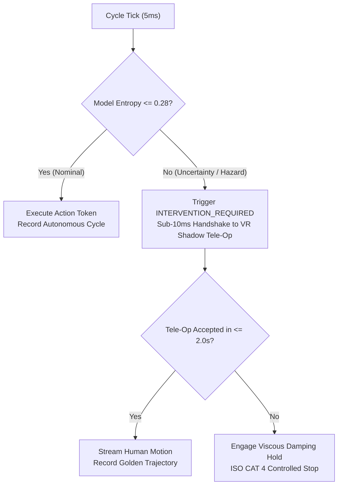

# Planetary Fleet Ops Skill

This skill enforces continuous operational reliability and SLA delivery across tens of millions of distributed robotic workcells operating under **Terra-OS**.

---

## 1. The 200 Hz Deterministic Control Loop

Every connected workcell must strictly adhere to the hard real-time cycle:
1. **Telemetry Intake ($\le 1.5\text{ ms}$)**: Ingest joint positions, velocities, torques, and camera frames.
2. **Model Policy Forward Pass ($\le 2.0\text{ ms}$)**: Execute local quantized VLA transformer weights.
3. **Safety Barrier Verification ($\le 0.5\text{ ms}$)**: Validate Control Barrier Functions (CBF) and torque limits via [`HardwareAbstractionLayer.validate_command`](file:///e:/anti/terra_kinetics/protocol/ukp_schema.py#L97).
4. **Actuator Torque Transmission ($\le 1.0\text{ ms}$)**: Dispatch to low-level motor drives.

Total loop deadline: **$5.0\text{ ms}$ (200 Hz)**.

---

## 2. Dynamic Escalation & Handover Ladder

---

## 3. Autonomous Maintenance & Field Orchestration

1. **Preflight Gating**: Never activate an industrial workcell unless ambient light ($\ge 300\text{ lux}$) and network latency jitter ($\le 4.5\text{ ms}$) pass [`PilotDeploymentOrchestrator.run_preflight_audit`](file:///e:/anti/terra_kinetics/pilots/pilot_orchestrator.py#L65).
2. **Predictive Wear Monitoring**: When joint harmonic drive backlash drifts above $0.008\text{ rad}$ or actuator temperatures exceed $65.0^\circ\text{C}$, automatically trigger maintenance ticketing via [`AutonomousFieldOpsAgent`](file:///e:/anti/terra_kinetics/agents/field_ops_agent.py#L25).
3. **Zero-Downtime OTA Rollouts**: Staged Canary model rollouts (1% $\rightarrow$ 10% $\rightarrow$ 100%) with automated rollbacks on any localized autonomy drop below 99.5%.
