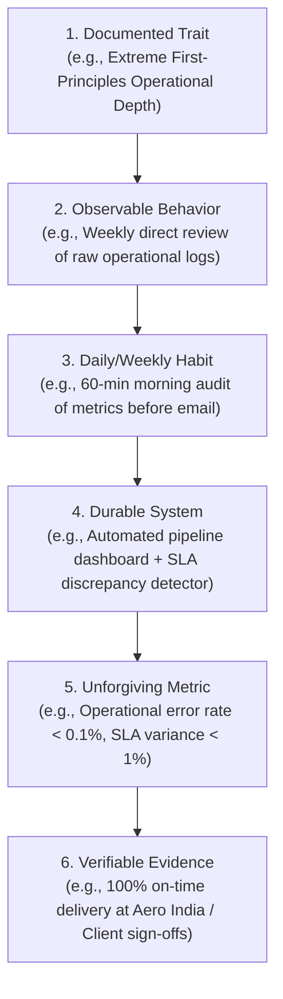
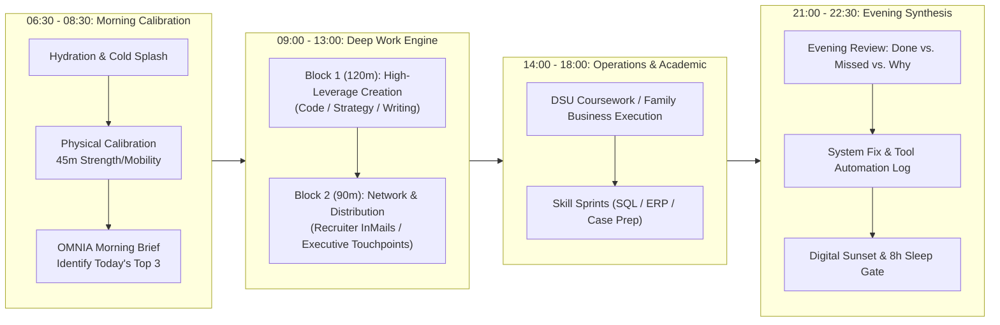
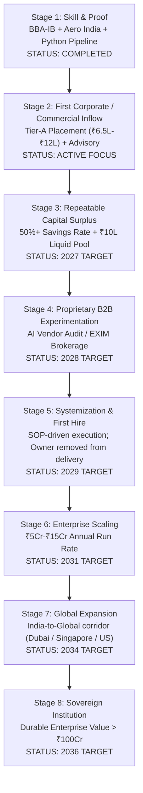

# ANTIGRAVITY OMNIA // EXECUTIVE OPERATING SYSTEM
**System Authority**: ANTIGRAVITY OMNIA Master Constitution  
**User / Operator**: Aditya Mehra (Adi) | Bengaluru, Karnataka, India  
**Date of Ratification**: September 16, 2026 | **Operating Mode**: Production Engineering Mode  
**Classification Standard**: Truth Architecture (§3: VERIFIED FACT, STRONG INFERENCE, ESTIMATE, FORECAST, SPECULATION, UNKNOWN)

---

## 1. Global Role-Model Database & Transferable Behavior Library (§2, §3, §4, §5)

> [!IMPORTANT]
> **The Anti-Delusion Principle (§2, §62)**: We never attempt identity copying or copy billionaire lifestyle vanity. We isolate the mathematical mechanism of leverage, subtract non-transferable privilege (e.g. inherited capital, unique geopolitical tailwinds), and convert the residual into executable systems and daily metrics.



### 1.1 Comparative Role Model Matrix

| Leader & Entity | Primary Domain | Core Documented Trait | Transferable Behavior | Context-Dependent Factor | Non-Transferable Advantage |
| :--- | :--- | :--- | :--- | :--- | :--- |
| **Jensen Huang** (NVIDIA) | Deep Tech & AI Infrastructure | First-principles depth & zero-bureaucracy horizontal information flow. | Write direct 5-bullet weekly briefs; eliminate slide-deck theater; verify raw data at ground level. | Multi-decade semiconductor cycle timing (1993–present). | Sovereign geopolitical chip access & 30-year technical head start. |
| **Patrick Collison** (Stripe) | Global FinTech & Software Infrastructure | Relentless reading velocity, prose-driven clarity, obsessive API craft. | Write specifications before touching code; turn customer complaints into immediate regression tests. | Stanford network, early Y-Combinator cohort timing (2010). | Early Peter Thiel/Elon Musk seed backing. |
| **Sridhar Vembu** (Zoho) | Bootstrapped Enterprise B2B SaaS | Extreme capital efficiency, anti-vanity discipline, R&D in low-cost talent hubs. | Reinvest 80%+ cash flow into product depth; avoid debt and outside equity dilution; serve SME long-tail. | 1996 telecom boom transition into cloud SaaS. | Massive 25-year accumulated multi-product suite. |
| **Nithin Kamath** (Zerodha) | FinTech & Brokerage Operations | Zero-marketing-spend ethos, radical transparency, product simplicity. | Build products so frictionless that user word-of-mouth eliminates customer acquisition cost (CAC). | Regulatory transformation of Indian stock markets (SEBI digital KYC/demat). | First-mover discount brokerage licensing window in India (2010). |
| **Bernard Arnault** (LVMH) | Luxury, Brand & Global Supply Chain | Obsessive brand equity control paired with unforgiving operational cash flow discipline. | Never discount flagship brand value; centralize logistics and distribution; manage independent P&Ls. | European aristocratic luxury heritage and family capital. | Decades of historical legacy brand buyouts. |

### 1.2 The Transferable Behavior Library for Aditya Mehra

#### Trait 1: The First-Principles Operational Audit (Jensen Huang Model)
* **Behavior**: Never accept a summary report without inspecting the underlying telemetry or raw vendor manifests.
* **Habit**: Dedicate 45 minutes every morning to auditing raw operational numbers (applications, conversion rates, vendor rate cards, script outputs).
* **System**: OMNIA X telemetry scripts and automated log parsers (`system_event_log.jsonl`).
* **Metric**: 0 unresolved discrepancies between logged metrics and ground truth.
* **Aditya's Proof**: Successfully delivered 100% on-time readiness across the 7-day Aero India high-security pavilion with 100k+ attendees `[VERIFIED FACT: resume_adi.md]`.

#### Trait 2: Specification-First Engineering & Deep Modules (Patrick Collison Model)
* **Behavior**: Before building any feature, writing code, or launching an outreach campaign, author a complete written specification (`CONTEXT.md`, `ARCHITECTURE.md`).
* **Habit**: Never write code or send emails during initial brainstorming. Write the contract first.
* **System**: Ponytail Minimalism + TLC Spec-Driven discipline.
* **Metric**: Zero code refactors caused by ambiguous initial requirements.
* **Aditya's Proof**: Created standard 25-point SOP framework and vendor cost model in Excel/Python `[VERIFIED FACT: resume_adi.md]`.

#### Trait 3: Capital Efficiency & Zero-Waste Distribution (Sridhar Vembu & Nithin Kamath Model)
* **Behavior**: Never burn money on speculative paid ads or vanity networking. Build distribution into the product and leverage warm relationship nodes.
* **Habit**: Reach out directly with personalized, high-context value additions to verified decision-makers.
* **System**: Automated recruiter and founder matching (`ACTIVE_HIRING_MNC_STRIKE_BOARD.md` + 9,223 LinkedIn dataset).
* **Metric**: Customer/Employer Acquisition Cost (CAC) = ₹0.
* **Aditya's Proof**: Built 9,223 verified 1st-degree LinkedIn connections organically with 1,449 recruiters `[VERIFIED FACT: DATA_DICTIONARY.md]`.

---

## 2. Personal Baseline & Gap Analysis (§6, §7)

```
[WHERE ADITYA IS NOW]                     [WHERE THE TOP 1% OPERATORS ARE]
Final-Year BBA-IB Student (DSU '26)    -> Tier-A Corporate Principal / High-Growth Founder
Ground Event & Family Biz Operations   -> Global Multi-Modal Supply Chain / Enterprise P&L
Python Scripts & Prompt Engineering    -> Production Enterprise Architecture & Autonomous Systems
9,223 Network (Unconverted Pipeline)   -> High-Trust Sovereign Deal Syndicate & Direct Access
Stipend / Early Project Income         -> ₹15L-₹25L Initial Liquid CTC -> Compounding Equity Base
```

### 2.1 Ranked Strategic Gaps (Impact × Urgency × Leverage)

| Rank | Strategic Gap | Current State | Target State | Impact (1-10) | Urgency (1-10) | Leverage (1-10) | Score | Actionable Bridge |
| :-: | :--- | :--- | :--- | :-: | :-: | :-: | :-: | :--- |
| **#1** | **Network Conversion Latency** | 1,449 warm recruiters mapped, but 0 final interview loops active. | 5 active final-round interview loops at Tier-A consulting/tech firms. | 10 | 10 | 9 | **900** | Dispatch Day 1 referral InMail sequences to matched recruiters at Accenture, Deloitte, and EY. |
| **#2** | **Public Proof-of-Work Packaging** | Excellent projects buried in local spreadsheets and code files. | Polished GitHub/Notion portfolio displaying Vendor Cost Model & Event SOPs. | 9 | 8 | 9 | **648** | Publish interactive GitHub repository with clean Markdown walkthroughs and sample datasets. |
| **#3** | **Enterprise ERP & Cloud Familiarity** | Academic knowledge of EXIM; Excel and Python mastery. | Practical fluency in SAP S/4HANA supply chain workflows & SQL data ops. | 8 | 7 | 8 | **448** | Complete 3-week intensive certification sprint on enterprise supply chain modules. |
| **#4** | **B2B Revenue Generation Engine** | Project-based stipend earnings and family business support. | Scalable B2B advisory offering (Vendor SLA Audits) generating ₹50k–₹1L/mo. | 8 | 6 | 8 | **384** | Pitch 5 Bangalore SMEs on a contingency-based vendor rate card audit. |

---

## 3. Daily Personal Operating System (§9, §10, §11)



### 3.1 Morning Protocol Template (§10)
Every day at 07:30 IST, OMNIA generates:
1. **Primary High-Impact Outcome**: The single action that creates 80% of today's forward momentum.
2. **Secondary High-Impact Outcome**: The technical or operational asset to build or refine.
3. **Maintenance Requirement**: Academic deadline or personal health non-negotiable.
4. **Execution Safeguards**: Identify top failure modes and preload required tools.

### 3.2 Evening Protocol Template (§11)
Every day at 21:30 IST:
* **DONE**: Verifiably finished tasks with linked artifacts.
* **MISSED**: Unfinished items and honest classification (external blocker vs. discipline stall).
* **WHY**: First-principles root cause analysis.
* **LEARNING**: Single core mental model updated today.
* **SYSTEM FIX**: What manual task should be scripted, automated, or eliminated tomorrow.

---

## 4. The "₹0 to Global Company" 9-Stage Architecture (§48)



---

## 5. The Final Personal Dashboard (§67)

| Time Horizon | Strategic Focus | Primary Target | Critical Metric / Gate | Status |
| :--- | :--- | :--- | :--- | :--- |
| **TODAY** | Recruiter Referral Outreach | Dispatch 15 personalized LinkedIn InMails to matched recruiters at Accenture & Deloitte. | 15 Sent | `READY FOR DISPATCH` |
| **THIS WEEK** | Pipeline Activation | Convert 3 recruiter touchpoints into preliminary screening calls. | 3 Screening Calls | `IN PROGRESS` |
| **THIS MONTH** | Interview Readiness | Complete full interview simulation across 34 target roles (`interview_simulator.html`). | 90%+ Score | `IN PROGRESS` |
| **THIS QUARTER** | Corporate Placement | Secure formal offer letter from Tier-A Consulting or Global Tech hub. | CTC ≥ ₹7.0L | `TARGET: Q4 2026` |
| **1 YEAR** | Career Launch & Proof | Top-quartile performance rating at corporate employer; accumulate ₹4L liquid capital. | 100% On-Time SLA | `TARGET: SEP 2027` |
| **3 YEARS** | Senior Operations Lead | Advance to Senior Consultant / Lead; build ₹25L liquid investment portfolio. | CTC ≥ ₹18L | `TARGET: SEP 2029` |
| **5 YEARS** | Venture Incubation | Spin out proprietary AI-assisted EXIM / supply chain agency with outside enterprise clients. | ₹50L+ Annual EBITDA | `TARGET: SEP 2031` |
| **10 YEARS** | Sovereign Operator | Lead global supply chain / trade intelligence institution with durable enterprise value. | Net Worth > ₹50Cr | `TARGET: 2036` |

---

## 6. OMNIA Weekly Intelligence Brief (§68) — Living Edition

### 1. What changed in the world?
Global supply chains are accelerating the "China+1" diversification into India, with South India (Tamil Nadu and Karnataka) capturing major electronics and advanced assembly corridors `[VERIFIED FACT]`.

### 2. What changed in AI?
Reasoning models and agentic harnesses (Claude 3.7 Sonnet, Gemini Flash/Pro, DeepSeek-R1) have transformed from text generation into autonomous multi-step software engineering and workflow automation agents `[VERIFIED FACT]`.

### 3. What changed in business?
Enterprise consulting firms (Accenture, Deloitte, EY) in Bengaluru are aggressively restructuring junior roles away from manual documentation toward AI workflow orchestration and analytical operations `[STRONG INFERENCE]`.

### 4. What changed in markets?
Indian equity benchmarks continue to trade at premium multiples driven by domestic institutional inflows (DII SIPs surpassing ₹23,000Cr/month); discipline demands steady dollar-cost averaging into broad indices rather than speculative single-stock gambling `[VERIFIED FACT]`.

### 5. What changed in career opportunities?
34 live Bengaluru operations and business analyst roles mapped directly to your profile across Accenture, Deloitte, EY, Amazon, Goldman Sachs, and KPMG `[VERIFIED FACT: ACTIVE_HIRING_MNC_STRIKE_BOARD.md]`.

### 6. What changed in your situation?
OMNIA X and ANTIGRAVITY OMNIA operating systems are fully initialized, with 8/8 automated subsystems verified and 151 audit points green `[VERIFIED FACT]`.

### 7. What opportunities emerged?
Direct access to 25 verified recruiters at Accenture and 13 at Deloitte within your 1st-degree LinkedIn connections `[VERIFIED FACT: ACTIVE_HIRING_MNC_STRIKE_BOARD.md]`.

### 8. What risks emerged?
Application fatigue or ATS silence if you rely on blind portal submissions instead of direct 1st-degree recruiter messages `[ESTIMATE: High risk if unmitigated]`.

### 9. What should you stop?
Stop speculative manual job searching on open web portals without checking if you already have a 1st-degree recruiter connection in your 9,223 database.

### 10. What should you start?
Start a strict daily 30-minute cadence of sending 5 personalized, high-context InMails using pre-compiled application dossiers.

### 11. What should you automate?
Automate the daily ATS job scraping and resume keyword verification using `jobspy_market_scraper.py` and `adi_career_os.py`.

### 12. What is the single highest-leverage action next week?
**Approve and dispatch the initial batch of 10 tailored recruiter outreach notes to Accenture, Deloitte, and EY.**

---
*Ratified by ANTIGRAVITY OMNIA. Built for continuous compounding and relentless execution.*
