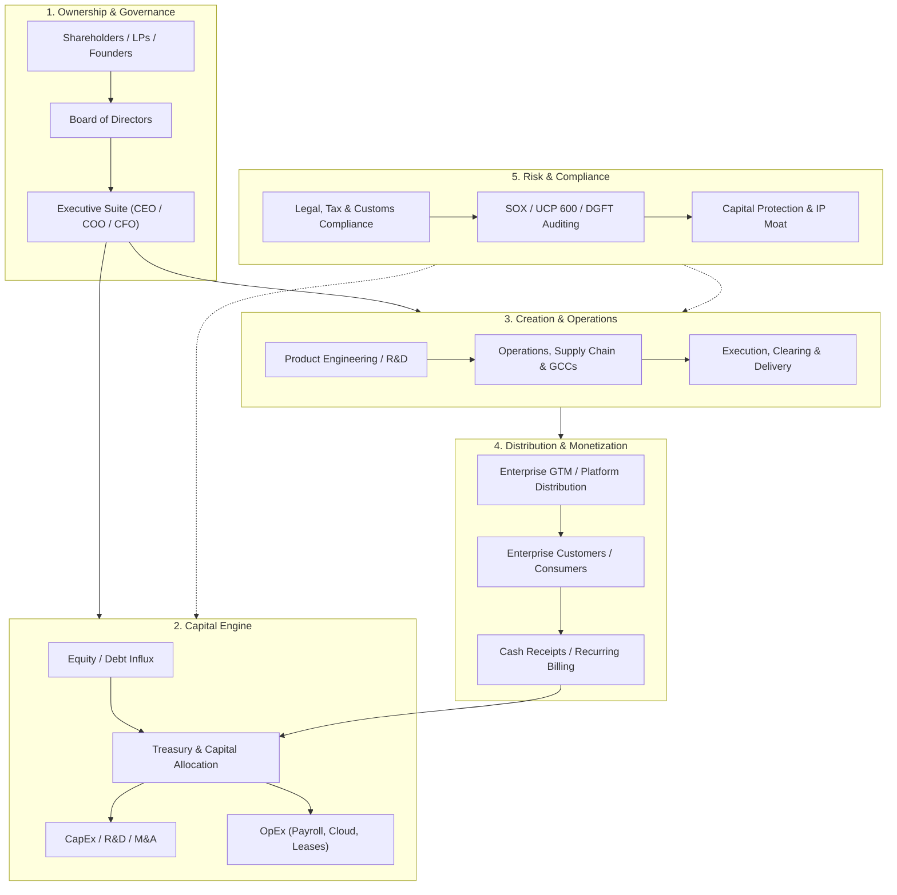

# HOW THE WORLD'S COMPANIES WORK: FROM START TO END (THE DEFINITIVE OPERATING MANUAL)

**Authoritative Architecture for Global Business Operations, Capital Allocation & Enterprise Machinery**  
*Compiled for Aditya Mehra | BBA International Business (Dayananda Sagar University, 2026)*

---

## 1. THE FOUNDATIONAL ANATOMY OF ANY COMPANY

At its elemental level, every commercial enterprise on Earth—from a garage startup in Koramangala to a \$3 Trillion titan like Apple—is an engine designed to do one fundamental thing:
$$\text{Enterprise Value} = \frac{\text{Free Cash Flows to the Firm (FCFF)}}{(1 + \text{WACC})^t}$$

To produce cash flows, every corporation operates across **5 Core Anatomical Organs**:



---

## 2. THE 6 MASTER ARCHETYPES OF GLOBAL CORPORATIONS

Every company in the world belongs to one of six master archetypes. Here is how each functions from start to finish:

---

### ARCHETYPE 1: THE BIG TECH TITANS & GLOBAL CAPABILITY CENTERS (GCCs)
*(Google, Microsoft, Apple, Amazon, Nvidia, Meta, Cisco, Walmart Global Tech)*

```
[Capital & Hardware R&D] ──> [Cloud Infra / Data Centers] ──> [Software Platform] ──> [Global Monetization]
                                      │                                  │
                                      ▼                                  ▼
                              [Bengaluru GCC Hub]             [Global Enterprise Scale]
```

#### Step-by-Step Lifecycle:
1. **Capital Influx & Massive R&D:**  
   Google, Microsoft, and Apple generate \$50B–\$100B+ in annual free cash flows. They reinvest 15–25% into CapEx (Nvidia GPU clusters, hyperscale submarine cables, custom silicon like Google TPU or Apple M-series chips).
2. **Platform & IP Creation:**  
   Engineers build scalable zero-marginal-cost software platforms (Google Cloud, Azure, iOS App Store, AWS). Once the software is written, serving user #100,000,001 costs virtually \$0.
3. **The Global Capability Center (GCC) Engine (Bengaluru's Role):**  
   US and European headquarters cannot scale engineering, data analytics, risk compliance, and operations solely in Silicon Valley or London due to talent density and payroll cost efficiency. They set up **GCCs in Bengaluru** (e.g., Bagmane Tech Park, Manyata, EcoWorld).
   - *What the GCC does:* 24/7 follow-the-sun code deployment, cloud infrastructure monitoring, vendor Master Service Agreement (MSA) audits, global partner integrations, and cross-border financial consolidation.
4. **Monetization & Free Cash Flow Compounding:**  
   - **Google/Meta:** Monetize high-intent attention via programmatic real-time bidding ad auctions.
   - **Microsoft/Amazon AWS:** Monetize enterprise compute, storage, and annual enterprise multi-seat SaaS licenses.
   - **Apple:** Monetize hardware margins (35-45% gross margin on iPhones) + 30% App Store cut.
5. **Where Aditya Mehra Fits:**  
   **Global Business Operations Analyst (BizOps) / Operations Program Manager** (₹9L - ₹16.5L LPA). Managing cross-border vendor SLAs, multi-timezone delivery governance, and operational bottleneck resolution.

---

### ARCHETYPE 2: BULGE BRACKET INVESTMENT BANKS & FINANCIAL HUBS
*(Goldman Sachs, JPMorgan Chase, Morgan Stanley, Standard Chartered, HSBC, Deutsche Bank)*

```
[Deposits & Institutional Capital] ──> [Investment Banking (M&A/IPO)] ──> [Sales & Trading] ──> [Middle Office Clearing & Settlement]
```

#### Step-by-Step Lifecycle:
1. **Capital Sourcing & Balance Sheet Underwriting:**  
   Banks operate with institutional deposits, commercial paper, and repo market liquidity. They use their Tier-1 capital ratios (governed by Basel III) to underwrite multi-billion-dollar corporate loans, IPOs, and bond issuances.
2. **Front-Office Deal Origination:**  
   - **Investment Banking Division (IBD):** Advises CEOs on multi-billion dollar mergers, acquisitions (M&A), and IPOs (taking 1–3% advisory fees).
   - **Global Markets (Sales & Trading):** Executes high-speed institutional trading across equities, currencies (FX), commodities, and fixed income derivatives.
3. **Middle-Office Operations & Trade Finance (The Real Engine):**  
   Every trade executed by the front office must be legally documented, cleared, and settled.
   - **International Trade Finance:** Scrutiny of Letters of Credit (LCs) governed by **ICC UCP 600** and **ISBP 745**.
   - **Cross-Border SWIFT Messaging:** Ingestion and verification of SWIFT **MT700** (Letter of Credit issue), **MT707** (amendments), and **MT103/MT202** (electronic wire settlements).
   - **Nostro / Vostro Reconciliations:** Auditing institutional bank accounts held abroad in foreign currency against domestic accounts to prevent unallocated ledger imbalances.
4. **Regulatory Risk & Compliance Shield:**  
   Executing mandatory **OFAC sanctions screening**, anti-money laundering (AML), and counter-terrorist financing (CTF) checks before releasing SWIFT payment wires.
5. **Where Aditya Mehra Fits:**  
   **Global Trade Finance & Clearance Analyst / Institutional Operations Specialist** (₹7.2L - ₹14.5L LPA). LC document auditing under UCP 600, Nostro/Vostro daily balance reconciliation, and FX settlement governance.

---

### ARCHETYPE 3: GLOBAL OCEAN CARRIERS, AIR FREIGHT & EXIM LOGISTICS
*(A.P. Moller - Maersk, Kuehne+Nagel, DHL Global Forwarding, Boeing, Bosch)*

```
[Factory Production (Origin)] ──> [Freight Forwarder / Incoterms] ──> [Customs Clearance (ICEGATE)] ──> [Ocean / Air Transit] ──> [Port Drayage & 3PL Warehouse]
```

#### Step-by-Step Lifecycle:
1. **Commercial Contract & Incoterms 2020 Allocation:**  
   A manufacturer in Bengaluru or Shenzhen sells 10,000 industrial parts to a buyer in Frankfurt or Chicago. The sales contract stipulates the exact risk and cost transfer point using **Incoterms 2020**:
   - **FOB (Free on Board):** Seller clears export customs and places goods on the ship; buyer pays ocean freight and marine insurance.
   - **CIF (Cost, Insurance & Freight):** Seller pays ocean freight and marine insurance to the destination port; risk transfers once loaded on the vessel.
   - **DDP (Delivered Duty Paid):** Maximum seller obligation—seller pays freight, import customs duties, taxes, and inland delivery to the buyer's door.
2. **Documentation & Bill of Lading (B/L) Scrutiny:**  
   The carrier or freight forwarder issues the **Bill of Lading (B/L)**, the supreme document of title. It acts as:
   - A receipt for the goods shipped.
   - Evidence of the contract of carriage.
   - A negotiable document of title allowing transfer of cargo ownership.
3. **Customs Clearance via ICEGATE & Tariff Classification:**  
   In India, goods clear through **ICEGATE** (Indian Customs Electronic Gateway) at ports like Chennai, Nhava Sheva, or Kempegowda Air Cargo Complex.
   - **HS Code Classification:** Every item is mapped to an 8-digit Harmonized System code determining the exact Basic Customs Duty (BCD), Social Welfare Surcharge (SWS), and IGST.
   - A single clerical error on the Commercial Invoice or Bill of Entry (BOE) triggers customs holds and crippling **demurrage penalties** (\$150–\$300 per container per day).
4. **Landed Cost Variance Modeling:**  
   $$\text{True Landed Cost} = \text{FOB Unit Price} + \text{Freight} + \text{Insurance} + \text{Customs Duty} + \text{IGST} + \text{Port Handling} + \text{Drayage}$$
5. **Where Aditya Mehra Fits:**  
   **Supply Chain Operations Analyst / EXIM Logistics Governance Lead** (₹7.5L - ₹13.0L LPA). Incoterms risk enforcement, Bill of Lading verification, port demurrage mitigation, and landed cost modeling.

---

### ARCHETYPE 4: TIER-1 TECH UNICORNS & QUICK-COMMERCE ECOSYSTEMS
*(Zepto, CRED, Swiggy, Ather Energy, Razorpay)*

```
[Venture Capital / Seed] ──> [Dark Store / Hub Infrastructure] ──> [Consumer App Marketplace] ──> [Fleet Dispatch & Real-Time Logistics] ──> [Unit Economics Optimization]
```

#### Step-by-Step Lifecycle:
1. **Venture Capital Influx & Network Seeding:**  
   Unicorns raise equity rounds (Series A, B, C, D) from Tier-1 venture funds (Sequoia/Peak XV, Andreessen Horowitz, Lightspeed) to fund initial hyper-growth and real estate/inventory CapEx.
2. **Hyper-Local Physical Infrastructure (The Dark Store Grid):**  
   - Companies like Zepto and Swiggy Instamart map metropolitan cities (Bengaluru, Mumbai, Delhi) into micro-catchment polygons (2–3 km radius).
   - Each polygon is anchored by a **Dark Store** (mini-fulfillment center stocking 3,000–5,000 SKUs).
3. **Real-Time Algorithmic Dispatch:**  
   - A customer orders on the app.
   - The warehouse picker has a strict 90-second SLA to pick and pack using handheld RFID/barcode scanners.
   - The algorithmic dispatch engine assigns the nearest delivery rider based on route traffic, weather, and fleet availability.
4. **The Unit Economics Equation (From Burn to Profit):**  
   To survive, the unicorn must achieve positive **Contribution Margin 3 (CM3)**:
   $$\text{CM3} = \text{Average Order Value (AOV)} - \text{COGS} - \text{Rider Payout} - \text{Dark Store Rent/Ops} - \text{Payment Gateway Fees}$$
   Profitability is unlocked through:
   - Increasing AOV (bundling, minimum order limits).
   - Private-label brand margins (25–35% gross margin vs. 8–12% on FMCG brands).
   - Brand advertising on the app (retail media network ads).
5. **Where Aditya Mehra Fits:**  
   **Founder's Office Associate / City Operations Lead** (₹10.0L - ₹18.0L LPA). Shadowing the CXO on dark store turnaround SLAs, vendor procurement terms, and unit economics variance.

---

### ARCHETYPE 5: BILLIONAIRE FAMILY OFFICES & SOVEREIGN WEALTH HUBS
*(PremjiInvest, Catamaran Ventures, Rainmatter Capital, Pratithi, Nadathur)*

```
[Family Enterprise Liquidity] ──> [Investment Committee Mandate] ──> [Due Diligence & Allocation] ──> [Portfolio Governance] ──> [Generational Compounding]
```

#### Step-by-Step Lifecycle:
1. **Liquidity Harvesting:**  
   Billionaires (Azim Premji, Narayana Murthy, Nithin Kamath) monetize shares from their primary mega-cap companies (Wipro, Infosys, Zerodha) through dividend distributions or secondary market share buybacks.
2. **The Sovereign/Family Office Charter:**  
   The family office is incorporated as a private investment firm with a dual mandate:
   - **Capital Preservation:** Protecting wealth against inflation, geopolitical shocks, and currency depreciation.
   - **Alpha Generation:** Investing in high-growth private equity, venture capital, and special situation assets.
3. **Asset Allocation Architecture:**  
   - **Public Equities (30–45%):** Blue-chip listed monopolies (TCS, HDFC Bank, Titan).
   - **Private Equity & Growth Deals (25–35%):** Growth-stage unicorns before IPO (Lenskart, PolicyBazaar, Meesho).
   - **Alternative Assets / Real Estate / Debt (15–20%):** Commercial tech parks, private credit funds, high-yield sovereign paper.
   - **Philanthropic Endowment (10–30%):** E.g., Azim Premji Foundation funding education and public healthcare.
4. **The Founder's Office & Portfolio Governance:**  
   The family office does not operate companies directly; it controls board seats. The **Chief of Staff and Founder's Office team** review monthly portfolio financials, track governance compliance, and triage strategic founder disputes.
5. **Where Aditya Mehra Fits:**  
   **Founder's Office Associate / Investment Operations Analyst** (₹12.0L - ₹18.0L LPA). Preparing board memos, tracking portfolio burn multiples, auditing deal dataroom documents, and executing CXO special projects.

---

### ARCHETYPE 6: HEAVY MANUFACTURING, AUTOMOTIVE & AEROSPACE
*(Boeing, Bosch, Airbus, Tata Motors, Hindustan Aeronautics Limited)*

```
[R&D & Engineering Specification] ──> [Multi-Tier Vendor Procurement] ──> [Assembly & Calibration] ──> [Regulatory Certification (FAA/DGCA)] ──> [Lifecycle MRO]
```

#### Step-by-Step Lifecycle:
1. **Multi-Year R&D & Systems Engineering:**  
   Developing a commercial aircraft or electric powertrain takes 5–8 years of aerospace-grade CAD modeling, aerodynamic wind tunnel testing, and safety stress simulations.
2. **Tier-1, Tier-2, Tier-3 Global Supply Chains:**  
   A single commercial aircraft has over 2,000,000 individual parts sourced from 40+ countries.
   - **Tier 3:** Raw material refiners (titanium, carbon fiber composites, lithium).
   - **Tier 2:** Precision component manufacturers (valves, fasteners, hydraulic pumps).
   - **Tier 1:** Subsystem integrators (GE/Rolls-Royce for jet engines, Honeywell for avionics).
3. **Just-In-Time (JIT) Assembly & Six Sigma Calibration:**  
   Plants operate under strict Lean manufacturing and Six Sigma quality standards (fewer than 3.4 defects per million opportunities).
4. **Government & Defense Certification:**  
   Before a commercial flight or defense vehicle deploys, it must pass mandatory airworthiness certifications from the **FAA (US)**, **EASA (Europe)**, or **DGCA (India)**.
5. **Lifecycle MRO (Maintenance, Repair & Overhaul):**  
   Companies generate the majority of their lifecycle profits not on the initial equipment sale, but on 30-year high-margin spare parts and MRO service contracts.
6. **Where Aditya Mehra Fits:**  
   **Defense & Aerospace Supply Chain Operations Lead / Vendor Governance Analyst** (₹8.5L - ₹13.5L LPA). Ground operations triage, vendor delivery schedule auditing, and customs clearance of imported aircraft spares.

---

## 3. THE UNIVERSAL 5-STEP LIFECYCLE OF EVERY BUSINESS

Regardless of industry, every successful company on Earth traverses the exact same 5 stages:

```
[0. Inception & Incorporation] ──> [1. Product-Market Fit] ──> [2. Scaling & Unit Economics] ──> [3. Enterprise Governance] ──> [4. Public Markets / Exit]
```

### Phase 0: Incorporation & Capital Structuring
- **Legal Entity:** A Private Limited Company (in India) or Delaware C-Corp (in the US) is formed to create a distinct legal person with limited liability.
- **Capital Table (Cap Table):** Founders divide 10,000,000 common shares. An **Employee Stock Ownership Plan (ESOP)** pool of 10–15% is reserved to attract top talent.
- **Corporate Governance:** Initial Articles of Association (AOA) and Memorandum of Association (MOA) filed with the Ministry of Corporate Affairs (MCA).

### Phase 1: Zero-to-One (Product-Market Fit - PMF)
- **Problem Discovery:** Identifying an intense, recurring operational pain point that customers are willing to pay for.
- **Minimum Viable Product (MVP):** Building the smallest functional product that solves the core problem.
- **The PMF Signal:** Retention curves flatten out—users keep returning, and net revenue retention (NRR) exceeds 100%.

### Phase 2: Hyper-Scale & Operational Discipline
- **The Scaling Trap:** Revenue multiplies 5x, but headcount multiplies 10x, leading to coordination chaos, communication silos, and operational friction.
- **The Rise of BizOps:** The company introduces dedicated Operations and Program Managers to create repeatable **Standard Operating Procedures (SOPs)**, automate manual reporting, and govern vendor contracts.
- **Unit Economics Tightening:** Shifting focus from gross merchandise value (GMV) to contribution margins and free cash flow generation.

### Phase 3: Global Expansion & Capability Centers
- **The Offshore Multiplier:** The enterprise opens global hubs (specifically in **Bengaluru**) to run global 24/7 engineering, finance, risk management, and vendor logistics at 1/4th the cost of London or New York while accessing world-class talent.
- **Regulatory Hardening:** Implementing strict internal controls, data privacy (GDPR/DPDP), and international trade compliance.

### Phase 4: Public Listing (IPO) or Generational Compounding
- **The Initial Public Offering (IPO):** Listing on the NSE/BSE or NYSE/NASDAQ.
- **Public Governance:** Complying with **SOX 404**, quarterly analyst earnings calls, quarterly financial filings (Form 10-K / SEBI disclosures), and institutional shareholder activism.
- **Capital Reallocation:** Distributing dividends, buying back undervalued shares, or acquiring disruptive competitors.

---

## 4. HOW THE FINANCIAL ENGINE ACTUALLY WORKS: CASH FLOW & THE P&L

Every business executive, Chief of Staff, and board member looks at companies through 3 interlocking financial statements:

```
[The Income Statement (P&L)]  ──>  How much revenue was generated and what did it cost to generate it?
[The Balance Sheet]           ──>  What does the company OWN (Assets) vs. what does it OWE (Liabilities)?
[The Cash Flow Statement]     ──>  Where did actual physical cash enter and exit the bank account?
```

### The Waterfall of Cash (From Top-Line to Free Cash Flow):
$$\begin{aligned}
\text{Gross Revenue (Top Line)} &\quad \text{Total invoice value billed to customers} \\
- \text{Cost of Goods Sold (COGS)} &\quad \text{Direct costs: raw materials, cloud hosting, dark store inventory} \\
\hline
= \mathbf{\text{Gross Profit}} &\quad \text{Gross Margin \% indicates pricing power and business quality} \\
- \text{Operating Expenses (OpEx)} &\quad \text{R&D, SG&A (Sales, Marketing, Admin, Bengaluru GCC payroll)} \\
\hline
= \mathbf{\text{EBITDA}} &\quad \text{Earnings Before Interest, Taxes, Depreciation \& Amortization} \\
- \text{Depreciation \& Amortization} &\quad \text{Accounting non-cash wear and tear on physical/IP assets} \\
\hline
= \mathbf{\text{Operating Profit (EBIT)}} &\quad \text{Core operational earning power} \\
- \text{Interest Expense} &\quad \text{Debt service on corporate bonds or bank credit facilities} \\
- \text{Taxes (Corporate Tax)} &\quad \text{Government statutory payments (22-25\% in India)} \\
\hline
= \mathbf{\text{Net Income (Bottom Line)}} &\quad \text{Accounting profit for shareholders} \\
+ \text{Non-Cash Items (D\&A)} &\quad \text{Added back} \\
- \text{Capital Expenditures (CapEx)} &\quad \text{Cash spent on new hardware, servers, warehouses} \\
- \Delta \text{Net Working Capital} &\quad \text{Cash tied up in unpaid customer invoices vs. supplier bills} \\
\hline
= \mathbf{\text{Free Cash Flow (FCF)}} &\quad \mathbf{\text{The actual, unencumbered cash the business generated!}}
\end{aligned}$$

---

## 5. THE THREE EXECUTIVE ROLES YOU FIT INTO PERFECTLY

Aditya Mehra's profile (**BBA International Business 2026, DSU**) sits right at the critical intersections of this global machinery:

| Operational Role | Department | What You Own Daily | Why Your Evidence Defends It |
| :--- | :--- | :--- | :--- |
| **Founder's Office Associate** | Executive Suite (CXO) | Triage cross-functional bottlenecks, draft board memos, unit economics modeling, special project execution. | **Aero India 2025:** High-stakes ground triage under extreme pressure with zero supervision. |
| **Global BizOps Analyst** | Global Capability Centers (GCCs) | Cross-border handovers (US/EMEA/India), vendor MSA/SOW audits, SLA governance dashboards. | **Puma & Tata Comm:** Real brand ops, asset reconciliation, and multi-vendor logistical control. |
| **EXIM & Trade Compliance Lead** | International Supply Chain | Incoterms 2020 compliance, Bill of Lading scrutiny, ICEGATE customs clearance, landed cost modeling. | **BBA International Business:** Rigorous grounding in DGFT trade policy, UCP 600, and marine logistics. |

---

## 6. THE GOLDEN RULE OF ENTERPRISE SURVIVAL

> **"Revenue is vanity, Profit is sanity, but Cash is reality."**  
> Companies do not go bankrupt because they fail to make a paper profit. Companies go bankrupt when their cash balance hits zero.  
> The highest-paid, most indispensable operators in the world are those who **eliminate friction**, **protect cash**, and **ensure execution velocity**.
