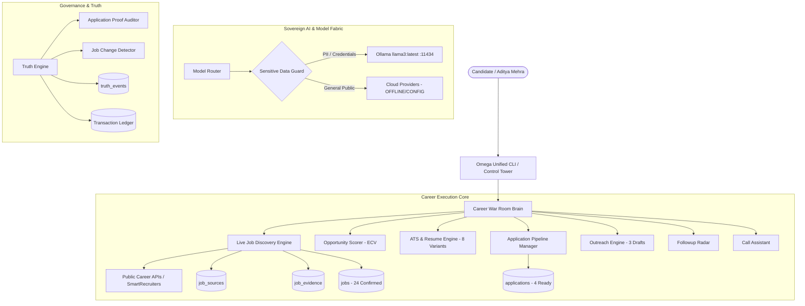

# OMEGA CURRENT ARCHITECTURE

```mermaid
graph TD
    User([Candidate / Aditya Mehra]) --> CLI[Omega Unified CLI / Control Tower]
    CLI --> Brain[Career War Room Brain]
    
    subgraph "Sovereign AI & Model Fabric"
        Router[Model Router] --> Guard{Sensitive Data Guard}
        Guard -->|PII / Credentials| LocalAI[Ollama llama3:latest :11434]
        Guard -->|General Public| CloudTpl[Cloud Providers - OFFLINE/CONFIG]
    end

    subgraph "Career Execution Core"
        Brain --> Disc[Live Job Discovery Engine]
        Disc --> SmartRec[Public Career APIs / SmartRecruiters]
        Disc --> Sources[(job_sources)]
        Disc --> Evidence[(job_evidence)]
        Disc --> Jobs[(jobs - 24 Confirmed)]
        
        Brain --> Scorer[Opportunity Scorer - ECV]
        Brain --> ATS[ATS & Resume Engine - 8 Variants]
        Brain --> AppMgr[Application Pipeline Manager]
        AppMgr --> Apps[(applications - 4 Ready)]
        
        Brain --> Outreach[Outreach Engine - 3 Drafts]
        Brain --> Followup[Followup Radar]
        Brain --> CallAss[Call Assistant]
    end

    subgraph "Governance & Truth"
        Truth[Truth Engine] --> ProofAuditor[Application Proof Auditor]
        Truth --> ChangeDet[Job Change Detector]
        Truth --> Events[(truth_events)]
        Truth --> Ledger[(Transaction Ledger)]
    end
```
