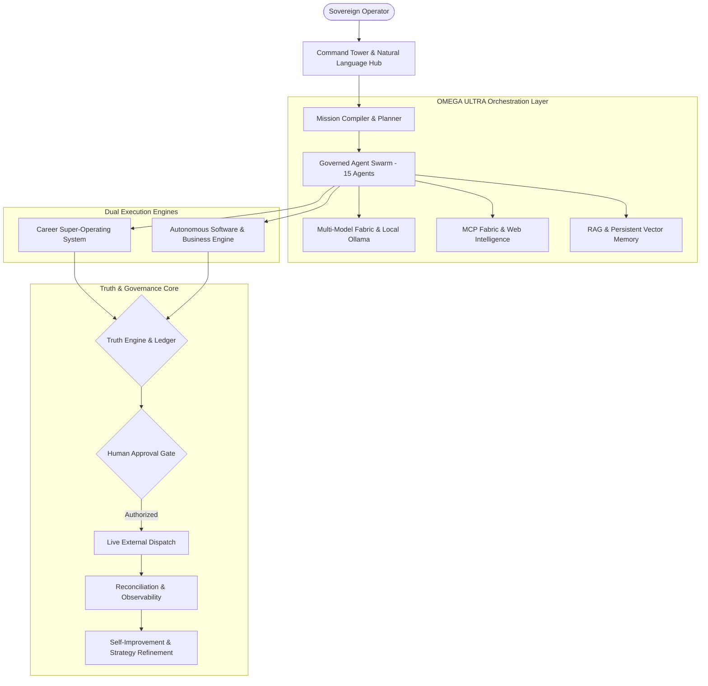

# OMEGA TARGET ARCHITECTURE // OMEGA ULTRA

```mermaid
graph TD
    User([Sovereign Operator]) --> Cmd[Command Tower & Natural Language Hub]
    Cmd --> MissionCompiler[Mission Compiler & Planner]
    
    subgraph "OMEGA ULTRA Orchestration Layer"
        MissionCompiler --> Swarm[Governed Agent Swarm - 15 Agents]
        Swarm --> ModelFabric[Multi-Model Fabric & Local Ollama]
        Swarm --> MCPFabric[MCP Fabric & Web Intelligence]
        Swarm --> MemoryCore[RAG & Persistent Vector Memory]
    end

    subgraph "Dual Execution Engines"
        Swarm --> CareerOS[Career Super-Operating System]
        Swarm --> CodeOS[Autonomous Software & Business Engine]
    end

    subgraph "Truth & Governance Core"
        CareerOS --> TruthGate{Truth Engine & Ledger}
        CodeOS --> TruthGate
        TruthGate --> ApprovalGate{Human Approval Gate}
        ApprovalGate -->|Authorized| LiveWorld[Live External Dispatch]
        LiveWorld --> Reconciliation[Reconciliation & Observability]
        Reconciliation --> Learning[Self-Improvement & Strategy Refinement]
    end
```
