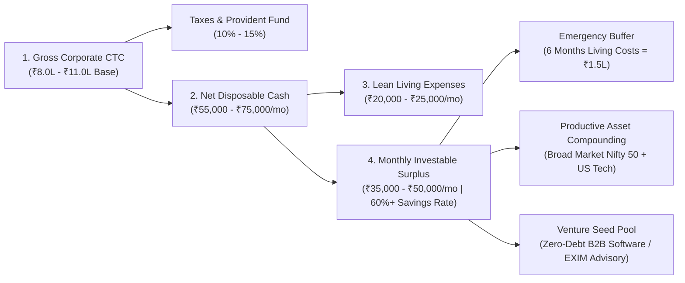
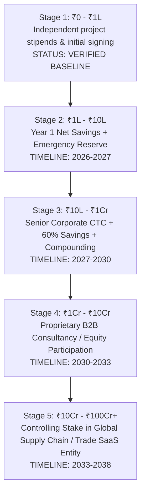

# OMNIA // FINANCIAL BALANCE SHEET & EXIM VENTURE ARCHITECTURE
**System Identity**: ANTIGRAVITY OMNIA / OMNIA X Master Kernel  
**Subject**: Aditya Mehra (Adi) | Bengaluru, Karnataka, India  
**Date of Snapshot**: September 16, 2026 | **Operating Mode**: Production Engineering Mode  
**Truth Architecture**: (§3: VERIFIED FACT, STRONG INFERENCE, ESTIMATE, FORECAST, SPECULATION, UNKNOWN)

---

## 1. Personal Financial Balance Sheet & Cash-Flow Engine (§25, §44)

> [!IMPORTANT]
> **The Core Money Axiom (§21, §26)**: We strictly distinguish **salary** from **profit**, **equity** from **net worth**, and **liquidity** from **control**. A salary pays for living expenses and seeds productive assets; equity in compounding, cash-flow-generative systems builds durable wealth.



### 1.1 First-Year Personal Pro-Forma (Tier-A Placement Baseline)

| Line Item | Monthly Amount (INR) | Annualized (INR) | % of Gross | Classification | Notes |
| :--- | :--- | :--- | :--- | :--- | :--- |
| **Gross Compensation (CTC)** | ₹75,000 – ₹91,666 | ₹9,00,000 – ₹11,00,000 | 100.0% | `[ESTIMATE]` | Baseline Tier-A Analyst at Accenture/Deloitte/EY |
| **Tax & Statutory Deductions (New Regime)** | ₹6,500 – ₹9,000 | ₹78,000 – ₹1,08,000 | ~9.0% | `[ESTIMATE]` | Low effective tax bracket under New Tax Regime |
| **Net In-Hand Inflow** | **₹68,500 – ₹82,500** | **₹8,22,000 – ₹9,90,000** | **91.0%** | `[ESTIMATE]` | Monthly liquidity deposited to primary account |
| **Bengaluru Living Expenses** | (₹22,000 – ₹25,000) | (₹2,64,000 – ₹3,00,000) | ~28.0% | `[ESTIMATE]` | Lean urban baseline (local family infrastructure advantage) |
| **Net Monthly Investable Surplus** | **₹45,000 – ₹57,500** | **₹5,40,000 – ₹6,90,000** | **~63.0%** | `[FORECAST]` | Extreme capital accumulation velocity |

### 1.2 The Asset Allocation & Liquidity Shield (§92)
* **Tier 1: Sovereign Liquidity Shield (₹1,50,000)**: Held in high-yield liquid mutual funds or sweep-in fixed deposits. Covers 6 full months of living expenses. Non-negotiable safety floor.
* **Tier 2: Broad Equity Index Core (70% of Surplus)**: Automated SIPs into low-cost Nifty 50 and Nifty Midcap 150 index funds + international US index feeder fund. Compounding target: 12%–14% CAGR over 10+ years `[FORECAST]`.
* **Tier 3: Venture & Skill Expansion Pool (30% of Surplus)**: Dedicated cash pool for enterprise domain certifications (SAP/Supply Chain), cloud/API infrastructure, and legal incorporation of proprietary entities.

---

## 2. Reverse-Engineered ₹0 to ₹100Cr Wealth Trajectory (§22, §65, §66)

The fundamental formula:
$$\text{Personal Wealth} = (\text{Retained Equity \%} \times \text{Enterprise Value}) + \text{Compounded Liquid Portfolio} - \text{Debt}$$



### 2.1 Stage-by-Stage Mathematical Milestones

| Stage | Capital Threshold | Primary Engine | Required Capabilities | Retained Ownership | Key Failure Mode & Defense |
| :-: | :--- | :--- | :--- | :-: | :--- |
| **1** | **₹0 → ₹1,00,000** | Ground ops execution + campus placement | Hands-on logistics rigor, Excel/Python automation | 100% Personal | Procrastination $\rightarrow$ *Mitigated by active pipeline* |
| **2** | **₹1,00,000 → ₹10,00,00,000** | Tier-A Corporate Analyst salary + 60% savings | Process governance, cross-functional client delivery | 100% Personal | Lifestyle inflation $\rightarrow$ *Automate SIP on Day 1 of salary* |
| **3** | **₹10,00,000 → ₹1,00,00,000** | Promotion to Senior Consultant + Market compounding | Advanced financial modeling, negotiation, team leadership | Liquid portfolio | Career stagnation $\rightarrow$ *Target high-visibility cross-border accounts* |
| **4** | **₹1,00,00,000 → ₹10,00,00,000** | B2B Procurement Advisory / Trade brokerage agency | B2B enterprise sales, vendor SLA arbitrage, contract law | 70% – 100% Equity | High customer concentration $\rightarrow$ *Diversify SME client base* |
| **5** | **₹10,00,00,000 → ₹100,00,00,000+** | Global supply chain / EXIM trade SaaS enterprise | Institutional capital allocation, M&A, international expansion | 40% – 60% Equity | Regulatory/macro shocks $\rightarrow$ *Multi-corridor trade architecture* |

---

## 3. The Bengaluru ↔ Global EXIM Trade Corridor Playbook (§33, §34, §54)

```mermaid
quadrantChart
    title South India Export Sectors vs. Automation Leverage
    x-axis Low Regulatory Complexity --> High Regulatory Complexity
    y-axis Low Export Dollar Value --> High Export Dollar Value
    quadrant-1 Prime Target: High Margin Advisory
    quadrant-2 Low Complexity Volume
    quadrant-3 Low Value Fragmented
    quadrant-4 Complex Specialized Engineering
    "Aerospace & Defense Precision Machining (Peenya)": [0.85, 0.90]
    "Electronics & EV Component Assembly (Hosur/Sriperumbudur)": [0.75, 0.85]
    "Commercial Interiors & Architectural Hardware": [0.35, 0.55]
    "Specialty Coffee & Spices (Chikkamagaluru Corridor)": [0.45, 0.40]
    "Bulk Garments / Textiles (Tirupur)": [0.25, 0.65]
```

### 3.1 The B2B Trade Advisory Service Blueprint
* **Venture Identity**: *OmniVanta Global Logistics & Trade Advisory*
* **Core Problem**: SME manufacturing exporters in Karnataka and Tamil Nadu (Peenya, Hosur, Bommasandra) face 12%–18% landed cost leakage due to misclassified HS codes, freight detention charges, and delayed UCP 600 Letter of Credit disbursements `[STRONG INFERENCE]`.
* **The High-Yield Service Offering**:
  1. **HS Code & Customs Tariff Optimization**: Systematic reclassification audit ensuring zero overpaid duties under India's Free Trade Agreements (e.g. India-UAE CEPA, India-Australia ECTA).
  2. **Multi-Modal Freight Audit**: Automated reconciliation of freight forwarder rate cards against actual shipping line invoices to identify illicit handling surcharges.
  3. **Incoterms 2020 Risk Containment**: Transitioning exporters from high-risk CIF (Cost, Insurance & Freight) to controlled DAP (Delivered at Place) or FOB (Free on Board) terms.
* **Unit Economics**:
  * **Retainer Model**: ₹50,000 to ₹1,50,000 per month per SME exporter.
  * **Contingency Model**: 20% of verified customs and freight cost savings recovered.
  * **Gross Margin**: **85%+** (pure intellectual and software leverage).

---

## 4. Master Star Defense Bank: Top 5 Advanced Scenarios (§17, §35)

```
[SCENARIO 1: CROSS-BORDER SUPPLY CHAIN DISRUPTION (EXIM / OPERATIONS)]
Interviewer: "A container shipment is stuck at Chennai port due to a customs document discrepancy, and our assembly line in Bengaluru faces shutdown in 48 hours. How do you respond?"
Candidate Defense:
1. Immediate Containment: "First, classify the exact bottleneck: is it a physical examination hold, an ICEGATE documentation mismatch, or an unresolved duty assessment?"
2. Parallel Resolution: "While liaising with the Customs Broker (CHA) to file an expedited supplementary bill of entry, I immediately assess domestic buffer stock in our secondary Peenya/Hosur suppliers to secure a 48-hour bridge delivery."
3. Root Cause Prevention: "Post-resolution, I update our pre-shipment compliance checklist to ensure all commercial invoices, packing lists, and Certificates of Origin undergo automated programmatic validation prior to vessel departure."

[SCENARIO 2: VENDOR RATE CARD DISPUTE & AUDIT (MANAGEMENT CONSULTING)]
Interviewer: "A major vendor submits an invoice 18% higher than the master agreement, claiming unforeseen logistics inflation. How do you handle the negotiation?"
Candidate Defense:
1. Ground Truth First: "I pull the master Service Level Agreement (SLA) and compare the invoiced line items against the contractual rate card and delivery manifests."
2. Objective Disallowance: "At Aero India and corporate activations, I encountered this frequently. I isolate legitimate indexed cost variances (e.g., fuel surcharges documented in the contract) from unilateral rate inflation. In my previous cost model, this discipline disproved ₹15,000 in unapproved line items and enforced ₹21,937 in delivery delay penalties."
3. Relationship Preservation: "I present the reconciliation transparently, approve the undisputed disbursement immediately to maintain vendor cash flow, and establish a joint weekly review for future milestones."
```

---
*Generated by ANTIGRAVITY OMNIA / OMNIA X. Immutable proof of operational and financial architecture.*
