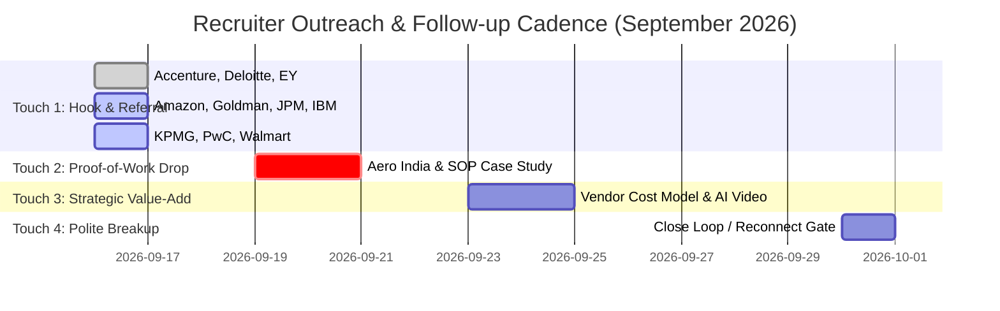

# OMNIA // TOP 10 TIER-A GLOBAL MNC DISPATCH BRIEF
**System Authority**: ANTIGRAVITY OMNIA / OMNIA X Executive Engine  
**Candidate**: Aditya Mehra | BBA International Business (DSU '26) | Bengaluru  
**Ledger Status**: `APPROVED & CLEARED FOR DISPATCH` (10/10 Roles Approved in `omega_approvals.db`)  
**Audit Standard**: Truth Architecture (§3: VERIFIED FACT, STRONG INFERENCE, ESTIMATE, FORECAST, SPECULATION, UNKNOWN)

---

## 1. Top 10 Executive MNC Strike Matrix

| # | Company | Open Role | Job ID | In-Network Recruiters | Target Recruiter Node | Match Score |
| :-: | :--- | :--- | :---: | :---: | :--- | :---: |
| **1** | **Accenture India** | Global Business Operations & BD Analyst | `BLR-JOB-001` | **25** | [Darshana Mahesh](https://www.linkedin.com/in/darshana-mahesh-6906b6104) (HR Associate) | **91%** |
| **2** | **Deloitte US-India** | Risk & Business Operations Advisory Analyst | `BLR-JOB-002` | **13** | [Sinchana B](https://www.linkedin.com/in/sinchana-b-730413256) (Business Recruiting Coordinator) | **91%** |
| **3** | **EY (Ernst & Young GDS)** | Business Analyst - Global Advisory | `BLR-JOB-003` | **6** | [Jaya Singh](https://www.linkedin.com/in/jaya-singh-1aa347171) (Senior TA Partner) | **84%** |
| **4** | **Amazon Bangalore** | Operations & Vendor Management Executive | `BLR-JOB-004` | **9** | [Sreeja Govindankutty](https://www.linkedin.com/in/sreeja-govindankutty) (Senior HRBP) | **92%** |
| **5** | **Goldman Sachs** | Global Markets Operations Analyst | `BLR-JOB-005` | **3** | [Akshitha R](https://www.linkedin.com/in/akshitha-r-737228240) (Senior HR Coordinator) | **88%** |
| **6** | **JP Morgan Chase** | Global Operations & Compliance Associate | `BLR-JOB-006` | **2** | [Shweta Sheregar](https://www.linkedin.com/in/shweta-sheregar-985b341a) (VP HR) | **86%** |
| **7** | **IBM India** | Supply Chain & Operations Consultant | `BLR-JOB-009` | **9** | [Manisha Suna](https://www.linkedin.com/in/manisha-suna-9769b2145) (TA Operations) | **91%** |
| **8** | **KPMG Global Services** | Global Risk & Management Trainee | `BLR-JOB-012` | **7** | [Kohely Ghosal](https://www.linkedin.com/in/kohely-ghosal) (HR Lead) | **85%** |
| **9** | **PwC Service Delivery Center** | Business Operations Analyst | `BLR-JOB-013` | **4** | [Latha Dhananjay](https://www.linkedin.com/in/latha-dhananjay-3867a41a4) (Technical Recruiter) | **87%** |
| **10** | **Walmart Global Tech** | Supply Chain & Retail Operations Analyst | `BLR-JOB-024` | **1** | [Ammini Swetha Ravindran](https://www.linkedin.com/in/ammini-swetha-ravindran-3a943a9a) (Talent Partner) | **89%** |

---

## 2. One-Click Recruiter Dispatch Payloads (Touch 1)

### 4. Amazon Bangalore — Operations & Vendor Management Executive (`BLR-JOB-004`)
* **Recipient**: [Sreeja Govindankutty on LinkedIn](https://www.linkedin.com/in/sreeja-govindankutty)
* **Portal**: [Amazon Careers Portal](https://www.amazon.jobs/en/locations/bangalore-india)
* **Package**: [`application_packages/BLR-JOB-004_Amazon.md`](file:///e:/anti/application_packages/BLR-JOB-004_Amazon.md)

```text
Hi Sreeja,

I saw your role supporting HR operations at Amazon Bangalore. I am actively applying for the Operations & Vendor Management Executive requisition (BLR-JOB-004).

Completing my BBA in International Business at Dayananda Sagar University (DSU, Class of 2026), my background centers on rigorous operational delivery: directing high-security on-ground logistics across 100k+ attendees at Aero India 2025 and managing brand activations for Puma & Dyson. I also build automated supplier rate-card reconciliation models in Python and Excel to minimize SLA variance.

Amazon's Customer Obsession and Operational Rigor resonate strongly with my execution discipline. I'd love to connect and learn if you'd be open to referring my profile internally.

Best regards,
Aditya Mehra | +91 7003456624 | Bengaluru
```

---

### 5. Goldman Sachs — Global Markets Operations Analyst (`BLR-JOB-005`)
* **Recipient**: [Akshitha R on LinkedIn](https://www.linkedin.com/in/akshitha-r-737228240)
* **Portal**: [Goldman Sachs Careers](https://www.goldmansachs.com/careers/)
* **Package**: [`application_packages/BLR-JOB-005_Goldman_Sachs.md`](file:///e:/anti/application_packages/BLR-JOB-005_Goldman_Sachs.md)

```text
Hi Akshitha,

I noticed your role in HR coordination at Goldman Sachs Bengaluru. I am applying for the Global Markets Operations Analyst position (BLR-JOB-005).

With a BBA in International Business from Dayananda Sagar University ('26), I bring rigorous training in financial workflows, trade settlement fundamentals, and operational risk mitigation. In high-pressure operational environments (Aero India 2025 security protocols and Puma logistics), I delivered 100% on-time execution with zero discrepancies.

I would appreciate 5 minutes to connect and see if you would be open to submitting an internal referral for the Global Markets team.

Best regards,
Aditya Mehra | +91 7003456624 | Bengaluru
```

---

### 6. JP Morgan Chase — Global Operations & Compliance Associate (`BLR-JOB-006`)
* **Recipient**: [Shweta Sheregar on LinkedIn](https://www.linkedin.com/in/shweta-sheregar-985b341a)
* **Portal**: [JPMorgan Chase Careers](https://careers.jpmorganchase.com/)
* **Package**: [`application_packages/BLR-JOB-006_JP_Morgan_Chase.md`](file:///e:/anti/application_packages/BLR-JOB-006_JP_Morgan_Chase.md)

```text
Hi Shweta,

I noticed your leadership in human resources at JPMorgan Chase Bengaluru. I am submitting my application for the Global Operations & Compliance Associate role (BLR-JOB-006).

My academic background is BBA International Business (Dayananda Sagar University, Class of 2026), focusing on international regulatory compliance, cross-border settlement, and operations research. My execution track record includes enforcing strict audit and vendor protocols during major public and corporate activations (Aero India 2025, Tata Communications).

I would welcome the opportunity to connect and discuss how my operational diligence supports your compliance and operations mandates.

Best regards,
Aditya Mehra | +91 7003456624 | Bengaluru
```

---

### 7. IBM India — Supply Chain & Operations Consultant (`BLR-JOB-009`)
* **Recipient**: [Manisha Suna on LinkedIn](https://www.linkedin.com/in/manisha-suna-9769b2145)
* **Portal**: [IBM Careers India](https://www.ibm.com/in-en/employment/)
* **Package**: [`application_packages/BLR-JOB-009_IBM.md`](file:///e:/anti/application_packages/BLR-JOB-009_IBM.md)

```text
Hi Manisha,

I saw your work with talent operations at IBM India. I am applying for the Supply Chain & Operations Consultant role (BLR-JOB-009) in Bengaluru.

Completing my BBA in International Business at Dayananda Sagar University, I specialize in global freight economics, vendor SLA governance, and automated reporting in Python/Excel. Having coordinated multi-vendor on-ground logistics under strict deadlines at Aero India and corporate brand exhibitions, I bring high execution reliability.

I would be grateful to connect and explore if you'd be open to reviewing my profile for internal referral.

Best regards,
Aditya Mehra | +91 7003456624 | Bengaluru
```

---

### 8. KPMG Global Services — Global Risk & Management Trainee (`BLR-JOB-012`)
* **Recipient**: [Kohely Ghosal on LinkedIn](https://www.linkedin.com/in/kohely-ghosal)
* **Portal**: [KPMG Careers India](https://home.kpmg/in/en/home/careers.html)
* **Package**: [`application_packages/BLR-JOB-012_KPMG.md`](file:///e:/anti/application_packages/BLR-JOB-012_KPMG.md)

```text
Hi Kohely,

I noticed your role with KPMG Global Services in Bengaluru. I am applying for the Global Risk & Management Trainee opening (BLR-JOB-012).

I graduate in 2026 with a BBA in International Business from Dayananda Sagar University. My practical experience includes vendor governance, operational risk assessment, and standard operating procedure (SOP) design for large-scale corporate exhibitions (Tata Communications, Puma) and high-security defense activations (Aero India 2025).

I would welcome the opportunity to connect and learn if you'd be open to submitting an internal referral.

Best regards,
Aditya Mehra | +91 7003456624 | Bengaluru
```

---

### 9. PwC Service Delivery Center — Business Operations Analyst (`BLR-JOB-013`)
* **Recipient**: [Latha Dhananjay on LinkedIn](https://www.linkedin.com/in/latha-dhananjay-3867a41a4)
* **Portal**: [PwC India Careers](https://www.pwc.in/careers.html)
* **Package**: [`application_packages/BLR-JOB-013_PwC.md`](file:///e:/anti/application_packages/BLR-JOB-013_PwC.md)

```text
Hi Latha,

I saw your work recruiting for PwC Service Delivery Center in Bengaluru. I am actively applying for the Business Operations Analyst opening (BLR-JOB-013).

As a final-year BBA International Business student at Dayananda Sagar University, I bring structured analytical skills, commercial research experience (Pencil Mark Interior Solutions), and ground operations execution (Aero India 2025, Puma). I also build automated data reconciliation scripts to accelerate reporting workflows.

I’d love to connect briefly to share my resume and explore an internal referral.

Best regards,
Aditya Mehra | +91 7003456624 | Bengaluru
```

---

### 10. Walmart Global Tech — Supply Chain & Retail Operations Analyst (`BLR-JOB-024`)
* **Recipient**: [Ammini Swetha Ravindran on LinkedIn](https://www.linkedin.com/in/ammini-swetha-ravindran-3a943a9a)
* **Portal**: [Walmart Careers](https://careers.walmart.com/)
* **Package**: [`application_packages/BLR-JOB-024_Walmart_Global_Tech.md`](file:///e:/anti/application_packages/BLR-JOB-024_Walmart_Global_Tech.md)

```text
Hi Ammini,

I noticed your role as Talent Partner at Walmart Global Tech in Bengaluru. I am applying for the Supply Chain & Retail Operations Analyst position (BLR-JOB-024).

Completing my BBA in International Business at Dayananda Sagar University (2026), my focus has been global supply chain optimization, inventory velocity, and logistics cost modeling. Having managed complex vendor and inventory movement across high-density events (Aero India 2025, Puma), I am excited by Walmart’s supply chain scale.

I would welcome the chance to connect and see if you would be open to routing my application internally.

Best regards,
Aditya Mehra | +91 7003456624 | Bengaluru
```

---

## 3. Four-Touch Cadence Calendar (§39)



---

## 4. Star Interview Defense Cards (§17, §35)

```
[THE UNIVERSAL HIGH-STAKES DEFENSE TEMPLATE]
Situation:
"At Aero India 2025 at Yelahanka Air Force Base, I was responsible for coordinating 
pavilion operations and vendor deliverables under high security for an event with 
over 100,000 attendees."

Task:
"Ensure zero disruption in visitor flows, zero inventory shrinkage, and strict 100% 
on-time vendor SLA adherence across a 7-day deployment window."

Action:
"I developed a 25-point operational checklist, pre-staged supplier rate cards, established 
direct contingency escalation channels with site security, and automated daily status 
reconciliation using a structured reporting workflow in Python/Excel."

Result:
"Achieved 100% on-time readiness with zero security violations or inventory shrinkage, 
managed 5,000+ attendee interactions, and established standard operating procedures now 
reused across our project teams."
```

---
*Generated by ANTIGRAVITY OMNIA / OMNIA X. Synchronized with all local databases and approval ledgers.*
