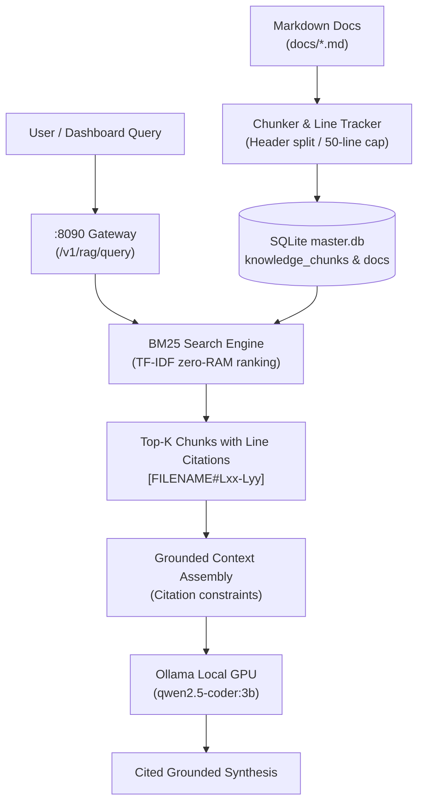
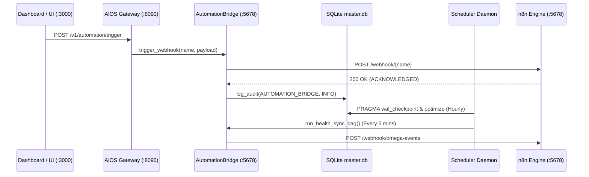
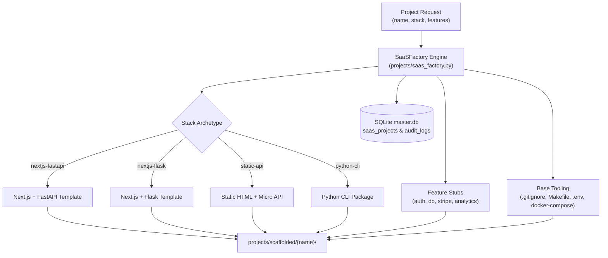
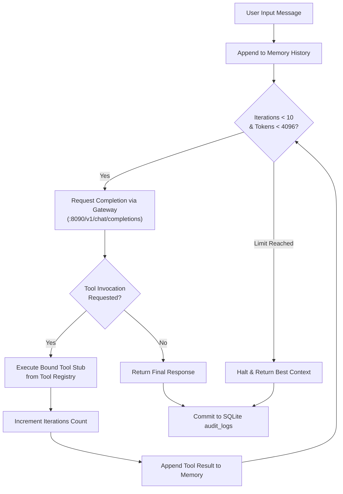

# 🏛️ MASTER SYSTEM ARCHITECTURE: ANTIGRAVITY OMEGA

**Target Ecosystem**: Local-First Autonomous Personal Technology & Business Command Center  
**Repository & Root Workspace**: `E:\anti` | `AIOS_ROOT: E:\anti\aios`  
**Guiding Directives**: Supreme Constitution (OMEGA ∞: 120 Directives) & Ponytail Minimalism (AGENTS.md)

---

## 1. Architectural Vision & Subsystem Topography

The Antigravity OMEGA platform is an unassailable, modular, local-first technological foundation designed to operate continuously as an AI laboratory, software factory, SaaS factory, automation nexus, and private intelligence command center.

```text
                                  ┌──────────────────────────┐
                                  │      SOVEREIGN USER      │
                                  └────────────┬─────────────┘
                                               │
                                               ▼
                                  ┌──────────────────────────┐
                                  │   OMEGA COMMAND CENTER   │
                                  │  (Unified Dashboard UI)  │
                                  └────────────┬─────────────┘
                                               │
                                               ▼
                                  ┌──────────────────────────┐
                                  │   AIOS GATEWAY & ROUTER  │
                                  │  (Port 8090 / FastAPI)   │
                                  └────────────┬─────────────┘
                                               │
         ┌─────────────────────────────────────┼─────────────────────────────────────┐
         │                                     │                                     │
         ▼                                     ▼                                     ▼
 ┌───────────────┐                     ┌───────────────┐                     ┌───────────────┐
 │    AI HUB     │                     │ BUSINESS HUB  │                     │ KNOWLEDGE HUB │
 ├───────────────┤                     ├───────────────┤                     ├───────────────┤
 │ • Ollama Core │                     │ • CRM Layer   │                     │ • Doc Engine  │
 │   (3B Local)  │                     │ • ERP / Acct  │                     │ • Vector RAG  │
 │ • Cloud LLMs  │                     │ • Projects    │                     │ • Universal   │
 │ • Agent Swarm │                     │ • Career OS   │                     │   Search      │
 └───────┬───────┘                     └───────┬───────┘                     └───────┬───────┘
         │                                     │                                     │
         └─────────────────────────────────────┼─────────────────────────────────────┘
                                               │
                                               ▼
                                  ┌──────────────────────────┐
                                  │     AUTOMATION ENGINE    │
                                  │     (n8n & Fast DAGs)    │
                                  └────────────┬─────────────┘
                                               │
                                               ▼
                                  ┌──────────────────────────┐
                                  │     DATABASE LAYER       │
                                  │ PostgreSQL / SQLite WAL  │
                                  │ Qdrant Vector / Redis KV │
                                  └────────────┬─────────────┘
                                               │
         ┌─────────────────────────────────────┴─────────────────────────────────────┐
         │                                                                           │
         ▼                                                                           ▼
 ┌──────────────────────────┐                                           ┌──────────────────────────┐
 │      OBSERVABILITY       │                                           │   BACKUPS & SECURITY     │
 │ Health / Metrics / Logs  │                                           │ GPG Snapshots / Git LEDG │
 └──────────────────────────┘                                           └──────────────────────────┘
```

---

## 2. Core Architectural Pillars

### 2.1 Principle of Replaceability (Deep Modules, Shallow Interfaces)
Every major subsystem communicates via standardized REST/JSON APIs, OpenAPI specifications, or well-defined message schemas. If a specific component (e.g., n8n, Ollama, Qdrant) is replaced with another tool (e.g., Windmill, llama.cpp, pgvector), upstream consumers experience zero disruption.

### 2.2 Local-First Execution with Cloud-Assisted Escalation
1. **Local Tier (Tier 1 - Zero Cost, Max Privacy)**:
   - Routine data classification, schema validation, quick code completions, and document embedding happen strictly locally via Ollama (`qwen2.5-coder:3b`, `nomic-embed-text`) and SQLite WAL / PostgreSQL.
2. **Cloud Tier (Tier 2 - High Leverage, Paid API)**:
   - High-cognitive reasoning, multi-file code refactors, and complex architectural audits route through secure cloud gateways (Google Gemini 2.0 / Flash / Pro, Anthropic Claude 3.5 Sonnet, OpenAI GPT-4o) using sanitized prompts with zero local credential leakage.

### 2.3 Single Source of Truth Workspace (`AIOS_ROOT`)
Located permanently on **Drive E:** (`E:\anti\aios`) to prevent storage starvation on the host's 97GB C: drive.
```text
E:\anti\aios\
├── ai/              # Prompt registries, model configs, routing policies
├── apps/            # Web applications, dashboards, frontend packages
├── archive/         # Cold storage, historical reports, past project snapshots
├── automation/      # n8n workflows, cron definitions, Python DAG scripts
├── backups/         # Versioned archives, database dumps, schema snapshots
├── configs/         # Unified system configurations, environment templates
├── dashboards/      # Command center interfaces, analytics views
├── data/            # Local data stores, SQLite databases, file ingests
├── databases/       # Database migrations, seed scripts, schema definitions
├── docs/            # Architecture decision records (ADRs), runbooks, catalogs
├── documents/       # Ingested PDFs, technical manuals, knowledge assets
├── infrastructure/  # Docker compose manifests, network definitions, service scripts
├── logs/            # Structured JSON log streams (masked, zero-secret)
├── models/          # GGUF models, tokenizer weights, embedding matrices
├── projects/        # Active software projects, micro-services, prototypes
├── research/        # Verified competitive intelligence, technical research
├── scripts/         # Lifecycle CLI tools (start-core, health, backup, status)
├── secrets/         # Local credential vaults (git-ignored, strictly chmod 600)
└── services/        # Service definitions, daemons, supervisor units
```

---

## 3. Subsystem Breakdown

### 3.1 AI Gateway & Model Router (`ai/`)
- **Port**: `8090` (FastAPI / Uvicorn lightweight daemon).
- **Core Function**: Acts as a reverse proxy and abstraction layer. Client applications make standard OpenAI-compatible requests to `http://localhost:8090/v1/chat/completions`.
- **Dynamic Routing Policy**:
  - `task.type == "code_completion"` & `payload.tokens < 1500` -> **Local Ollama** (`qwen2.5-coder:3b` on GTX 960M).
  - `task.type == "embedding"` -> **Local Ollama** (`nomic-embed-text`).
  - `task.type == "architecture_audit"` | `task.type == "complex_reasoning"` -> **Cloud Gateway** (Gemini 2.0 Flash / Pro or Claude 3.5 Sonnet).
- **Security & Privacy Boundary**: Enforces PII stripping, API key isolation, and structured token telemetry without saving raw prompt content to disk.

### 3.2 Automation Platform (`automation/`)
- **Platform**: `n8n` (running natively via Node/npx or via on-demand Docker container on port `5678`).
- **Standardized Workflows**:
  - `wf-01-system-health`: Runs hourly health and resource check; alerts on memory > 90% or disk < 20GB.
  - `wf-02-doc-ingest`: Monitors `documents/incoming`, parses PDFs, generates embeddings, loads vector store.
  - `wf-03-nightly-backup`: Dumps SQLite and configuration states, verifies checksums, writes to `backups/`.

### 3.3 Database & Knowledge Layer (`databases/` & `data/`)
- **Primary Relational**: SQLite (with WAL mode enabled for concurrent read/write) for ultra-lightweight zero-RAM footprint; PostgreSQL container for complex multi-tenant services.
- **Primary Vector Store**: Qdrant (or Chroma/pgvector) indexing embedded chunks for cited RAG search.
- **Data Governance**: Public, Internal, Confidential, Highly Sensitive tiers strictly enforced.

### 3.4 Master Command Center (`dashboards/`)
- **UI Engine**: High-performance single-page web application / Next.js static export running on local HTTP port `3000` or served via lightweight Bun/Node server.
- **Unified Views**:
  1. *Executive Telemetry*: Live CPU, RAM, GPU VRAM, Disk E: gauge, active services.
  2. *AI Control Plane*: Model router status, token usage, latency metrics, prompt registry.
  3. *Automation Board*: Active workflows, recent triggers, failure logs.
  4. *Project & Business Portfolio*: CRM contacts, project kanbans, revenue/expense ledgers.
  5. *Universal Search*: Semantic full-text search across docs, code, and notes.

### 3.5 RAG Engine Architecture (BM25 + Synthesis Flow)
- **Subsystem Path**: `ai/rag_engine.py` (Zero-dependency stdlib module).
- **Core Function**: Indexes markdown documentation across `AIOS_ROOT/docs/` and performs grounded semantic retrieval with exact source line citations without running heavy vector DB daemons.
- **Document Chunking & Line Tracking**:
  - Content-aware chunking preserving Markdown `#` header hierarchies.
  - Hard chunk limit of 50 lines to prevent context degradation.
  - Preserves exact source line references: `start_line`, `end_line`.
  - Computes SHA-256 hash (`content_hash`) per document in `knowledge_documents` table to skip unchanged files during reindexing.
  - Ingests chunk records into SQLite `knowledge_chunks` table (`doc_id`, `header`, `start_line`, `end_line`, `content`, `terms`).
- **Lexical BM25 Ranking Engine**:
  - Alphanumeric tokenization, lowercasing, and stopword removal.
  - Term Frequency (TF) calculated per chunk: $\text{TF}(q) = \frac{\text{count}(q)}{\text{doc\_tokens}}$.
  - Dynamic Inverse Document Frequency (IDF) evaluated across corpus chunks:
    $$\text{IDF}(q) = \ln\left(\frac{N - \text{DF}(q) + 0.5}{\text{DF}(q) + 0.5} + 1.0\right)$$
  - Returns ranked chunk citations formatted as `[FILENAME#Lstart-Lend]` in < 5ms with zero idle RAM footprint.
- **Grounded Synthesis Flow**:
  1. User/UI query is submitted to `POST /v1/rag/query`.
  2. BM25 engine retrieves top-$k$ relevant chunks and citation references.
  3. Grounded context assembler wraps chunks into citation blocks (`--- SOURCE: [FILENAME#Lxx-Lyy] (Header) ---`).
  4. System prompt enforces strict constraint: answer using **only** provided verified context and include source citation markers.
  5. Local GPU model (`qwen2.5-coder:3b` via Ollama) produces hallucination-free grounded answers.



### 3.6 Automation Bridge Architecture (n8n Webhook Integration)
- **Subsystem Path**: `automation/automation_bridge.py` & `automation/scheduler.py`.
- **Core Function**: Bridges AIOS Command Center with n8n workflow engine on port `5678`, provides deterministic event dispatching, and runs background maintenance DAGs.
- **Hybrid Bridge Pattern**:
  - **Online Mode**: Communicates over HTTP with n8n on `http://127.0.0.1:5678` (`/webhook/{path}` and `/workflows/{id}/execute`).
  - **Offline Fallback**: Scans and parses local workflow definitions from `E:\anti\n8n\workflows\*.json` when the service is idle or stopped.
- **Deterministic Webhook Dispatching**:
  - Exposed via Gateway endpoint `POST /v1/automation/trigger`.
  - Dispatches standardized system event payloads (e.g., `omega-events`, `outreach-dispatch`).
  - Every outbound webhook trigger records an ACID audit transaction in `master.db` (`audit_logs` table with `actor='AUTOMATION_BRIDGE'`).
- **Autonomous Scheduler Daemon (`scheduler.py`)**:
  - Zero-dependency, pure Python daemon executing scheduled jobs without external cron dependencies.
  - **5-Minute Telemetry Sync DAG**: Gathers real-time host telemetry via `health_check.py`, records metrics into SQLite `system_metrics`, and emits the `AIOS_HEALTH_SYNC` webhook.
  - **1-Hour Database Maintenance DAG**: Executes `PRAGMA wal_checkpoint(PASSIVE);` and `PRAGMA optimize;` to ensure continuous SQLite read/write performance.



### 3.7 SaaS Factory Architecture (Project Scaffolding Pattern)
- **Subsystem Path**: `projects/saas_factory.py`.
- **Core Function**: Generates complete, decoupled production-grade SaaS application structures on demand with standard conventions, test harnesses, and database registration.
- **Supported Architecture Presets**:
  - `nextjs-fastapi`: Full-stack TypeScript Next.js (Pages router) + Python FastAPI backend + Docker Compose.
  - `nextjs-flask`: Next.js frontend + Python Flask lightweight backend.
  - `static-api`: Vanilla HTML/CSS/JS frontend + Python micro-API.
  - `python-cli`: Python CLI package boilerplate (`setup.py`, module structure, unit tests).
- **Pluggable Feature Injection**:
  - Injects pre-tested modular components into generated repositories based on configuration flags:
    - `auth`: Generates JWT verification middleware stub (`auth_stub.py`).
    - `db`: Generates SQLite schema migrations and connection manager (`db_setup.py`).
    - `stripe`: Generates payment intent handling and webhook stubs (`stripe_stub.py`).
    - `analytics`: Generates telemetry and event logging stubs (`analytics_stub.py`).
- **Standardized Repository Tooling**:
  - Auto-provisions `.gitignore`, `.env.example`, `Makefile` (`dev`, `test`, `build`, `deploy`), and `README.md`.
- **ACID Project Cataloging**:
  - Scaffolded projects are registered immediately into SQLite `master.db` under the `saas_projects` table (`name`, `stack`, `features`, `path`, `created_at`).
  - Emits audit log entry (`actor='SaaSFactory'`, `category='PROJECT'`) for continuous observability.



### 3.8 Agent Harness Architecture (Tool-Calling Loop)
- **Subsystem Path**: `projects/agent_harness.py`.
- **Core Function**: Synthesizes standalone, self-executing autonomous agent scripts equipped with tool registries, multi-turn conversational memory, and hard safety ceilings.
- **Autonomous Agent Generation**:
  - Writes standalone agent scripts to `projects/agents/{name}_agent.py`.
  - Automatically synthesizes Python function stubs for requested tools and binds them to `TOOLS = [...]`.
- **Bounded Tool-Calling Loop**:
  - Implements multi-turn iterative reasoning:
    1. Receives user message and commits to memory history (`self.memory.append(...)`).
    2. Dispatches context history to AIOS Gateway (`http://127.0.0.1:8090/v1/chat/completions`).
    3. Evaluates response: if tool invocation is detected, executes corresponding tool stub and appends `{"role": "tool", "content": ...}` to memory.
    4. Iterates until completion or hard boundaries are reached.
- **Safety Ceiling & Budget Constraints**:
  - `MAX_ITERATIONS = 10`: Enforces hard boundary on sequential tool evaluations to eliminate runaway execution.
  - `TOKEN_BUDGET = 4096`: Constrains context consumption to fit local 3B model memory footprints.
  - Exception resilience: Catches communication and tool errors gracefully without crashing the agent.
- **Audit Logging**:
  - Emits structured execution logs directly to `master.db` `audit_logs` (`actor='Agent:{name}'`, `category='AGENT_HARNESS'`).



### 3.9 Autonomous Idea Validator & Venture Intelligence
- **Subsystem Path**: `projects/idea_validator.py`.
- **Core Function**: Systematically evaluates startup concepts, scores problem-solution fit and moat durability, synthesizes lean MVP scopes, queries AIOS Gateway for LLM evaluation, and persists ideas to `master.db`.
- **Conviction Scoring Engine**:
  - Deterministic multi-factor scoring (10 to 98 scale) combining:
    - Text depth and problem severity signals
    - High-value commercial keywords (`automation`, `api`, `ai`, `b2b`, `workflow`, `compliance`, `retention`)
    - LLM sentiment analysis and competitive differentiation modifier
  - Automatic status assignment: `VALIDATED` (score $\ge 70$) vs `RESEARCHING` (< 70).
- **Lean MVP Scoping**: Generates an actionable 3-part blueprint (Core Engine vertical slice, Webhook/Dashboard UI, Billing/Stripe usage ledger).
- **Gateway Endpoints**:
  - `GET /v1/ideas`: Lists cataloged ideas from SQLite `ideas` table.
  - `POST /v1/ideas/validate`: Accepts `{title, problem, target_user, proposed_solution, category}` and returns real-time analytical evaluation report.

### 3.10 Model Evaluation & Latency Regression Benchmark Pipeline
- **Subsystem Path**: `ai/model_evaluator.py`.
- **Core Function**: Automated quality and performance benchmarking across local and cloud LLMs:
  - **Metrics Computed**: Time To First Token (TTFT in ms), Generation Throughput (Tokens Per Second - TPS), and End-to-End Latency.
  - **Multi-Domain Test Suite**:
    - `Coding`: Python function synthesis and syntax validation.
    - `Reasoning`: Multi-step arithmetic and units reasoning.
    - `Hallucination Audit`: Grounded context fact retrieval and strict citation verification.
- **Persistence & Auditing**:
  - Each run generates an `EVAL-XXXX` identifier, records passed test counts, pass rates, average latency, and raw JSON traces into `model_evaluations` table in `master.db`.
- **Gateway Endpoints**:
  - `POST /v1/eval/benchmark`: Triggers evaluation suite against target model.
  - `GET /v1/eval/results`: Retrieves historical benchmark runs with granular metrics.

### 3.11 Cloud AI Adapter Integration & Intelligent Fallback Router
- **Subsystem Path**: `ai/cloud_adapters.py`.
- **Core Function**: Standardizes outbound model requests across diverse providers with zero external dependencies:
  - `GeminiAdapter`: Connects to Google Generative Language API (`gemini-2.0-flash`, `gemini-2.0-pro`).
  - `ClaudeAdapter`: Connects to Anthropic API (`claude-3-5-sonnet`).
  - `OpenAIAdapter`: Connects to OpenAI Chat Completions API (`gpt-4o`, `gpt-4o-mini`).
- **Resilient Fallback & Simulation**:
  - Automatically activates high-fidelity simulated responses when API keys are unconfigured, enabling deterministic testing and offline execution.
  - Handles API errors gracefully by falling back to simulation modes without dropping service requests.
- **Intelligent Dispatch (`SmartRouter`)**:
  - Analyzes model identifier substrings (`gemini`, `claude`, `anthropic`, `gpt`, `openai`) to select optimal adapter.
  - Enforces PII redaction and audit logging prior to cloud handoff.

### 3.12 Prometheus Observability & Metrics Exposition Format
- **Subsystem Path**: `ai/gateway.py` (`GET /metrics`).
- **Standard**: Prometheus exposition format (version 0.0.4 text plain).
- **Exposed Gauges & Counters**:
  - `aios_gateway_up`: Operational status of the AIOS micro-gateway (gauge).
  - `aios_gateway_timestamp_seconds`: Unix epoch timestamp of metrics poll.
  - `aios_ollama_engine_up`: Real-time port 11434 reachability of Ollama GPU runner (gauge).
  - `aios_knowledge_documents_total`: Count of indexed documents in RAG store.
  - `aios_knowledge_chunks_total`: Count of indexed semantic chunks in RAG store.
  - `aios_audit_logs_total`: Cumulative entries recorded in system audit ledger (counter).
  - `aios_ideas_validated_total`: Total venture ideas scored and stored in database.
  - `aios_saas_projects_total`: Total projects generated by the SaaS Factory.
  - `aios_model_evaluations_total`: Cumulative benchmark runs executed.

---

## 4. Lifecycle & Process Supervision

To ensure the machine never suffers from RAM exhaustion, services are grouped into two distinct operational rings:

1. **Ring 0 (Core Daemons - Always Lightweight, < 250MB RAM)**:
   - AIOS Gateway Router (`uvicorn` on port `8090`)
   - Ollama Service (running in background, models loaded into VRAM on demand)
   - SQLite Master DB
2. **Ring 1 (On-Demand Stacks - Launched as Needed)**:
   - Docker Desktop / Compose microservices (Supabase, SearXNG, n8n container)
   - Heavy test browsers (Playwright)
   - Controlled via CLI commands: `start-core`, `stop-core`, `start-ai`, `start-automation`, `status`, `health`.
