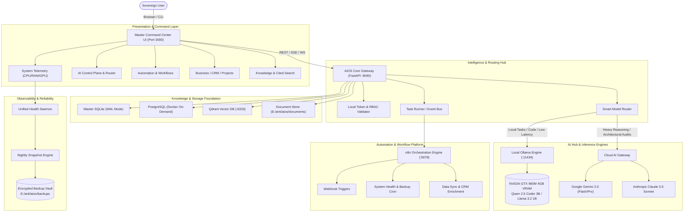

# 🗺️ ARCHITECTURE DIAGRAMS: ANTIGRAVITY OMEGA

Visual architecture documentation for the Antigravity OMEGA Autonomous Technology Command Center.

---

## 1. End-to-End System Topography



---

## 2. Dynamic AI Model Routing Flow

```mermaid
flowchart TD
    A[Client Request Received at :8090] --> B{Sensitive / PII Data?}
    
    B -->|Yes - Confidential| C[Force Local Execution]
    B -->|No - Sanitized| D{Task Complexity Evaluation}
    
    C --> E[Ollama Local Engine]
    E --> F[Qwen 2.5 Coder 3B / Llama 3.2 1B]
    
    D -->|Quick Code Completion <1500 Tok| E
    D -->|Embedding Calculation| G[Nomic Embed Text (Local)]
    D -->|Architectural Reasoning / Deep Synthesis| H[Cloud AI Gateway]
    
    H --> I{Provider Availability}
    I -->|Primary| J[Gemini 2.0 Flash / Pro]
    I -->|Fallback| K[Claude 3.5 Sonnet / OpenAI]
    
    F --> L[Structured JSON Output]
    G --> L
    J --> L
    K --> L
    
    L --> M[Telemetry Logged: Latency / Token Count / Privacy Flag]
    M --> N[Return Response to Client]
```

---

## 3. Knowledge Ingestion & Cited RAG Pipeline

```mermaid
flowchart LR
    Doc[Raw Documents / Notes / PDFs] --> Parse[Text & Metadata Parser]
    Parse --> Clean[Cleaning & Header Normalization]
    Clean --> Chunk[Semantic Text Chunking]
    Chunk --> Embed[Local Embedding: nomic-embed-text]
    Embed --> Index[(Qdrant Vector Store)]
    
    UserQuery[User Question] --> QueryEmbed[Embed Query]
    QueryEmbed --> Search[(Vector Search & Inverted Index)]
    Index --> Search
    Search --> Rerank[Cross-Encoder Reranker]
    Rerank --> Context[Synthesized Context + Strict Citations]
    Context --> LLM[LLM Reasoning Engine]
    LLM --> CitedAnswer[Accurate, Cited Answer with File & Line References]
```



---

## 4. Host Storage Volume Allocation Topology

```mermaid
flowchart TB
    Host[Windows 10 Workstation Storage]
    
    subgraph DriveC["Drive C: System Partition (97.73 GB Total | 17.59 GB Free)"]
        direction TB
        C1["Windows OS & Core System DLLs"]
        C2["Installed Runtimes (Python 3.13, Node 26, Rust)"]
        C3["Antigravity / VS Code Executables"]
        C4["⚠️ POLICY: STRICT ZERO-DATA DUMP ZONE"]
    end

    subgraph DriveE["Drive E: OMEGA Primary Hub (586.54 GB Total | 335.76 GB Free)"]
        direction TB
        E1["AIOS_ROOT Workspace (E:/anti/aios)"]
        E2["Ollama GGUF Model Blobs (E:/anti gravity/OllamaData)"]
        E3["Docker Volume Mounts & Virtual Disks"]
        E4["SQLite WAL Databases & Qdrant Collections"]
        E5["Document Repositories, Research, & Backups"]
        E6["✅ PRIMARY EXECUTION & PERSISTENCE ZONE"]
    end

    subgraph DriveD["Drive D: Secondary Partition (344.84 GB Total | 69.04 GB Free)"]
        direction TB
        D1["Long-term Cold Archives"]
        D2["Media Files & Offline Datasets"]
    end
```


