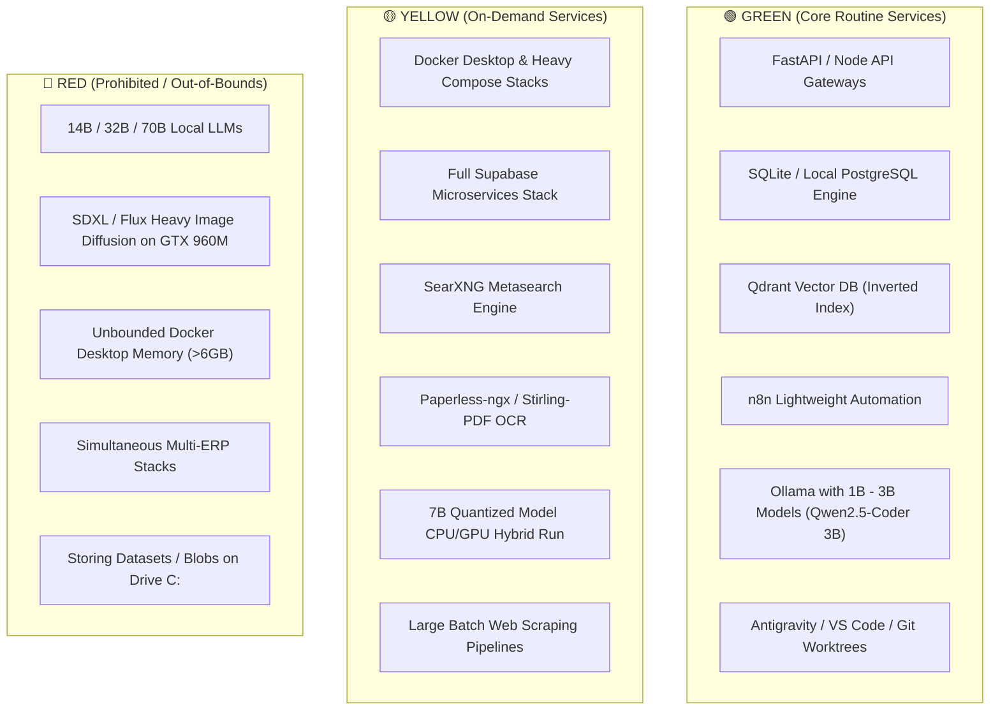

# 🛡️ HARDWARE PROFILE & WORKLOAD GOVERNOR: OMEGA COMMAND CENTER

**Host System**: Intel Core i7-6700HQ (4C/8T) | 16GB DDR4 RAM | NVIDIA GeForce GTX 960M (4GB VRAM)  
**Storage Architecture**: 97GB C: (17GB Free) | 344GB D: (69GB Free) | 586GB E: (335GB Free)  
**Standard Compliance**: OMEGA Constitution Section 5 & 14, AGENTS.md Minimalist Principles

---

## 1. Executive Capability Summary

The machine is an agile, multi-purpose development workstation capable of running high-performance local web applications, automation engines, relational databases, vector search indices, and lightweight local AI models (1B to 3.8B parameter GGUF).

Because physical RAM is 16 GB with ~2.5 GB free headroom under active multi-app development, and discrete GPU VRAM is 4 GB (Maxwell architecture, Compute Capability 5.0), **the system must be managed with architectural discipline**:
1. **Never attempt unquantized 7B/14B/70B models locally** (would cause immediate swapping or OOM kill).
2. **Never store containers, models, or large caches on Drive C:** (Drive C: has only 17.59 GB free).
3. **Route heavy coding, massive reasoning, and complex document synthesis to Cloud AI Gateways** (Gemini 2.0 / Flash / Pro, Claude 3.5 Sonnet, GPT-4o), while keeping local models for fast, zero-latency, private offline tasks.

---

## 2. Hardware Constraint Breakdown

### 2.1 RAM Constraints (16 GB Physical Total)
- **Host Baseline Consumption**: ~13.4 GB currently used by Windows OS, Antigravity IDE, language server, Chrome, and desktop apps.
- **Available Working Buffer**: 2.5 GB to 3.5 GB safe memory ceiling.
- **Governor Policy**:
  - Always enforce memory limits on background daemon processes.
  - If Docker/WSL2 is activated, create `.wslconfig` capping WSL memory at **4.0 GB** and swap at **2.0 GB**.
  - Terminate idle Electron / WebView2 applications when running heavy build passes.

### 2.2 GPU Constraints (NVIDIA GeForce GTX 960M, 4 GB VRAM, CC 5.0)
- **Architecture**: Maxwell GM107.
- **CUDA Capability**: Compute Capability 5.0 (sm_50). Modern PyTorch 2.x CUDA 12+ prebuilt binaries drop native sm_50 support, but **llama.cpp / Ollama with cuBLAS, Vulkan, and DirectML backends fully support Maxwell**.
- **Usable VRAM for Models**: Up to **3.2 GB** (leaving 800 MB for Windows DWM and display buffer).
- **Optimal Model Quantizations**: `Q4_K_M`, `Q5_K_M`, `IQ4_XS`.

### 2.3 CPU Constraints (Intel Core i7-6700HQ @ 2.60 GHz, 4 Cores / 8 Threads)
- **Instruction Support**: `AVX2`, `FMA3`, `SSE4.2`.
- **Thermal Envelope**: 45W TDP laptop chip. Sustained 8-thread workloads trigger frequency throttling down to ~2.3 - 2.6 GHz.
- **Recommended Threading**: Limit background worker pools (e.g., UV, PyTest, llama.cpp, Bun) to **4 to 6 threads max** to maintain snappy IDE UI responsiveness.

### 2.4 Storage Constraints
- **Drive C: (`97.73 GB`, `17.59 GB Free`)**: **CRITICAL RED ZONE**. Low free space.
  - *Rule*: Absolutely NO models, Docker root data, or heavy data dumps on `C:`.
  - *Action*: Configure environment variables (`OLLAMA_MODELS`, `UV_CACHE_DIR`, `DOCKER_DATA_ROOT`) to Drive `E:`.
- **Drive E: (`586.54 GB`, `335.76 GB Free`)**: **SAFE GREEN ZONE**.
  - Dedicated home for `AIOS_ROOT` (`e:\anti\aios`), all Docker volumes, models, and databases.

---

## 3. Workload Classification Matrix

### Detailed Service Tiers

| Tier | Services | Max RAM Allocation | Operational Rule |
| :--- | :--- | :--- | :--- |
| **GREEN** *(Safe 24/7)* | SQLite, Ollama (1B-3B), FastAPI micro-gateway, n8n (native/light), Git, dev servers | < 1.8 GB RAM combined | Default auto-launch state |
| **YELLOW** *(On-Demand)* | Docker Compose stacks, Supabase local, PostgreSQL, Meilisearch, Playwright browser QA | 2.5 GB - 4.0 GB RAM | Start when needed; stop when done (`start-dev`, `stop-dev`) |
| **RED** *(Forbidden)* | 14B+ LLMs, Multiple simultaneous browser test instances, unconstrained Docker | > 6.0 GB RAM | Never run locally; route to Cloud API / VPS |

---

## 4. Recommended Local Model Registry Guidelines

| Model Family | Size / Quant | Memory Needed | Execution Mode | Role in OMEGA |
| :--- | :--- | :--- | :--- | :--- |
| **Qwen 2.5 Coder 3B** | 3.2B / `Q4_K_M` | ~2.1 GB VRAM | **100% GPU Offload** (GTX 960M) | **Primary Local Code Assistant** (Fast, accurate, fits in VRAM) |
| **Llama 3.2 1B / 3B** | 1.2B / 3.2B `Q4_K_M` | 1.1 GB / 2.0 GB VRAM | **100% GPU Offload** | Fast text classification, intent parsing, summarization |
| **SmolLM2 1.7B** | 1.7B / `Q4_K_M` | ~1.3 GB VRAM | **100% GPU Offload** | Offline agent planning, tool selection |
| **Nomic Embed Text** | 137M / `F16` | ~300 MB VRAM | **100% GPU Offload** | Vector embeddings for local RAG |
| **Qwen 2.5 7B** *(Optional)*| 7.6B / `Q4_K_M` | ~4.8 GB RAM/VRAM | Hybrid 60% GPU / 40% CPU | Run on-demand for offline reasoning (7-12 t/s) |
| **Cloud Models (Gemini/Claude)**| Cloud API | Zero local VRAM | Cloud HTTPS Gateway | Complex architecture, large multi-file refactors, deep research |

---

## 5. Concurrency & Performance Thresholds

- **Max Concurrent Local Model Inferences**: `1` (Single sequential inference stream to avoid VRAM thrashing).
- **Max Background Worker Threads**: `4` (Leaves 4 logical threads for OS and UI interactivity).
- **Max Active Docker Containers**: `4 - 6` lightweight Alpine-based micro-containers.
- **Disk Space Watermark on E:**: Warning at `< 50 GB Free`; Current Free is `335 GB` (Excellent headroom).
