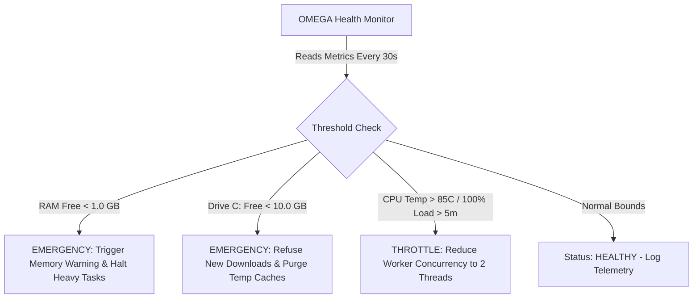

# ⚠️ RISK REGISTER & MITIGATION MATRIX: ANTIGRAVITY OMEGA

**Assessment Scope**: Hardware, Storage, Runtime, Security, and Operational Vulnerabilities  
**Scoring Model**: Severity (1-5) × Likelihood (1-5) = Risk Score (Max 25)

---

## 1. Identified Risk Matrix

| Risk ID | Category | Risk Description | Severity | Likelihood | Score | Primary Mitigation Strategy |
| :--- | :--- | :--- | :--- | :--- | :--- | :--- |
| **RSK-01** | **Memory** | Host RAM exhaustion under concurrent IDE, Chrome, and Docker loads (~2.5 GB free) | 5 | 4 | **20** | Enforce `.wslconfig` memory cap (4GB); prioritize zero-daemon SQLite over Postgres; run Ring 1 services on-demand. |
| **RSK-02** | **Storage** | Drive C: OS partition exhaustion (only 17.59 GB free space) | 5 | 3 | **15** | Relocate `AIOS_ROOT`, `OLLAMA_MODELS`, and package caches to Drive E: (335 GB Free). Strict zero-dump policy on C:. |
| **RSK-03** | **GPU / AI** | Modern PyTorch CUDA 12+ packages dropping native Maxwell (Compute Capability 5.0) support | 3 | 4 | **12** | Standardize local LLM execution on `llama.cpp` / Ollama with cuBLAS / Vulkan backend; bound models to 1B-3B GGUF. |
| **RSK-04** | **Infrastructure**| Docker Desktop daemon inactive & WSL2 distro missing, blocking instant container boot | 4 | 3 | **12** | Engineer Ring 0 Core (Gateway, SQLite, Health Daemon, Ollama) natively in Python/Node/Bun without container dependencies. |
| **RSK-05** | **Security** | Accidental commit or exposure of API credentials / private keys to public Git | 5 | 2 | **10** | Strict `.gitignore` on `secrets/` and `*.env`; automated regex hook preventing git staging of tokens. |
| **RSK-06** | **Privacy** | Sensitive business or personal data transmitted unencrypted to external Cloud LLMs | 4 | 2 | **8** | Implement client-side PII sanitizer in Gateway Router; force local-only routing for Tier P3/P4 confidential data. |
| **RSK-07** | **Thermal** | CPU thermal throttling during prolonged multi-threaded compiles or test suites | 3 | 3 | **9** | Limit background worker pools to 4 threads; preserve 4 logical threads for interactive responsiveness. |

---

## 2. Risk Trigger & Escalation Protocol

---

## 3. Contingency Action Plans

### Contingency RSK-01 (Memory Pressure Event):
- Health daemon detects free memory `< 1.2 GB`.
- Automated script executes `omega_ctl.py stop-heavy`.
- Docker containers and unneeded Chrome/node child processes are signaled to release memory.
- SQLite runs `PRAGMA shrink_memory;` to release unneeded cache pages.

### Contingency RSK-02 (Drive C: Alert):
- If Drive C: free space falls below 12 GB:
  - Automatically runs `cleanmgr /sagerun` or purges `%TEMP%` and `%LOCALAPPDATA%\Temp`.
  - Refuses `npm install` or `pip install` without `--cache-dir E:\anti\aios\data\cache`.
