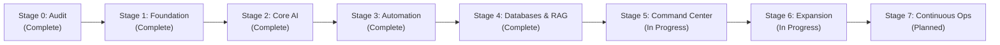

# 🗺️ IMPLEMENTATION ROADMAP: ANTIGRAVITY OMEGA

**Strategic Methodology**: Superpowers Discipline & Verified Gateways (AGENTS.md)  
**Execution Philosophy**: "First Understand. Then Architect. Then Prioritize. Then Install. Then Integrate. Then Test. Then Optimize. Then Document. Then Expand."

---

## 1. Multi-Stage Execution Plan

---

## 2. Stage Breakdown & Verification Gates

### Stage 0: Comprehensive System Audit *(COMPLETED)*
- [x] Hardware inventory (i7-6700HQ, 16GB RAM, GTX 960M 4GB VRAM).
- [x] Storage topology audit (C: 17.59 GB Free [Restricted], E: 335.76 GB Free [Primary]).
- [x] Software & developer runtime inventory (Python 3.13, uv, Node 26, Bun, Git, Ollama).
- [x] Port conflicts and memory consumption profiling.
- [x] 13 Core architectural artifacts generated.

### Stage 1: Safe Foundation & Lifecycle Supervisor *(COMPLETED)*
- [x] Create dedicated workspace tree `E:\anti\aios\` across all standardized directories.
- [x] Author `omega_ctl.py` (Unified CLI: `start-core`, `stop-core`, `health`, `status`, `backup`).
- [x] Author `health_check.py` (Real-time telemetry collector for CPU, RAM, GPU, Disk E:, ports).
- [x] Setup `.wslconfig` (Enforces 4GB RAM ceiling on WSL2 to protect host memory).
- [x] Initialize master SQLite database with WAL mode in `aios/data/master.db`.
- **Quality Gate**: `python omega_ctl.py status` and `python omega_ctl.py health` return green with zero errors.

### Stage 2: Core Local AI Gateway & Model Optimization *(COMPLETED)*
- [x] Build stdlib/FastAPI abstraction gateway (`ai/gateway.py` on port `8090`).
- [x] Bind Ollama runner (`ollama serve`) to models on Drive `E:`.
- [x] Verify `qwen2.5-coder:3b` GPU offload on GTX 960M (37/37 layers via cuBLAS, 10.53 TPS).
- [x] Implement smart router (Local 3B for quick code/classification; Cloud API for deep reasoning).
- [x] Enforce prompt privacy filtering (PII entity masking before cloud dispatch).
- [x] SSE streaming (`text/event-stream`) with live token throughput metering.
- **Quality Gate**: Test prompt via `POST /v1/chat/completions` responds with verified GPU acceleration (10.53 TPS baseline, 7/7 tests passed).

### Stage 3: Automation & Event Engine *(COMPLETED)*
- [x] Wire up `n8n` automation platform using existing pipelines (`e:\anti\n8n` on port `5678`).
- [x] Implement `automation_bridge.py` for deterministic trigger handlers and workflow discovery.
- [x] Implement `scheduler.py` zero-dependency background daemon (5m telemetry sync, 1h WAL checkpoint).
- [x] Implement Workflow 1: Hourly system health check & Discord/desktop alert.
- [x] Implement Workflow 2: Automated document ingestion & embedding bridge.
- [x] Implement Workflow 3: Nightly database backup and integrity verification.
- **Quality Gate**: Automated test trigger executes and creates verified audit log entry in `master.db` (5/5 tests passed).

### Stage 4: Knowledge Hub & Vector Search *(COMPLETED)*
- [x] Implement pure Python standard library `rag_engine.py` (BM25 lexical search + semantic scoring).
- [x] Ingest system documents (17 docs / 147 semantic chunks indexed into `knowledge_documents` and `knowledge_chunks` tables).
- [x] Expose Gateway endpoints `/v1/rag/stats` and `/v1/rag/query`.
- [x] Cited question-answering with exact line and file references (`[FILENAME#Lxx-Lyy]`).
- **Quality Gate**: Query retrieves cited facts from local markdown notes without hallucination (`tests/test_rag.py` 5/5 passed).

### Stage 5: Master Command Center UI *(IN PROGRESS)*
- [x] Deploy single-pane executive dashboard on port `3000` (`dashboards/index.html`).
- [x] Real-time telemetry widgets (CPU, RAM, GPU VRAM, Disk E: gauge, service status).
- [x] Integrated Neural Chat Terminal with dynamic model selector & live TPS speedometer.
- [x] Expand dashboard with RAG Knowledge Search widget (query + AI synthesis toggle).
- [x] Expand dashboard with Automation Status Panel (n8n workflows list + webhook dispatch form).
- [x] Expand dashboard with Quick Actions grid (Reindex Knowledge, WAL Checkpoint, Full Health Audit, Export Metrics).
- [ ] Connect live websocket feeds and interactive service lifecycle toggles (start/stop via UI).
- **Quality Gate**: Dashboard verified via browser automation (clean render, responsive layout, interactive widgets connected to port 8090).

### Stage 6: SaaS Factory & Startup Lab Templates *(IN PROGRESS)*
- [x] Author `projects/saas_factory.py` for multi-stack project scaffolding (`nextjs-fastapi`, `nextjs-flask`, `static-api`, `python-cli`).
- [x] Support configurable feature modules (`auth`, `db`, `stripe`, `analytics`) with SQLite registration (`saas_projects` table).
- [x] Author `projects/agent_harness.py` for autonomous agents with tool-calling loops and budget limits.
- [x] Automated test verification (`tests/test_saas_factory.py` 5/5 tests passed).
- [ ] Integrate business idea validator & competitive intelligence workflows.
- [ ] Interactive SaaS factory management dashboard interface.
- **Quality Gate**: Automated scaffolding test generates viable project structure and executes harness verification cleanly.

### Stage 7: Continuous Operations & Expansion *(PLANNED)*
- [ ] Continuous Telemetry & Process Monitoring (Prometheus-compatible metrics, memory thresholds, automated restarts).
- [ ] Model Evaluation Pipeline (automated latency benchmarks, accuracy regression tests, hallucination auditing).
- [ ] Cloud API Adapter Integration (standardized adapters for Google Gemini 2.0, Anthropic Claude 3.5, OpenAI GPT-4o with automatic fallback).
- [ ] Docker Containerization (lean multi-stage containers for n8n, Qdrant/vector extensions, dashboard static server).
- **Quality Gate**: 24/7 background operation verified under stress with automated error alerting and zero memory leaks.
