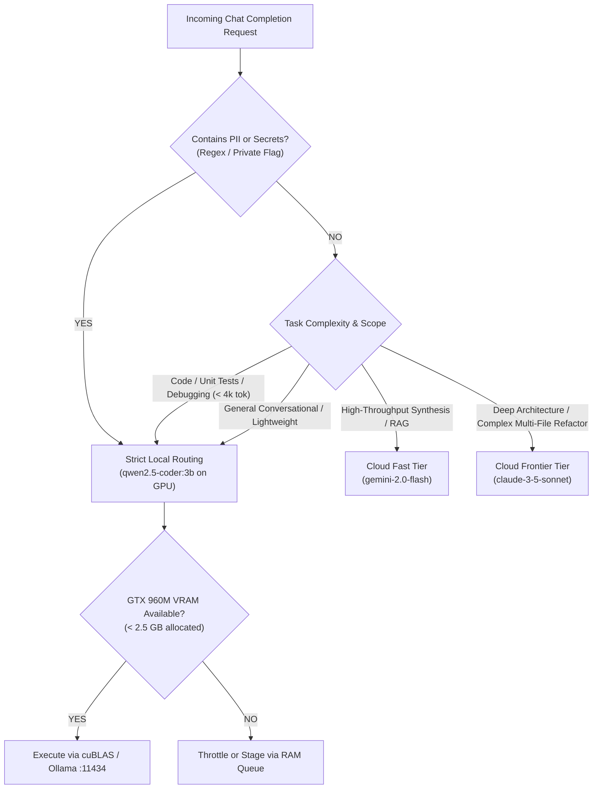

# ANTIGRAVITY OMEGA :: MODEL ROUTING SPECIFICATION

**Version**: 1.0.0  
**Last Updated**: 2026-10-01  
**Authority**: Supreme Constitution Directives & AI Architect  
**Status**: APPROVED & ACTIVE  

---

## 1. Architectural Routing Principles

The ANTIGRAVITY OMEGA AI Gateway operates as a unified, OpenAI-compatible proxy (`http://127.0.0.1:8090/v1/chat/completions`) providing intelligent, context-aware model routing governed by four non-negotiable principles:

1. **Privacy Invariant (Zero Leakage)**: If any user prompt contains sensitive credentials, API keys, private corporate data, or explicit local flags, the request is **strictly forbidden from leaving the local host**. It routes exclusively to local Ollama on GPU.
2. **Hardware Budget Enforcement**: The host hardware (16GB physical RAM, GTX 960M 4GB VRAM) defines rigid resource ceilings. Local models must fit within the VRAM buffer without destabilizing host desktop processes.
3. **Latency & Throughput Optimization**: Simple code completions and micro-tasks execute locally with low latency and zero network jitter (10.53 TPS baseline). Massive synthesis and cross-codebase refactoring route to frontier cloud endpoints.
4. **Resilient Circuit Breaking**: If an engine is offline or times out, the gateway must fall back gracefully or provide immediate diagnostic status rather than hanging indefinitely.

---

## 2. Multi-Dimensional Routing Heuristics

The gateway evaluates each incoming request across six criteria:

---

## 3. Operational Routing Matrix

| Task Category | Primary Route | Secondary Route | Selection Triggers | Latency Profile | Cost Profile |
| :--- | :--- | :--- | :--- | :--- | :--- |
| **Code Generation & TDD** | `qwen2.5-coder:3b` (Local GPU) | `gemini-2.0-flash` (Cloud) | Python/JS/SQL functions, unit tests, bug fixes | ~1.7s TTFT, 10.5 TPS | $0.00 (Local) |
| **Sensitive / PII Data** | `qwen2.5-coder:3b` (Local GPU) | REJECT / REDACT | Detected credit card, email, auth keys | Local execution | $0.00 (Private) |
| **Broad Knowledge & Summary**| `gemini-2.0-flash` (Cloud) | `llama3:latest` (Local CPU) | Cross-domain research, market analysis | < 400ms TTFT, >80 TPS | Minimal ($0.0001) |
| **Deep Architecture & RFCs** | `claude-3-5-sonnet` (Cloud) | `gemini-2.0-flash` (Cloud) | Multi-subsystem design, constitutional audit | ~800ms TTFT, >50 TPS | Standard ($0.003) |
| **Vector Embeddings** | `bge-small-en-v1.5` (Local) | `text-embedding-004` (Cloud) | Documentation indexing, vector retrieval | < 50ms batch | $0.00 (Local) |

---

## 4. Hardware State Awareness & Throttling

The router continuously polls the real-time hardware status reported by `scripts/health_check.py` and stored in SQLite `system_metrics`:

1. **Host RAM Threshold (> 82%)**:
   - The router locks out Yellow Zone models (`llama3:latest`, `fable5:latest`) to prevent Windows memory exhaustion and thrashing.
   - All tasks are routed either to `qwen2.5-coder:3b` (pinned in VRAM) or external cloud endpoints.
2. **VRAM Exhaustion Protection (> 3,400 MB)**:
   - If other desktop GPU applications consume video memory, Ollama is invoked with reduced context length (`num_ctx: 4096`) to prevent CUDA allocation faults.
3. **Zero Drive C: Invariant**:
   - The router rejects any model pull or cache operation pointing to Drive C:. All model weights and artifacts must reside on `E:\anti\aios\`.

---

## 5. Audit Logging & Compliance Ledger

For every request processed through `http://127.0.0.1:8090/v1/chat/completions`:
- An entry is automatically committed to SQLite `master.db` inside the `audit_logs` table.
- Log schema attributes:
  - `actor`: `AIOS_GATEWAY`
  - `action`: `CHAT_COMPLETION`
  - `category`: `AI`
  - `details`: `Model: <id> | Stream: <bool> | PII: <bool> | RoutedTo: <local|cloud>`
  - `severity`: `WARNING` if PII was detected, otherwise `INFO`.
