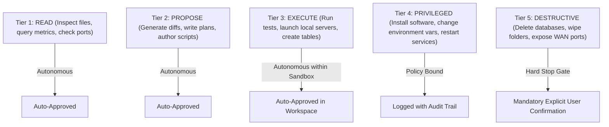

# 🔒 SECURITY MODEL & DATA GOVERNANCE: ANTIGRAVITY OMEGA

**Security Posture**: Zero Trust, Least Privilege, Local-First Privacy Boundary  
**Enforcement Authority**: Supreme Constitution & AGENTS.md Directives  
**Auditor**: Antigravity OMEGA Security Agent

---

## 1. Permission Tier Model

To ensure autonomous systems cannot perform catastrophic actions without human oversight, all operations are classified into five strict tiers:



### Prohibited Destructive Operations (Requires Explicit Approval)
- Deleting databases (`*.db`, `*.sqlite`, Postgres volumes).
- Wiping project directories or git histories.
- Exposing local service ports to public WAN (`0.0.0.0` with port forwarding).
- Disabling Windows Defender or OS firewall rules.
- Writing secrets or credentials to plain text git-tracked files.

---

## 2. Data Governance & Sensitivity Classification

Every file, database record, and LLM prompt must be tagged with a data sensitivity tier:

| Tier | Classification | Description | Handling & LLM Routing Policy |
| :--- | :--- | :--- | :--- |
| **P1** | **PUBLIC** | Open-source code, public documentation, blog drafts | Safe for all local and cloud LLMs (Gemini, Claude, GPT). |
| **P2** | **INTERNAL** | System logs, architecture docs, non-confidential project schemas | Can route to cloud LLMs with organizational zero-retention flags. |
| **P3** | **CONFIDENTIAL** | Business financial records, client names, proprietary algorithms | **Local AI First**. If cloud is required, PII and identifiable names must be masked/anonymized. |
| **P4** | **HIGHLY SENSITIVE**| Passwords, API keys, private keys, personal identity docs | **NEVER leaves local machine**. Zero cloud routing. Stored exclusively in encrypted `secrets/` vault. |

---

## 3. Privacy Router Specification

Before any prompt is transmitted to an external cloud AI model, it passes through the **AIOS Privacy Gateway Filter**:

```text
Incoming Prompt 
      │
      ▼
Regex & Entity Scanner (Detects API keys, SSNs, credit cards, emails, tokens)
      │
      ├── If P4 Detected ──> [HALT] Reject prompt or enforce Local-Only routing
      │
      ├── If P3 Detected ──> Tokenize entities (e.g., Replace "Client Alpha" with "[ENTITY_01]")
      │                      Send anonymized payload to Cloud Gateway
      │                      Re-hydrate entity tokens on response return
      │
      └── If P1/P2 ───────> Direct transmission via secure HTTPS with TLS 1.3
```

---

## 4. Secret Isolation & Environment Architecture

### 4.1 Storage Standard
- All API keys, database credentials, and service tokens are kept strictly in `E:\anti\aios\secrets\`.
- The directory `secrets/` is globally ignored in `.gitignore`.
- Files within `secrets/` follow the format:
  - `secrets/credentials.env` (chmod/ACL locked to user `amehr` only).
  - A tracked template `configs/env.example` documents required keys with placeholder values.

### 4.2 Frontend Protection
- No secret key is ever bundled into frontend JavaScript/HTML.
- Frontend components authenticate against the local backend router (`localhost:8090`) using short-lived session tokens. The backend securely injects provider keys server-side.

---

## 5. Network Boundary & Service Hardening

```text
               PUBLIC INTERNET (WAN)
                         │
                    [FIREWALL]
                         │
     [BLOCKED: No public port forwards or UPnP]
                         │
                         ▼
             LOCAL PRIVATE NETWORK (LAN)
                   (192.168.1.0/24)
                         │
      ┌──────────────────┴──────────────────┐
      │                                     │
      ▼                                     ▼
Localhost Bindings (127.0.0.1)         Container Bridge Networks
• AI Gateway (:8090)                   • Docker default bridge
• Ollama API (:11434)                  • Service-to-service isolation
• SQLite Engine (In-Process)           • No exposed daemon ports
• Master Command Center (:3000)
```

- **Loopback Enforcement**: All daemons default to binding on `127.0.0.1` rather than `0.0.0.0`.
- **Zero Remote Admin**: Admin endpoints (database management, container sockets) are strictly restricted to local loopback connections.
- **Log Masking**: Standard log formatters automatically redact patterns matching `sk-[a-zA-Z0-9]{20,}`, `Bearer [a-zA-Z0-9_-]+`, and password parameters.
