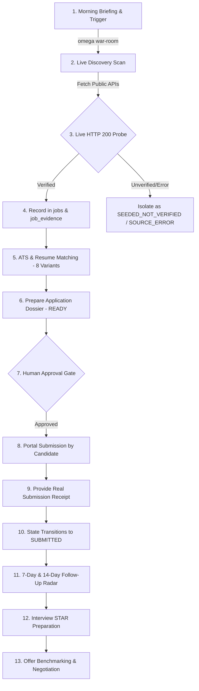

# CAREER HQ — WORKFLOW MAP

```mermaid
graph TD
    A[1. Morning Briefing & Trigger] -->|omega war-room| B[2. Live Discovery Scan]
    B -->|Fetch Public APIs| C{3. Live HTTP 200 Probe}
    C -->|Verified| D[4. Record in jobs & job_evidence]
    C -->|Unverified/Error| E[Isolate as SEEDED_NOT_VERIFIED / SOURCE_ERROR]
    
    D --> F[5. ATS & Resume Matching - 8 Variants]
    F --> G[6. Prepare Application Dossier - READY]
    G --> H{7. Human Approval Gate}
    H -->|Approved| I[8. Portal Submission by Candidate]
    I --> J[9. Provide Real Submission Receipt]
    J --> K[10. State Transitions to SUBMITTED]
    K --> L[11. 7-Day & 14-Day Follow-Up Radar]
    L --> M[12. Interview STAR Preparation]
    M --> N[13. Offer Benchmarking & Negotiation]
```
