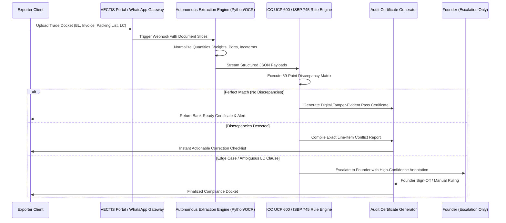

# PHASES 13, 14, 15 & 16: PRODUCT ARCHITECTURE, OPERATING MODEL & AI WORKFORCE

## Phase 13: Minimum Product That Receives Payment (V0 Concierge $
ightarrow$ V1 MVP)

### V0 Concierge MVP ("Software With a Human Spine") — Days 1 to 14
- **Interface**: Secure WhatsApp Business channel / dedicated Google Drive folder / email gateway (`audit@vectis.trade`).
- **Client Workflow**: Customer drops their scanned PDF trade docket:
  1. LC Draft / Confirmed SWIFT MT700 message.
  2. Commercial Invoice.
  3. Packing List.
  4. Draft Bill of Lading (BL) / Sea Waybill.
  5. Certificate of Origin (COO).
- **Backend Architecture (Solo Founder + Python + Gemini/Claude API)**:
  - Python extraction pipeline parses the PDFs, normalizes line-item quantities, gross/net weights, description of goods, ports of loading/discharge, and shipping marks.
  - LLM agent evaluates extracted fields against the 39 canonical check-points of UCP 600 and ISBP 745.
  - Generates a branded, 2-page `VECTIS Trade Pre-Submission Audit Certificate` highlighting:
    - **PASS / FAIL Status** for each document.
    - **Exact Discrepancies Detected** (e.g., "Invoice item 4 description omits 'Grade 316' required by LC Field 45A").
    - **Corrected Text Snippets** ready for copy-pasting to the CHA/shipping line.
- **Founder Touch**: Founder reviews the generated PDF (5 minutes), verifies accuracy, and emails it to the exporter with an invoice link (Razorpay / UPI).
- **Time to Deliver**: $< 2$ hours from receipt.
- **Price**: ₹1,500 per audited shipment docket.

### V1 Autonomous MVP — Days 15 to 60
- **Frontend**: Clean, lightweight Next.js / Tailwind single-page app hosted on Vercel.
- **Auth**: Passwordless magic link / Google Workspace auth.
- **Processing Engine**:
  - Drag-and-drop docket upload (multi-file PDF ingestion).
  - Fast OCR & bounding-box entity extractor.
  - Deterministic discrepancy evaluation engine running in Python FastAPI backend on Render / Railway.
  - Real-time interactive diff viewer: red highlights on conflicting fields across documents.
  - Automated generation of Bank-Ready Compliance Docket.
- **Monetization**: Razorpay / Stripe billing integration:
  - *Starter*: ₹12,000/mo (up to 10 dockets/mo).
  - *Growth*: ₹28,000/mo (up to 25 dockets/mo + priority SLA).
  - *Enterprise*: ₹65,000/mo (unlimited dockets + dedicated API webhook into ERP).

---

## Phase 14: The One-Person Operating Model

The operating model is architected around **The Ladder** to maximize **Enterprise Value Created Per Founder Hour**:

```
[Level 1: YAGNI] Does this task need to exist at all? -> Eliminate 70% of vanity startup activity.
[Level 2: Reuse] Has this been solved in the workspace? -> Use existing scripts & templates.
[Level 3: Stdlib] Can Python/Bash built-ins do it? -> No external bloat.
[Level 4: Platform] Can OS/Vercel/GitHub primitives handle it? -> Zero DevOps maintenance.
[Level 5: Single-Line] Can it be one clean command? -> One line.
[Level 6: AI-Automated] Can our agentic workforce execute it deterministically? -> Autonomous loop.
[Level 7: Founder Only] High-stakes sales closing, capital governance, legal signature.
```

### Founder Daily Time Budget (Zero Busywork Architecture)
- **Total Working Hours**: 8 hours/day (40 hours/week).
- **Distribution**:
  - **High-Leverage Customer Interaction & Demos**: 3.0 hours (10:00 AM – 1:00 PM).
  - **Core Product Architecture & System Prompting**: 2.5 hours (2:30 PM – 5:00 PM).
  - **Reviewing Autonomous Agent Workflows & Exceptions**: 1.5 hours (5:00 PM – 6:30 PM).
  - **CEO Strategic Reflection & Cash Review**: 1.0 hour (6:30 PM – 7:30 PM).
- **Eliminated**: Zero manual billing, zero manual data entry, zero cold outbound emailing by hand, zero manual invoice chasing.

---

## Phase 15: The Autonomous 9-Agent AI Workforce

Every agent operates under a strict **Agent Contract** with defined inputs, tools, permission boundaries, and human escalation triggers:

| Agent Name | Core Role | Inputs | Automated Tools | Output Deliverable | Permission Level |
| :--- | :--- | :--- | :--- | :--- | :--- |
| **01. CEO Intelligence** | Daily strategic priority & capital allocation | Daily cash balances, pipeline stages, support logs | Script runners, workspace analytics | Daily Founder 3-Bullet Brief | RECOMMEND |
| **02. Chief of Staff** | Calendar control & cognitive load shielding | Founder inbox, task registry, calendar | Gmail API, Calendar API, Slack webhooks | Morning prioritized battle-plan | EXECUTE (Bounded) |
| **03. Market Researcher** | Customs tariff updates, DGFT circulars, competitor scan | DGFT RSS, CBIC notifications, ICC opinions | Headless browser, web scraper, PDF parser | Weekly Trade Compliance Brief | DRAFT |
| **04. Product Architect** | PRD generation, schema maintenance, UCP rules | ICC opinions, customer feedback transcripts | Markdown generator, schema validator | Feature specs & test fixtures | DRAFT |
| **05. Lead Software Agent** | TDD code implementation, bug fixing, test harness | Feature specs, issue tracker, error logs | Git, Pytest, Python linter, Vercel CLI | Tested commits & pull requests | EXECUTE (Sandbox) |
| **06. Sales SDR & Signal Miner** | Exporter prospecting, customs shipment trigger tracking | Public trade data, LinkedIn export directorates | Data enrichment scripts, Hunter API | Enriched ICP prospect dossiers | DRAFT |
| **07. Growth & Case Study Engine** | Original teardowns of recent trade rejections | Anonymized discrepancy cases, trade stats | Markdown authoring, image generator | Bi-weekly "Trade Anatomy" newsletter | DRAFT |
| **08. Finance & Operations** | Invoicing, GST reconciliation, subscription renewal | Bank statements, Razorpay webhooks, Tally | Razorpay API, Tally XML connector | Monthly P&L and GST Form 2B match | RECOMMEND |
| **09. Security & Governance** | Data leakage prevention, RBAC, secret rotation | Server logs, API request payloads | Static code analyzer, secret scanner | Zero-Trust audit report | EXECUTE (Blocking) |

### Hard Permission Control Matrix:
- `READ`: Agents 01–09 (Unrestricted reading of workspace docs and logs).
- `ANALYZE`: Agents 01–09 (Internal synthesis and pattern extraction).
- `DRAFT`: Agents 03, 04, 06, 07 (Generate code, emails, marketing drafts).
- `RECOMMEND`: Agents 01, 08 (Suggest pricing changes, strategic pivots, expenses).
- `EXECUTE`: Agents 02, 05, 09 (Create git commits, schedule meetings, block malicious IPs).
- `APPROVE`: **FOUNDER ONLY** (Moving money $> ₹0$, legal commitments, sending contracts, firing/hiring specialists).

---

## Phase 16: The Automation Spine (Deterministic System Architecture)



The system requires **zero human manual data entry**. Every transaction is logged with tamper-evident cryptographic hashes in `logs/audit_ledger.jsonl`.
