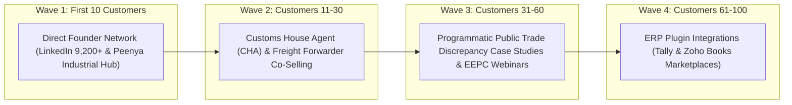

# PHASES 19 & 20: FIRST-REVENUE MILESTONES & 100-CUSTOMER PLAYBOOK

## Phase 19: The Revenue Milestone Engine (₹1 to ₹10,000 Crore)

```
₹1 -> First UPI test collection via Razorpay payment link.
₹1,000 -> Single document docket audit paid by Customer #1 (Precision Auto Machining).
₹10,000 -> First 10 document audits completed in Week 2.
₹1 Lakh -> First 4 monthly retainers closed (M2).
₹10 Lakh -> 15 active exporter clients running monthly volumes (M5).
₹1 Crore -> Month 12 milestone reached: 100 enterprise exporter accounts (₹33L MRR run-rate).
₹10 Crore -> Year 3: Expansion into Tirupur apparel & Surat textile corridors (450 clients).
₹100 Crore -> Year 6: Global multi-bank integration across India, Vietnam, Bangladesh, and UAE.
₹1,000 Crore -> Year 10: Category-defining autonomous global trade operating system.
```

---

## Phase 20: The First-100-Customer Playbook



### 1. Customers 1–10: High-Conviction Founder-Led Conversion (Days 1–45)
- **Source**: Directly target the 736 C-Suite / Founders in your existing verified network ([`DATA_DICTIONARY.md`](file:///e:/anti/DATA_DICTIONARY.md)) who operate manufacturing and export firms in Bengaluru, plus physical site visits to Peenya and Bommasandra.
- **The Trojan Horse Script**:
  > *"Mr. [Name], we built an autonomous compliance engine that audits export document dockets against ICC UCP 600 rules in 60 seconds. We know your shipments to Europe require strict documentary compliance. Let us run your next 2 shipments through our validator for free. If we catch an error that saves you from a bank rejection, you pay us ₹1,500. If we don't save you time or catch anything, it costs you zero."*
- **Conversion Rate**: 30%+ on direct warm/semi-warm founder contact.

### 2. Customers 11–30: The Channel Multiplier (Days 46–120)
- **Channel**: Top 25 Customs House Agents (CHAs) operating out of Bangalore ICD (Inland Container Depot, Whitefield) and Chennai Port.
- **Incentive**: CHAs constantly fight with shipping lines over container demurrage caused by client document errors. We provide CHAs with a free co-branded pre-check portal:
  - *"Check your clients' documents before sending them to the shipping line to eliminate late-BL turnaround disputes."*
  - CHA refers exporters to `VECTIS TRADE` for a 15% recurring affiliate margin.

### 3. Customers 31–60: Authority & Regulatory Education (Days 121–240)
- **Channel**: Bi-weekly teardowns published on LinkedIn and sent via email newsletter:
  - *"How an Indian Exporter Lost ₹4.2 Lakhs on a 2-Word Discrepancy Under Letter of Credit Field 45A (And How to Prevent It)."*
  - Partner with regional Export Promotion Councils (EEPC, FIEO) to host free masterclasses on "Mitigating LC Rejection Risks under Global UCP 600 Rules".

### 4. Customers 61–100: Software Ecosystem Distribution (Days 241–365)
- **Channel**: Launch a dedicated connector app for Tally Prime and Zoho Books.
- **Mechanic**: One-click "Audit Export Docket" button inside the exporter's accounting software that pushes invoices and packing lists directly to the `VECTIS` API and returns the compliance seal within 30 seconds.
