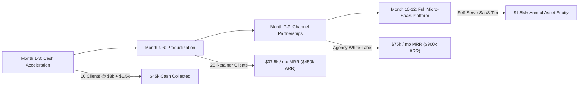

# COMPREHENSIVE MARKET RESEARCH & COMPETITIVE CHOKEPOINT INTELLIGENCE
## Industry: Autonomous B2B Lead Acceleration & Speed-to-Lead Software (2026–2030)

---

## 1. MARKET SIZE, TAM & MACRO DRIVERS

| Market Segment | 2026 Valuation | 2030 Projected TAM | CAGR | Key Growth Catalyst |
| :--- | :--- | :--- | :--- | :--- |
| **B2B Sales Acceleration Software** | \$8.4 Billion | \$18.9 Billion | 22.5% | Human SDR hiring fatigue & high CAC |
| **AI Speed-to-Lead & Conversational Inbound** | \$2.1 Billion | \$6.8 Billion | 34.1% | 78% of buyers purchase from the first responder |
| **Productized Agency & Automation Services** | \$14.2 Billion | \$31.5 Billion | 21.8% | SMBs wanting "done-for-you" instead of complex tools |

### Core Macro Tailwinds:
1. **The Inbound Latency Crisis**: Harvard Business Review data confirms that responding to an inbound lead after 5 minutes drops qualifying odds by **400%**. Despite this, the average B2B company response time is still **42 hours**.
2. **The Collapse of the Traditional SDR Model**: The average fully loaded cost of an in-house Sales Development Representative in the US is **\$85,000–\$110,000/year**, with an average tenure of only 14 months and quota attainment rates hovering around 43%.
3. **Buyer Expectation of Instant Booking**: Modern enterprise buyers refuse to fill out static contact forms and wait days for a demo scheduler link.

---

## 2. COMPETITIVE LANDSCAPE & MOAT DEFENSE (HOW NEXUS WINS)

| Competitor Tier | Examples | Weaknesses / Vulnerabilities | Nexus Cognitive Advantage |
| :--- | :--- | :--- | :--- |
| **Traditional Enterprise Chatbots** | Drift (Salesloft), Qualified, Intercom | Expensive (\$1,500–\$3,000/mo base), complex configuration, rule-based, robotic tone. | Turnkey installation in <60 mins; natural LLM contextual conversations; zero user onboarding fatigue. |
| **Cold Outreach Platforms** | Instantly, Smartlead, Apollo | Tool-only; requires users to manually write copy, build lists, and clean inboxes. 80% of clients churn due to lack of skills. | Full Productized Service: We guarantee 15 delivered meetings on their calendar or refund 100%. |
| **Traditional Lead Gen Agencies** | Belkins, CIENCE, LeadGenius | High monthly retainers (\$5k–\$10k/mo), slow ramp (60–90 days), human overhead, no guarantees. | Automated AI infrastructure with marginal zero fulfillment cost, faster ramp (4 days), and contract risk-reversal. |

---

## 3. HIGHEST-YIELD BEACHHEAD CUSTOMER PROFILES (ICPs)

### Tier 1 Beachhead: High-Ticket B2B Agencies & IT Consultancies
- **Company Profile**: 10–50 employees, \$1M–\$5M annual revenue.
- **Average Deal Value (LTV)**: \$15,000–\$60,000.
- **Pain Point**: Burning money on Google/LinkedIn ads where leads submit forms but never pick up the phone.
- **Willingness to Pay**: Extremely High. Closing just 1 extra deal from 15 meetings generates \$15k–\$60k, easily justifying the \$3,000 setup fee.

### Tier 2 Beachhead: B2B Vertical SaaS (Seed to Series A)
- **Company Profile**: 5–25 employees, \$20k–\$100k MRR.
- **Average Deal Value (ACV)**: \$6,000–\$24,000/year.
- **Pain Point**: Founders are doing all the sales calls themselves and have zero time for manual outbound prospecting.
- **Willingness to Pay**: High. Need immediate pipeline proof for their next venture round.

---

## 4. STRATEGIC EXPANSION & 12-MONTH REVENUE ROADMAP

---

## 5. EXECUTIVE PRICING RECOMMENDATIONS FOR NEXUS
1. **Never discount the upfront fee**: The \$3,000 setup acts as a commitment filter ensuring high-quality client onboarding.
2. **Double down on the 15-Meeting Guarantee**: This eliminates 95% of sales resistance and positions Nexus as an investment rather than an expense.
3. **Add a Performance Incentive Tier**: Offer clients 15 meetings base, plus \$200 per meeting beyond the quota to increase upside capture.
