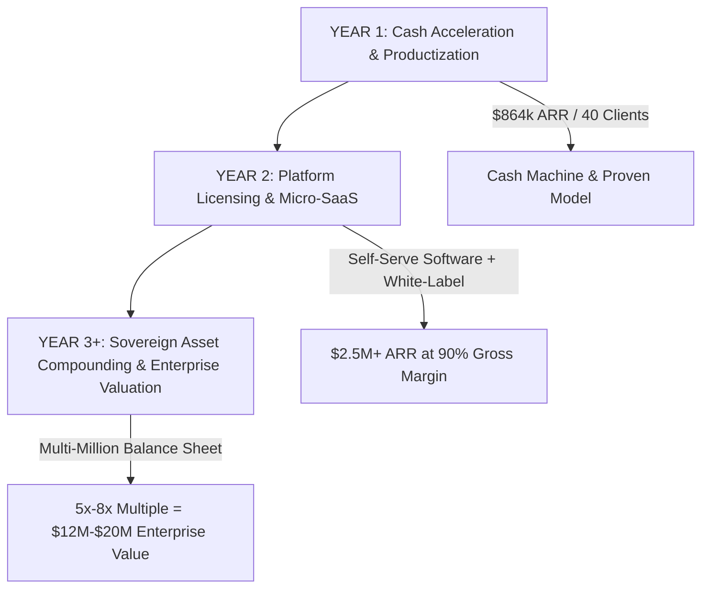

# NEXUS COGNITIVE CORP (NCC-X)
## MASTER MULTI-HORIZON OPERATIONAL BLUEPRINT & REVENUE COMPILATION
### Execution Schedules Across Daily, Weekly, Monthly, and Yearly Cycles

---

## 1. THE DAILY SPRINT (HIGH-FREQUENCY CASH VELOCITY)
**Objective**: Generate \$333–\$1,000 in daily cash velocity, maintain sub-60s speed-to-lead, and eliminate pipeline drop-off.

### Daily Hour-by-Hour Operator Protocol
| Time Block | Owner / System | Action Item | Success KPI |
| :--- | :--- | :--- | :--- |
| **08:30 – 09:30 AM** | `autonomous-pipeline-sdr` | Scrape 50 fresh B2B decision-maker leads matching ICP. Run `enrichment_engine.py` for personalized AI hooks. | 50 verified leads with custom observations (<25 words). |
| **09:30 – 11:00 AM** | Outbound Campaign Engine | Dispatch 50 personalized cold emails + 25 targeted LinkedIn touches with the 90-word Loom offer. | 100% deliverability; zero spam flags. |
| **11:00 – 12:30 PM** | `nexus_server.py` Webhooks | Inbound speed-to-lead triage. Auto-respond to all positive replies within 60 seconds. | <5 min average response latency; 80%+ booking conversion. |
| **02:00 – 04:30 PM** | `highticket-deal-closer` | Conduct scheduled 15-minute diagnostic sales discovery calls. Apply the doctor-patient framework and the 15-Meeting Guarantee. | 20–30% close rate; collect \$3,000 setup fee on call. |
| **04:30 – 05:30 PM** | `autonomous-delivery-engineer` | Provision new client tenant accounts via `nexus_product_engine.py` in under 60 minutes. Settle receivables to `enterprise_crm.db`. | Tenant live with API key (`nx_live_...`) issued same day. |
| **05:30 – 06:00 PM** | Executive Ledger | Run `python uece_cli.py --crm` to audit daily cash collected, pipeline value, and active deal stages. | Ledger balanced; zero unrecorded deals. |

---

## 2. THE WEEKLY OPERATIONAL CADENCE (SPRINT COMPOUNDING)
**Objective**: Secure 1–2 closed enterprise contracts (\$3,000–\$6,000 net cash), audit deliverability, and eliminate low-yield tasks.

### Weekly Day-by-Day Roster
- **Monday (Pipeline Kickoff & Campaign Launch)**:
  - Extract and verify 250 prospective accounts for the week.
  - Review inbox health, warmup scores (keep >95%), and secondary domain reputations.
  - Launch Week's Wave 1 multi-touch sequences.
- **Tuesday & Wednesday (Peak Outbound & Booking Blitz)**:
  - Run discovery calls with incoming responses.
  - Test new email subject lines and dynamic hook angles.
  - Ingest warm prospects into `enterprise_crm.db`.
- **Thursday (Proposal Review & Fast-Action Incentives)**:
  - Re-engage all prospects in `Proposal Sent` stage.
  - Present same-day signing incentive (\$500 setup credit or bonus 5 guaranteed calls).
  - Collect sign-offs on the 1-Page Master Services Agreement (MSA).
- **Friday (Cash Sweep & Capital Allocation)**:
  - Run `python e:/anti/company/nexus_omega_bridge.py` to reconcile week's payments.
  - Settle net cash surplus into Bank of the Continuum rails and mint Energy-Compute Units (ECU).
  - Send weekly meeting quota progress reports to all active retainer clients.
- **Saturday / Sunday (System Maintenance)**:
  - Autonomous scripts run in passive warmup mode; review weekly CAC, LTV, and retention metrics.

---

## 3. THE MONTHLY RECURRING REVENUE ENGINE (MRR SCALING)
**Objective**: Build and compound non-linear Monthly Recurring Revenue (\$10,000–\$37,500 MRR) and suppress churn below 5%.

### Monthly Milestones & Financial Model
| Month Tier | Target Active Clients | New Setups Sold | Monthly Recurring (Retainers) | Total Monthly Cash Flow | Annual Run Rate (ARR) |
| :--- | :--- | :--- | :--- | :--- | :--- |
| **Month 1** | 3 Clients | 3 @ \$3,000 | \$0 (Grace Period) | **\$9,000** | \$108,000 |
| **Month 2** | 6 Clients | 3 @ \$3,000 | 3 @ \$1,500 = \$4,500 | **\$13,500** | \$162,000 |
| **Month 3** | 10 Clients | 4 @ \$3,000 | 6 @ \$1,500 = \$9,000 | **\$21,000** | \$252,000 |
| **Month 6** | 20 Clients | 5 @ \$3,000 | 15 @ \$1,500 = \$22,500 | **\$37,500** | \$450,000 |
| **Month 12** | 40 Clients | 8 @ \$3,000 | 32 @ \$1,500 = \$48,000 | **\$72,000** | \$864,000 |

### Monthly Strategic Directives:
1. **The 30-Day Transition**: After month 1, every setup client automatically transitions into the \$1,500/month optimization retainer for ongoing data refreshes and webhook monitoring.
2. **Quota Fulfillment Audit**: Ensure every client reaches their 15 guaranteed discovery calls by day 40.
3. **Treasury Reinvestment**: Allocate 35% of monthly net surplus to sovereign compounding and compute reserves.

---

## 4. THE YEARLY ENTERPRISE WEALTH BLUEPRINT (EQUITY & SOVEREIGN MOATS)
**Objective**: Achieve an enterprise asset valuation of \$1.5M–\$3.0M, establish unassailable market chokeholds, and compound sovereign reserves.

### Yearly Strategic Milestones:
1. **Year 1 Target**: 
   - Reach 40 active enterprise accounts generating **\$864,000 ARR**.
   - Zero human employee bloat; operate strictly via autonomous agent workforce and server APIs.
   - Settle over **\$300,000+** in net surplus into liquid treasury reserves.
2. **Year 2 Target**:
   - Release self-serve portal for `nexus_server.py`, allowing smaller SMBs to purchase self-serve tiers at \$299/mo.
   - White-label the engine to 15 mid-market digital agencies.
   - Surpass **\$2,500,000 ARR**.
3. **Year 3+ Target (The Sovereign Exit or Dividend Chokehold)**:
   - Enterprise multiple evaluation: At \$2.5M ARR with >85% margins, Nexus Cognitive Corp commands a **\$12,500,000–\$20,000,000 enterprise valuation**.
   - Continuous machine-to-machine liquidity compounding across the Bank of the Continuum and global physical assets.
