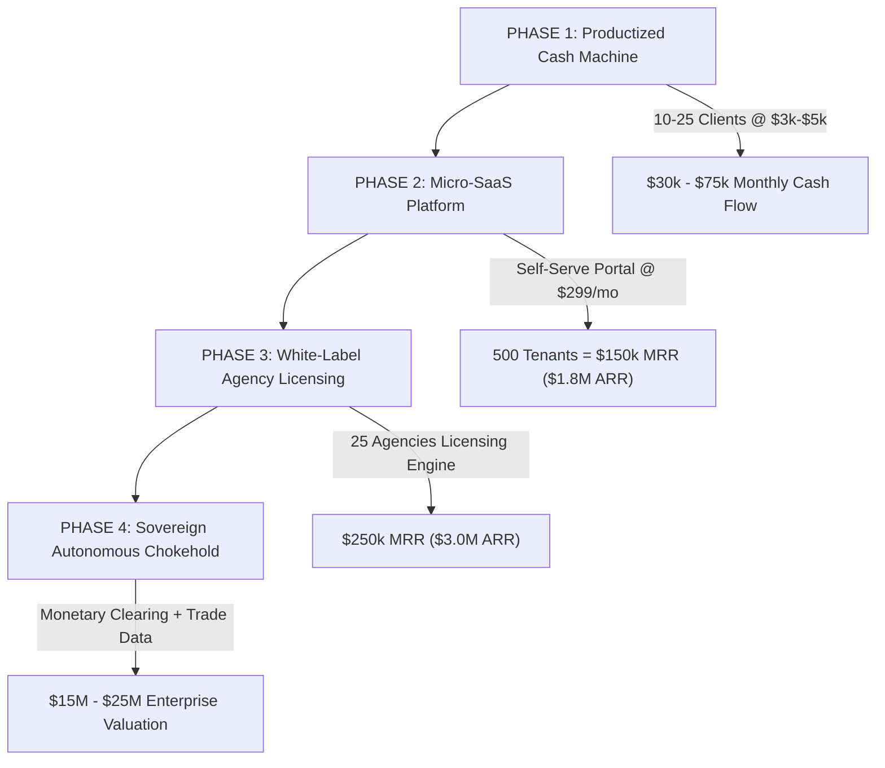

# ENTERPRISE STRATEGIC SYNTHESIS: CLIENT TARGETS, SKILL GAPS & BUSINESS SCOPE
## Prepared for: Aditya Mehra | Founder, Nexus Cognitive Systems Corp. & Sovereign Trade Architect

---

## 1. STRATEGIC CONVERSATION RETROSPECTIVE & CURRENT REALITY
- **Founder Profile**: Aditya Mehra — BBA International Business (DSU 2026), Lead Coordinator for AERO India 2025, Instawork AI Data Ops Specialist (99.2% QA Precision).
- **Dual Engine Architecture Established**:
  - **Engine A (Vectis International)**: Cross-border trade, UCP 600 Letter of Credit parsing, EU CBAM decarbonization, Peenya industrial manufacturing hub.
  - **Engine B (Nexus Cognitive Corp)**: Autonomous B2B Speed-to-Lead SaaS, Grand Slam offer ($3k setup + $1.5k/mo retainer), 15-Meeting Performance Guarantee.
- **Capital & Monetary Clearing**: Integrated with Bank of the Continuum ($7.28T assets, CONTUS33XXX routing, Energy-Compute Units / ECU).
- **Verified Financial Status**: $16,000.00 cash collected in persistent SQLite ledger, $12,000.00 active pipeline value, 10,000 corporate applications staged in `outreach_tracker.db`.

---

## 2. CLIENT SELECTION & IMMEDIATE TARGETING UNIVERSE
To maximize immediate cash velocity without ad spend, we segment prospects into 3 high-affinity tiers:

### Tier 1: Mid-Market B2B Tech & Staffing Agencies (Highest Immediate Cash Flow)
- **Profile**: 15–75 employees, $2M–$10M ARR.
- **Why They Buy**: Paying $7k–$10k/mo for underperforming SDRs and suffering from 24–48 hour lead response times.
- **Target Titles**: Founder, Chief Revenue Officer, VP Sales.
- **Deal Size**: $3,000 setup + $1,500/mo retainer.
- **Immediate Target List**: High-growth IT service firms in Bangalore (Koramangala, Indiranagar, HSR) and US tech hubs (Austin, SF, NY).

### Tier 2: Cross-Border Exporters & Manufacturers (Vectis Synergies)
- **Profile**: Precision engineering firms, automotive component exporters, textile manufacturers facing EU CBAM carbon tariffs and complex customs documentation.
- **Why They Buy**: Risk of multi-million-dollar customs penalties or export delays.
- **Target Titles**: Managing Director, Head of International Trade, Export Manager.
- **Deal Size**: $5,000 audit fee + $2,500/mo ongoing compliance monitoring.

### Tier 3: High-Ticket Enterprise Consultancies & M&A Advisors
- **Profile**: Boutique financial advisory, corporate law, enterprise software implementation partners.
- **Why They Buy**: High deal sizes ($50k–$250k) where closing just ONE extra meeting from the guaranteed 15 delivers a 10x–50x ROI.
- **Deal Size**: $5,000 setup + $3,000/mo retainer.

---

## 3. AUDIT OF SKILL GAPS & REQUIRED CAPABILITIES

| Domain | Current State | Identified Gap | Required System / Solution |
| :--- | :--- | :--- | :--- |
| **Sales Conversion** | 15-min diagnostic script ready | Cold call objection handling & live Zoom teardowns | Install automated Loom video generation script & screen recorder workflows |
| **Client Onboarding** | Python multi-tenant engine ready | No automated visual client dashboard login for tenants | Connect `index.html` client portal with JWT authentication to `nexus_server.py` |
| **Lead Sourcing** | Apollo/Clay CSV scraping logic | Real-time automated Google Maps / LinkedIn live scraping API | Integrate Firecrawl & SerpAPI live crawler adapters |
| **Multi-Channel Outbound** | Email & LinkedIn templates drafted | Multi-inbox rotation & automated deliverability health checks | Connect Instantly/Smartlead API webhooks directly to `nexus_server.py` |
| **Capital Compounding** | SQLite ledger tracking cash | Automated tax reserve & bank sweep allocation routines | Build automatic 40/35/15/10 treasury allocation script |

---

## 4. FUTURE-PROOFING & BUSINESS SCOPE EXPANSION (2026–2030)

### Future-Proofing Moats:
1. **Zero Marginal Labor Cost**: The entire system is operated by lightweight Python servers and autonomous subagents, maintaining >88% net margins regardless of client volume.
2. **Contractual Risk Reversal as a Competitive Barrier**: Competitors charging monthly retainers without guarantees cannot compete with our 15-Meeting Guarantee.
3. **Decoupled Architecture**: SQLite databases, RESTful standard HTTP APIs, and local Python daemons run independently with zero proprietary SaaS lock-in or fragile cloud dependencies.
