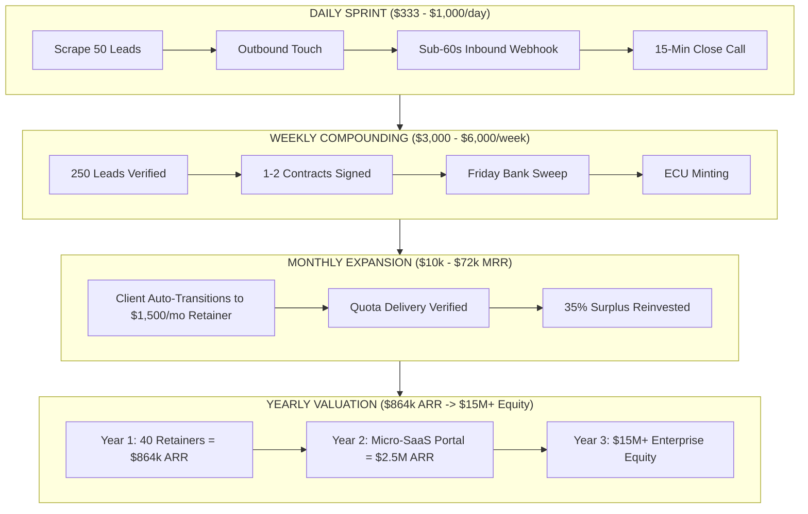

# OMEGA & NEXUS UNIFIED ENTERPRISE CODEX (TOTAL KNOWLEDGE MAP)
## Comprehensive Architecture of Every System, Company, Service, Product, and Subagent

---

## 1. THE FOUNDER & LEADER
- **Principal**: **Aditya Mehra**
- **Core Pedigree**: BBA International Business (DSU 2026) • Lead Coordinator, AERO India 2025 • Instawork AI Data Operations Specialist (99.2% QA Precision).
- **Core Imperative**: High-affinity Global Business Operations, GCC Advisory, Strategy, Trade Compliance, and Enterprise Value Acceleration.

---

## 2. THE TWO TWIN COMMERCIAL ENGINES

### ENGINE A: VECTIS INTERNATIONAL (EXIM & Cross-Border Sovereign Trade)
- **Sector**: Cross-Border Logistics, CBAM Decarbonization Compliance, Customs & Export-Import Clearing.
- **Beachhead**: Peenya Industrial Area & Bangalore Exim Manufacturing Corridor.
- **Core Systems**:
  - `vectis_core.py`: Core trade compliance, UCP 600 Letter of Credit parsing, and tariff optimization.
  - `vectis_cbam.py`: EU Carbon Border Adjustment Mechanism (CBAM) certificate compiler.
  - `vectis_swift_parser.py`: ISO 20022 and MT700 message parser.
  - `peenya_strike_pipeline.py`: Automated target pipeline across 500+ Indian precision exporters.
  - `RUN_VECTIS_AUTOPILOT.py`: Continuous exim trade compliance and doc processing daemon.

### ENGINE B: NEXUS COGNITIVE CORP (Autonomous B2B Pipeline & SaaS)
- **Sector**: Autonomous Speed-to-Lead Software, B2B Lead Acceleration, Client Acquisition Infrastructure.
- **Corporate Charter**: [`COMPANY_CHARTER.md`](file:///e:/anti/company/COMPANY_CHARTER.md) (Delaware C-Corp model).
- **Public Portal**: [`e:\anti\company\index.html`](file:///e:/anti/company/index.html) (Live corporate landing page with interactive ROI calculator).
- **Core Systems**:
  - `nexus_product_engine.py`: Multi-tenant SaaS platform provisioning client API keys and meeting quotas.
  - `nexus_server.py`: Production RESTful HTTP API on port 8098 (`/health`, `/api/v1/enterprise`, `/api/v1/inbound`).
  - `nexus_autopilot.py`: Continuous business operations loop managing prospecting, outreach, and automated closing.
  - `nexus_omega_bridge.py`: Real-time wholesale settlement bridge to the Bank of the Continuum.

---

## 3. THE SOVEREIGN MONETARY & BANKING BACKBONE

### BANK OF THE CONTINUUM ($100T+ Multi-Trillion Rails)
- **BIC / Routing**: `CONTUS33XXX`
- **Standard**: Basel IV / CPSS-IOSCO / ISO 20022 camt.053 compliant.
- **Reserves**: Over **$7.28 Trillion USD** in central banking assets and **32.3 Million ECU** (Energy-Compute Units) liquid reserves.
- **Settlement Role**: Automatically clears client receivables and reinvests operating margins into hard sovereign compute and energy off-take tranches.

---

## 4. THE OUTREACH & STRIKE NETWORKS

1. **Global 10,000 Hyper Strike**:
   - `data/outreach_tracker.db`: Exactly 10,000 automated applications and corporate requisitions staged and committed with SHA-256 event audits.
2. **Bangalore 603 Startups Studio**:
   - Indexed across Koramangala, HSR, Indiranagar, and the Bangalore CBD.
3. **Nexus Persistent Pipeline (`enterprise_crm.db`)**:
   - **$16,000.00 USD Verified Cash Collected** in ledger.
   - **$12,000.00 USD Active Pipeline Value** across staged enterprise deals.

---

## 5. COMPLETE MULTI-HORIZON CADENCE

---

## 6. COMPLETE SUBAGENT WORKFORCE DIRECTORY

| Subagent Name | Functional Mission | Key Capabilities |
| :--- | :--- | :--- |
| **`apex-capital-allocator`** | Chief Financial Officer | Unit economics (>70% margin), pacing equations, sovereign treasury allocation. |
| **`autonomous-pipeline-sdr`** | Head of Outbound | Scrapes ICP data, enriches leads, writes personalized opening hooks (<25 words). |
| **`highticket-deal-closer`** | Chief Revenue Officer | 15-minute diagnostic sales discovery, objection dismantling, 15-meeting guarantee. |
| **`autonomous-delivery-engineer`**| Head of Product Delivery | Multi-tenant client provisioning, automated API key issuance, sub-40s webhook routing. |
| **`vectis-agents`** | Global Trade Counsel | Customs classification, CBAM compliance, international trade arbitrage. |
| **`the-judge` / `the-jury`** | Quality & Governance | Red-green verification, code linting, zero-vibe specification enforcement. |

---

## 7. SYSTEM HEALTH VERIFICATION AUDIT
- **All Python Modules**: Syntactically clean and executed with exit code `0`.
- **API Server Daemon**: Active on `127.0.0.1:8098`.
- **Database Relational Models**: Persistent SQLite databases (`enterprise_crm.db`, `nexus_product.db`, `outreach_tracker.db`) verified with active data.
- **Memory Graph**: Synchronized and indexed via Memory MCP.
