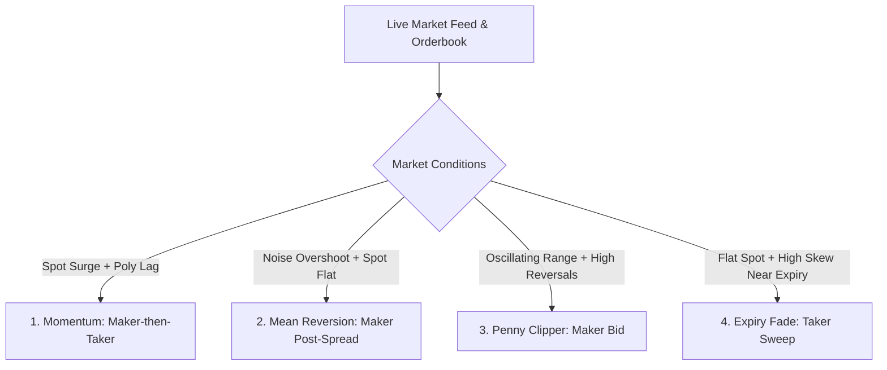

# CloddsBot High-Frequency & Arbitrage Strategy Specification

**Source Module**: [`src/strategies/crypto-hft/`](file:///e:/anti/external/CloddsBot/src/strategies/crypto-hft) & [`src/arbitrage/`](file:///e:/anti/external/CloddsBot/src/arbitrage)  
**Target Markets**: Polymarket (5m, 15m, 1h, 4h, Daily), Kalshi, Drift, Betfair, Solana DEXs  

---

## 1. Fast-Round Market Discovery & Gamma API Slug Parsing

Polymarket fast-interval crypto prediction markets are organized in round slots:
$$\text{slotStart} = \left\lfloor \frac{\text{unixTime}}{\text{roundDurationSec}} \right\rfloor \times \text{roundDurationSec}$$

### Slug Formatting
| Interval | Round Seconds | Example Slug |
| :--- | :--- | :--- |
| **5m** (BTC only) | 300 | `btc-updown-5m-1770935700` |
| **15m** (BTC, ETH, SOL, XRP) | 900 | `eth-updown-15m-1770935700` |
| **1h** | 3600 | `sol-updown-1h-1770934800` |
| **4h** | 14400 | `btc-updown-4h-1770921600` |
| **Daily** | 86400 | `btc-updown-daily-1770854400` |

### Timing Gates
- **Minimum Round Age**: Spreads are typically erratic in the first 60–120 seconds of a round. Trading is gated until spreads stabilize.
- **Minimum Time Left**: Positions should be closed or entered with taker execution if $\text{timeLeftSec} < 60\text{s}$ to avoid settlement lockup.

---

## 2. Polymarket 4-Pillar Strategy Portfolio

### Strategy 1: Momentum (`evaluateMomentum`)
- **Premise**: Spot exchanges (Binance / Bybit) lead prediction market orderbooks by 2–10 seconds. When spot surges, binary market UP/DOWN tokens lag fair value.
- **Trigger**:
  $$|\Delta_{\text{spot}}| \ge 0.15\% \quad \text{within } 30\text{ seconds}$$
  $$\text{polyStaleSec} \le 5\text{s}, \quad \text{spreadPct} \le 2.0\%$$
- **Fair Value Scaling**:
  $$\text{expectedPolyPrice} = 0.50 + \frac{|\Delta_{\text{spot}}|}{100} \times 5$$
  $$\text{lagCents} = \text{expectedPolyPrice} - \text{price} \ge \$0.02$$
- **Execution**: `maker_then_taker` (Attempt maker fill within spread for 1.5s; cross spread if unfilled and signal persists).

---

### Strategy 2: Mean Reversion (`evaluateMeanReversion`)
- **Premise**: Retail panic or temporary liquidity imbalance moves binary prices to extreme values without a corresponding spot move.
- **Trigger**:
  $$\text{Token Price} \le 0.30 \quad (\text{Cheap}) \quad \lor \quad \text{Token Price} \ge 0.72 \quad (\text{Expensive})$$
  $$\text{roundAge} \ge 120\text{s}, \quad |\Delta_{\text{spot}}| \le 0.08\%$$
  $$\text{Orderbook Imbalance (OBI)} \ge -0.10 \quad (\text{Do not fight deep order flow})$$
- **Execution**: `maker` (Post limit order inside bid-ask spread to collect 0% maker rebates).

---

### Strategy 3: Penny Clipper (`evaluatePennyClipper`)
- **Premise**: Binary contracts in the $\$0.08-\$0.50$ range frequently oscillate around a local mean.
- **Metrics**:
  - **Oscillation Range**: $\max(P) - \min(P) \ge \$0.03$ over a 30s rolling window.
  - **Reversals**: Count of alternating directional moves $(\ge 3)$ exceeding $\$0.01$ step.
  - **Entry Discount**: $\text{mean}_{30s} - P_{\text{current}} \ge \$0.01$.
  - **Spot Confirmation**: Spot price movement over last 10s must match position direction.
- **Execution**: `maker` (Post at current best bid).

---

### Strategy 4: Expiry Fade (`evaluateExpiryFade`)
- **Premise**: In the final minutes of a round, binary prices often remain distorted away from 50/50 even when the spot price has flattened.
- **Trigger**:
  $$60\text{s} \le \text{timeLeftSec} \le 300\text{s}$$
  $$|\Delta_{\text{spot}}| \le 0.06\% \quad (\text{spot is calm})$$
  $$\max(|P_{\text{UP}} - 0.50|, |P_{\text{DOWN}} - 0.50|) \ge 0.15$$
- **Execution**: `taker` (Cross spread to capture rapid theta/decay convergence before final settlement).

---

## 3. Cross-Platform Arbitrage & Kelly Sizing

### Cross-Market Spread Calculation
For two platforms $A$ and $B$ trading identical or semantically matching outcomes:
$$\text{Spread} = P_B - P_A, \quad \text{Spread\%} = \frac{P_B - P_A}{P_A} \times 100$$
$$\text{Profit per } \$100 = \left(\frac{100}{P_{\text{buy}}}\right) \times P_{\text{sell}} - 100$$

### Prediction Market Kelly Criterion
Given estimated probability $p$ and market probability (price) $q$:
$$\text{Edge} = p - q$$
$$\text{Full Kelly Fraction } f^* = \frac{p \cdot (1 - q) - (1 - p) \cdot q}{1 - q} = \frac{p - q}{1 - q}$$
To safeguard against estimation variance, CloddsBot enforces **Quarter Kelly** or **Half Kelly**:
$$\text{Safe Size} = \min\left(\text{Bankroll} \times f^* \times \text{Confidence} \times 0.25, \; \text{MaxPositionSize}\right)$$
