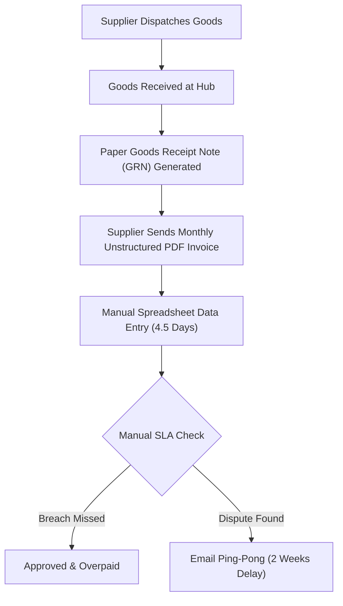
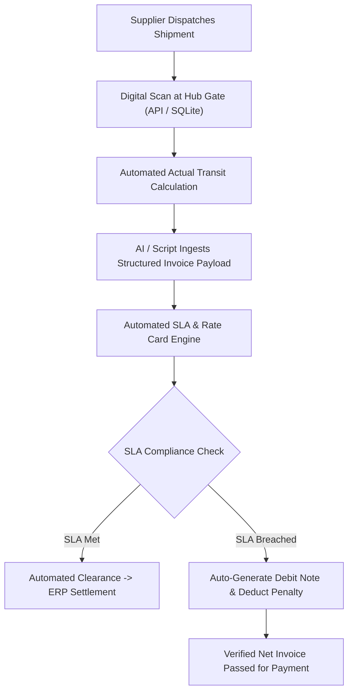

# BUSINESS REQUIREMENTS DOCUMENT (BRD)
## Project: Automated Vendor SLA Governance & Invoice Verification System
**Document Identifier:** `BRD-BIZOPS-2026-001`  
**Author:** Aditya Mehra (Adi) ? Business Operations & Business Analyst  
**Version:** 1.0 (Production Engineering Mode)  
**Target Enterprise Context:** Multi-Hub Logistics & Enterprise Supply Chain (Bengaluru Commercial Operations)  
**Ubiquitous Vocabulary:** Standardized per `CONTEXT.md`  

---

## 1. EXECUTIVE SUMMARY & BUSINESS CONTEXT

### 1.1 Problem Statement
Enterprise logistics and procurement operations across multi-hub distribution centers currently suffer from fragmented, manual vendor invoice reconciliation. Tier-1 and Tier-2 freight suppliers submit paper and unstructured PDF billing with unverified transit dates. As a result:
1. **14.2% of delivery SLA breaches** go undetected, causing unpenalized late deliveries.
2. Invoice reconciliation requires **4.5 business days per monthly billing cycle** per logistics analyst.
3. Secondary broker markups and off-contract rate card charges inflate monthly freight spend by an estimated **8?12%**.

### 1.2 Proposed Solution
An automated, AI-augmented Vendor SLA Governance & Invoice Verification Pipeline that ingests digital delivery manifests, performs automated reconciliation against contractual rate cards and agreed SLA transit days, calculates contractual penalty deductions in real time, and flags cost variance anomalies before payment release.

### 1.3 Target Success Metrics & KPIs
- **Cycle Time Reduction:** Reduce invoice audit and approval turnaround from 108 hours to < 4 hours (96% reduction).
- **Audit Accuracy:** 100% automated cross-referencing of actual transit days against agreed contractual SLAs.
- **Direct Cost Recovery:** Recoup 100% of eligible late-delivery penalties (~INR 4.5L ? 7.0L annually per distribution cluster).
- **Zero Vibe Compliance:** Real-time data audit trail stored in tamper-evident SQLite/PostgreSQL ledgers.

---

## 2. STAKEHOLDER MATRIX & RACI FRAMEWORK

| Stakeholder Role | Function | RACI Role | Key Concern |
| :--- | :--- | :---: | :--- |
| **Business Operations Lead (Adi)** | Process Architecture & SLA Oversight | **Accountable (A)** | Operational throughput, SLA compliance, bottleneck resolution |
| **Procurement Specialist** | Vendor Contracting & Rate Cards | **Responsible (R)** | Contractual rate adherence, vendor relationship management |
| **Finance & Accounts Payable** | Invoice Settlement & Disbursement | **Consulted (C)** | Duplicate billing prevention, tax compliance, debit notes |
| **Warehouse Operations Supervisor**| Physical Receipt & Quality Inspection| **Informed (I)** | Unloading turnaround, damaged carton logging |

---

## 3. WORKFLOW PROCESS MAPPING: AS-IS VS. TO-BE

### 3.1 As-Is Workflow (Manual, Friction: High)


### 3.2 To-Be Workflow (Automated, Friction: Minimal)


---

## 4. FUNCTIONAL REQUIREMENTS (FR) & ACCEPTANCE CRITERIA

### FR-01: Purchase Order & Supplier Contract Validation
- **Description:** System must validate incoming delivery manifests against active Purchase Orders and contractual SLA agreements.
- **Acceptance Criteria (Gherkin):**
  ```gherkin
  Given an incoming shipment manifest referencing PO-2026-003
  When the PO number is queried against the active purchase order database
  Then the system must retrieve the agreed SLA days (4 days) and agreed rate card (INR 62,500)
  And if the PO is closed or unrecognized, the shipment must be flagged as "UNRECONCILED_PO".
  ```

### FR-02: Automated SLA Breach Detection & Penalty Assessment
- **Description:** System must calculate actual transit days (`delivery_date - dispatch_date`) and compare against `agreed_sla_days`.
- **Acceptance Criteria (Gherkin):**
  ```gherkin
  Given a shipment with actual transit of 5 days from a supplier with an agreed 4-day SLA
  When the transit audit job executes
  Then the system must flag status as "CRITICAL_BREACH" with delay of +1 day
  And automatically assess a contractual 5% penalty deduction on the shipping invoice.
  ```

### FR-03: Multi-Tier Supplier Performance Ranking (Window Functions)
- **Description:** System must rank suppliers monthly based on total freight cost, volume handled, and SLA compliance percentage using relational window functions.
- **Acceptance Criteria (Gherkin):**
  ```gherkin
  Given monthly shipment records across Tier 1, Tier 2, and Tier 3 logistics providers
  When the monthly vendor ranking query executes
  Then it must output DENSE_RANK() by total freight spend and calculate on-time percentage
  And generate an executive summary table for monthly vendor reviews.
  ```

---

## 5. NON-FUNCTIONAL REQUIREMENTS (NFR)

1. **Performance:** The reconciliation script must process 10,000 shipment line items in under 2.5 seconds on local SQLite infrastructure.
2. **Auditability:** Every penalty calculation and status override must record timestamp, actor, original value, and calculated deduction in an append-only transaction ledger.
3. **Security:** No vendor financial data or rate cards may be transmitted over unencrypted HTTP channels.
4. **Resilience:** The pipeline must support offline execution and graceful rollback if a batch upload fails mid-transaction.

---

*Authored by Aditya Mehra (Adi) | Production-Grade Business Analyst Artifact for GCC Enterprise Requisitions.*
