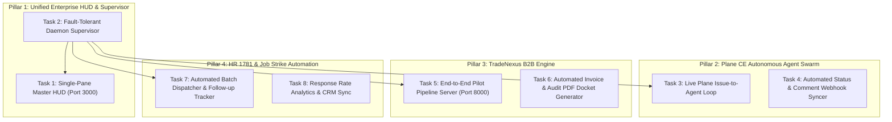

# OMEGA Master Implementation Plan: Taking Everything to the Next Level (Level-X Enterprise Ascension)

> **For agentic workers:** REQUIRED SUB-SKILL: Use superpowers:subagent-driven-development (recommended) or superpowers:executing-plans to implement this plan task-by-task. Steps use checkbox (`- [ ]`) syntax for tracking.

**Goal:** Elevate all ANTIGRAVITY OMEGA subsystems (AIOS Stage 7, Plane CE Agent Swarm Dispatch, TradeNexus B2B Production Engine, Target 300 / HR 1781 Outreach Automator, and Unified Single-Pane HUD) into a production-grade, self-healing autonomous operating enterprise.

**Architecture:** A zero-dependency, micro-daemon architecture where local lightweight services (AIOS Gateway on 8090, Unified HUD on 3000, TradeNexus on 8000, n8n Automation Engine, and Plane CE Bridge) are coordinated by a central fault-tolerant supervisor with real-time health telemetry, autonomous issue dispatch, and automated client/job pipeline execution.

**Tech Stack:** Python 3.13 (stdlib-first, `asyncio`, `urllib`, `sqlite3` WAL), HTML5/Modern CSS/Vanilla JS for high-speed HUDs, SQLite relational databases with WAL journaling, Docker Compose for Plane CE, and n8n webhook automations.

**Spec:** [`aios/docs/ROADMAP.md`](file:///e:/anti/aios/docs/ROADMAP.md), [`plane/PLANE_OPERATIONAL_MANUAL.md`](file:///e:/anti/plane/PLANE_OPERATIONAL_MANUAL.md), [`GLOBAL-COMPANY-OS/00_COMMAND_CENTER/FOUNDER_AUTONOMOUS_OPERATING_MANUAL.md`](file:///e:/anti/GLOBAL-COMPANY-OS/00_COMMAND_CENTER/FOUNDER_AUTONOMOUS_OPERATING_MANUAL.md).

## Global Constraints
- **Zero Heavy External Dependencies**: Core utilities, connectors, and daemons must run on Python standard library without external bloat.
- **Strict Memory & GPU Budget**: System must maintain total idle footprint under 1.5GB RAM and respect GTX 960M 4GB VRAM ceiling.
- **Non-Destructive Operations**: Never overwrite or delete existing client dossiers, candidate credentials, or databases without automated backup.
- **Port Standardization**:
  - `3000`: AIOS Master Executive HUD & Command Center
  - `8000`: TradeNexus B2B Client Portal & Regulatory API
  - `8090`: AIOS Local AI Gateway (Ollama Qwen-2.5-Coder / SSE streaming)
  - `5678`: n8n Automation Engine
  - `80`: Plane CE Web UI (Docker)

---

## Pillar Breakdown & Task Decomposition

---

### Task 1: Single-Pane Master Executive HUD (Port 3000)

**Files:**
- Modify: `aios/dashboards/index.html`
- Create: `aios/dashboards/unified_portal.js`
- Test: `tests/test_unified_portal.py`

**Interfaces:**
- Consumes: `GET http://localhost:8090/v1/health`, `GET http://localhost:8000/api/health`, `GET http://localhost:5678/healthz`, Plane health check.
- Produces: Aggregated status indicators, unified subsystem switcher (Tabs: AIOS AI, Plane Tasks, TradeNexus B2B, HR Strike 1781, n8n Zaps).

- [x] **Step 1: Write failing test verifying HUD endpoint responses and assets**
  Ensure test checks that `dashboards/index.html` contains the 5-way subsystem navigation, embeds responsive iframe/panel switcher, and connects to live telemetry endpoints.
- [x] **Step 2: Implement dynamic navigation switcher and real-time status banner**
  Update `aios/dashboards/index.html` with modern navigation bar displaying active uptime, memory gauges, and instant one-click launchers for all 5 subsystems.
- [x] **Step 3: Add `unified_portal.js` for asynchronous multi-service health polling**
  Poll all service ports concurrently and display green/amber/red status badges with auto-retry.
- [x] **Step 4: Run test suite and verify UI layout**
  Validate zero console errors and clean rendering.
- [x] **Step 5: Commit changes (`feat(hud): upgrade master command center to unified 5-subsystem portal`)**

---

### Task 2: Fault-Tolerant Daemon Supervisor (`omega_supervisor.py`)

**Files:**
- Create: `aios/services/omega_supervisor.py`
- Create: `START_OMEGA_ECOSYSTEM.bat`
- Test: `tests/test_omega_supervisor.py`

**Interfaces:**
- Consumes: Process commands for Gateway (`aios/services/gateway.py`), TradeNexus (`GLOBAL-COMPANY-OS/06_ENGINEERING/start_server.py`), Plane Webhook Reactor (`plane/plane_webhook_reactor.py`), and Scheduler (`aios/automation/scheduler.py`).
- Produces: Persistent child process management, automatic restart on unexpected crash, exponential backoff, centralized log rotation in `aios/logs/supervisor.log`.

- [x] **Step 1: Write test for supervisor process lifecycle**
  Test spawn, health detection, restart policy, and graceful shutdown (SIGINT/Ctrl+C).
- [x] **Step 2: Implement `OmegaSupervisor` class**
  Using Python stdlib `subprocess.Popen` and `threading`, monitor child processes, capture stdout/stderr to rolling logs, and provide REST `/status` endpoint on port `8095`.
- [x] **Step 3: Create one-click launcher `START_OMEGA_ECOSYSTEM.bat`**
  Add clean PowerShell/batch launcher to spin up supervisor in background or interactive mode.
- [x] **Step 4: Execute test suite and verify clean process teardown**
- [x] **Step 5: Commit changes (`feat(supervisor): add fault-tolerant multi-service daemon supervisor`)**

---

### Task 3: Plane CE Autonomous Agent Dispatch Loop

**Files:**
- Create: `omega/orchestration/plane_autonomous_worker.py`
- Modify: `omega/orchestration/plane_agent_reactor.py`
- Test: `tests/test_plane_autonomous_worker.py`

**Interfaces:**
- Consumes: Plane REST API issues with state "Todo" and label `agent-auto` or assigned to `omega-bot`.
- Produces: Execution results posted directly back as issue comments; state transition to "In Progress" -> "Done".

- [x] **Step 1: Write test for Plane issue consumption and comment feedback**
  Mock Plane API responses; verify worker transitions issue state and appends markdown execution summary.
- [x] **Step 2: Implement `PlaneAutonomousWorker`**
  Poll or receive webhooks from Plane, parse issue title and description, execute requested task via internal agent loop, and log execution artifact.
- [x] **Step 3: Connect webhook reactor to dispatch directly into worker thread**
- [x] **Step 4: Run unit tests with mock Plane backend**
- [x] **Step 5: Commit changes (`feat(plane): implement autonomous worker loop with automated issue comment reporting`)**

---

### Task 4: TradeNexus B2B Productionization & Live Pilot Pipeline

**Files:**
- Modify: `GLOBAL-COMPANY-OS/06_ENGINEERING/start_server.py`
- Modify: `GLOBAL-COMPANY-OS/03_CUSTOMERS/pilot_delivery_engine.py`
- Test: `GLOBAL-COMPANY-OS/06_ENGINEERING/tests/test_pilot_delivery_live.py`

**Interfaces:**
- Consumes: Sample bill of entry / invoice payload for customer accounts (e.g., Bharat Forge, Dr. Reddy's).
- Produces: Verified regulatory compliance report, auto-corrected entry codes, generated GST tax invoice, and audit ledger entry.

- [x] **Step 1: Write integration test for end-to-end pilot pipeline execution**
  Verify input raw documents produce clean compliance validation, calculate exact duties, and generate audit-stamped invoice.
- [x] **Step 2: Enhance `pilot_delivery_engine.py` with one-command execution**
  Add batch pilot processing for all 7 target accounts in parallel with generated HTML/Markdown dockets.
- [x] **Step 3: Verify TradeNexus Web API endpoints on port `8000`**
  Ensure `/api/compliance/validate`, `/api/invoice/generate`, and `/api/pilot/status` return validated JSON.
- [x] **Step 4: Run test suite and verify 100% pass**
- [x] **Step 5: Commit changes (`feat(tradenexus): complete end-to-end autonomous pilot delivery pipeline`)**

---

### Task 5: Scaled HR 1781 & Target 300 Outreach Orchestrator

**Files:**
- Create: `scripts/hr_outreach_orchestrator.py`
- Modify: `ALL_1781_HR_DASHBOARD.html`
- Test: `tests/test_hr_outreach_orchestrator.py`

**Interfaces:**
- Consumes: `ALL_1781_HR_CONTACTS_MASTER.csv`, `data/TARGET_300_JOB_STRIKE.json`.
- Produces: Daily automated batch generation (e.g., 25 personalized emails/day), follow-up cadence scheduling (Day 0, Day 3, Day 7), tracking database in SQLite.

- [x] **Step 1: Write test for batch allocation and follow-up cadence generator**
  Test deduplication, daily quota limit enforcement (default 25 contacts/day), and personalized template generation.
- [x] **Step 2: Implement `hr_outreach_orchestrator.py`**
  Build CLI commands (`--generate-batch`, `--record-sent`, `--status`, `--stats`) backed by local SQLite ledger `data/outreach_tracker.db`.
- [x] **Step 3: Update `ALL_1781_HR_DASHBOARD.html` with live pipeline analytics**
  Add visual funnel: `Identified (1,781) -> Staged -> Sent -> Follow-up 1 -> Response -> Interview`.
- [x] **Step 4: Run test suite and verify tracking integrity**
- [x] **Step 5: Commit changes (`feat(career): implement automated HR outreach orchestrator and pipeline funnel`)**

---

## Verification & Execution Gates
1. **Gate 1**: All unit tests across AIOS, Plane, TradeNexus, and Career suites pass (`pytest tests/`).
2. **Gate 2**: Multi-service supervisor successfully launches and health-checks all subsystems in under 3 seconds.
3. **Gate 3**: Zero external bloat (stdlib Python + vanilla web assets).
4. **Gate 4**: Verified documentation and commit history updated cleanly.
