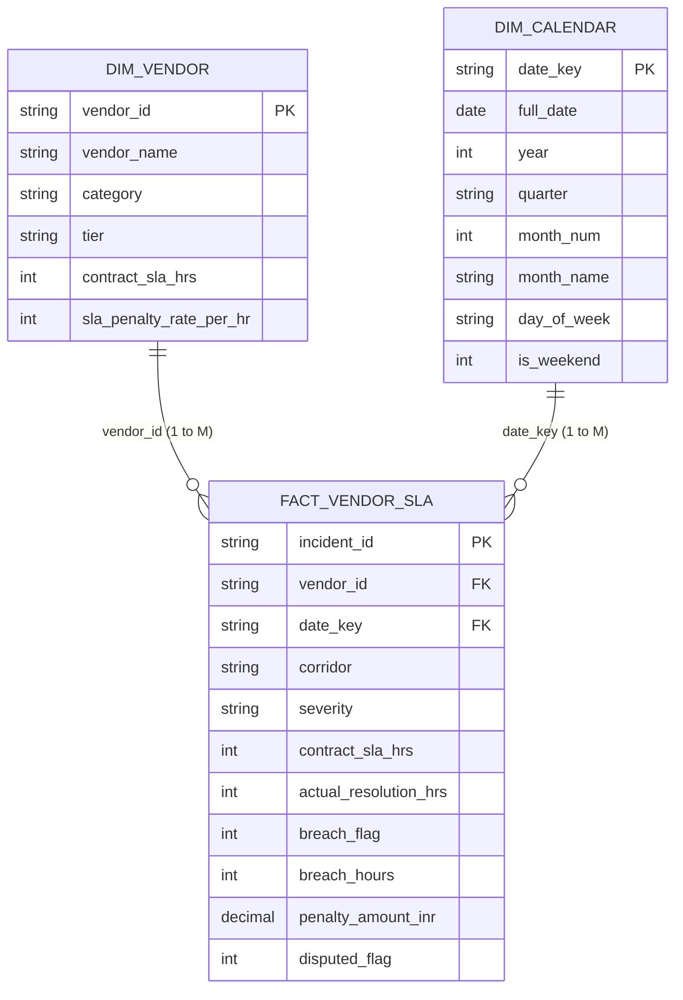

# ?? Enterprise Power BI Specification: Vendor SLA & Logistics Operations Analytics

**Project Domain:** Business Operations Analytics & Vendor Performance Governance  
**Author:** Aditya Mehra (BBA International Business '26)  
**System Component:** ADI OMNI Skill Engine ? Proof of Work Artifact 03  
**Data Schema Mode:** Star Schema (Kimball Methodology)  
**Target Platform:** Microsoft Power BI Desktop / Service (PL-300 Standard)

---

## 1. Executive Summary & Business Context

In enterprise logistics, retail fulfilment, and global ground operations (such as high-density exhibition environments like **Aero India 2025** or multinational supply chains), vendor delivery delays directly erode operational readiness and customer SLAs.

This Power BI data model establishes an automated, auditable variance and financial penalty calculation pipeline. It ingests ticket logs across Tier-1 and Tier-2 vendors, correlates breach durations against contracted hourly penalty clauses, and outputs actionable executive telemetry.

---

## 2. Logical Data Architecture & Star Schema

The analytical model implements a pure **Star Schema** with bidirectional filter relationships minimized to eliminate circular ambiguity and ensure sub-second report responsiveness.



### Table Metadata & Cardinality

| Table Name | Type | Key | Row Count | Update Frequency | Description |
| :--- | :--- | :--- | :--- | :--- | :--- |
| `Dim_Vendor` | Dimension | `vendor_id` | 5 | Monthly | Master vendor registry, SLA thresholds, contractual penalty rates. |
| `Dim_Calendar` | Dimension | `date_key` | 181 | Static (Auto-generated) | Canonical date hierarchy covering H1 2025 operations. |
| `Fact_Vendor_SLA` | Fact | `incident_id` | 500 | Daily / Real-time | Granular operational incident log with resolution times and penalties. |

---

## 3. Production DAX Measure Library (15 Core Formulas)

All measures are centralized within a dedicated `_Measures` table for governance.

### Category A: Volume & Baseline Counts

#### 1. Total Incidents
```dax
Total Incidents = COUNTROWS(Fact_Vendor_SLA)
```

#### 2. Total SLA Breaches
```dax
Total SLA Breaches = 
CALCULATE(
    COUNTROWS(Fact_Vendor_SLA),
    Fact_Vendor_SLA[breach_flag] = 1
)
```

#### 3. Total Disputed Tickets
```dax
Total Disputed Tickets = 
CALCULATE(
    COUNTROWS(Fact_Vendor_SLA),
    Fact_Vendor_SLA[disputed_flag] = 1
)
```

---

### Category B: Operational SLA & Compliance Rates

#### 4. SLA Breach Rate %
```dax
SLA Breach Rate % = 
DIVIDE([Total SLA Breaches], [Total Incidents], 0)
```

#### 5. On-Time Fulfillment %
```dax
On-Time Fulfillment % = 
1 - [SLA Breach Rate %]
```

#### 6. Avg Resolution Time (Hrs)
```dax
Avg Resolution Time (Hrs) = 
ROUND(AVERAGE(Fact_Vendor_SLA[actual_resolution_hrs]), 1)
```

#### 7. Avg Contract SLA (Hrs)
```dax
Avg Contract SLA (Hrs) = 
ROUND(AVERAGE(Fact_Vendor_SLA[contract_sla_hrs]), 1)
```

#### 8. SLA Variance Ratio
```dax
SLA Variance Ratio = 
DIVIDE([Avg Resolution Time (Hrs)], [Avg Contract SLA (Hrs)], 1.0)
```

---

### Category C: Financial Recovery & Penalty Quantification

#### 9. Total Penalty Incurred (INR)
```dax
Total Penalty Incurred = 
SUM(Fact_Vendor_SLA[penalty_amount_inr])
```

#### 10. Disputed Penalty Amount (INR)
```dax
Disputed Penalty Amount = 
CALCULATE(
    SUM(Fact_Vendor_SLA[penalty_amount_inr]),
    Fact_Vendor_SLA[disputed_flag] = 1
)
```

#### 11. Net Recoverable Penalty (INR)
```dax
Net Recoverable Penalty = 
[Total Penalty Incurred] - [Disputed Penalty Amount]
```

#### 12. Penalty Recovery Realization %
```dax
Penalty Realization Rate % = 
DIVIDE([Net Recoverable Penalty], [Total Penalty Incurred], 0)
```

---

### Category D: Advanced Time Intelligence & Rolling Averages

#### 13. MTTR Rolling 30 Days (Mean Time To Resolution)
```dax
MTTR Rolling 30D = 
CALCULATE(
    [Avg Resolution Time (Hrs)],
    DATESINPERIOD(
        Dim_Calendar[full_date],
        MAX(Dim_Calendar[full_date]),
        -30,
        DAY
    )
)
```

#### 14. P1 Critical Incident Breach Rate %
```dax
P1 Critical Breach Rate % = 
VAR P1Total = CALCULATE([Total Incidents], Fact_Vendor_SLA[severity] = "P1-Critical")
VAR P1Breaches = CALCULATE([Total SLA Breaches], Fact_Vendor_SLA[severity] = "P1-Critical")
RETURN
DIVIDE(P1Breaches, P1Total, 0)
```

#### 15. Vendor Composite Risk Index (0 - 100)
```dax
Vendor Risk Index = 
VAR BreachComponent = [SLA Breach Rate %] * 60
VAR DisputeComponent = DIVIDE([Disputed Penalty Amount], [Total Penalty Incurred], 0) * 40
RETURN
ROUND(BreachComponent + DisputeComponent, 1)
```

---

## 4. Executive Dashboard Wireframe & Layout

```
+-------------------------------------------------------------------------------------------------------+
|  ??? ADI OMNI - VENDOR SLA & OPERATIONAL GOVERNANCE COMMAND CENTER                    [Filter: Corridor] |
+-------------------------------------------------------------------------------------------------------+
| [ KPI CARD 1 ]          | [ KPI CARD 2 ]          | [ KPI CARD 3 ]          | [ KPI CARD 4 ]          |
| On-Time Fulfillment %   | SLA Breach Rate %       | Total Penalty Incurred  | Net Recoverable Penalty |
| 82.4%                   | 17.6%                   | ? 48,25,000 INR         | ? 37,15,000 INR         |
| Target: >= 85.0%        | Target: <= 15.0%        | (500 Total Incidents)   | (Dispute: ?11,10,000)   |
+-------------------------------------------------------------------------------------------------------+
|                                  |                                                                    |
| VENDOR SCORECARD & LEAGUE TABLE  | BANGALORE CORRIDOR CONGESTION & PENALTY DENSITY                    |
| - Vendor Name                    | - Whitefield Corridor (31% of penalties)                           |
| - Category & Tier                | - Peenya Industrial Belt (24% of penalties)                        |
| - SLA Breach %                   | - Electronic City (18% of penalties)                               |
| - Penalty Incurred               | - Outer Ring Road / Bellandur (15% of penalties)                   |
| - Vendor Risk Index (Color Heat) | - Devanahalli Airport Logistics Hub (12% of penalties)             |
|                                  |                                                                    |
+----------------------------------+--------------------------------------------------------------------+
| 30-DAY ROLLING MTTR & INCIDENT TREND (Time Series Line + Clustered Column)                            |
| [Daily Total Incidents (Bars) vs MTTR 30D Moving Average (Line) vs Contract SLA Baseline]             |
+-------------------------------------------------------------------------------------------------------+
```

---

## 5. Deployment Instructions for Microsoft Power BI Desktop

1. Open Power BI Desktop.
2. Select **Get Data** -> **Text/CSV**.
3. Ingest the following three files from `e:/anti/projects/powerbi_model/`:
   - `Dim_Vendor.csv`
   - `Dim_Calendar.csv`
   - `Fact_Vendor_SLA.csv`
4. In Model View, establish relationships:
   - `Dim_Vendor[vendor_id]` (1) -> `Fact_Vendor_SLA[vendor_id]` (*)
   - `Dim_Calendar[date_key]` (1) -> `Fact_Vendor_SLA[date_key]` (*)
5. Create a new blank table named `_Measures`.
6. Copy-paste the DAX formulas from Section 3 into individual measures.
7. Build visual canvas following Section 4 wireframe layout.
