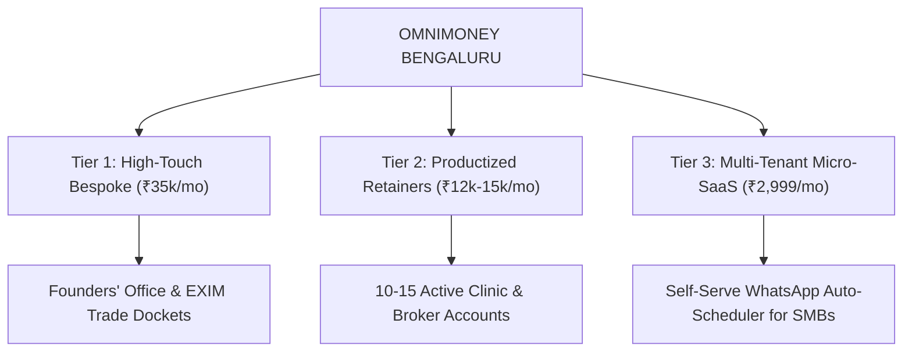

# OMNIMONEY OS: 90-Day Business & Enterprise Plan (₹3,00,000/Month Target)

**North Star**: Transition from high-touch service delivery into a productized agency, automated agent workforce, and micro-SaaS platform generating ₹10,000 daily-equivalent cash flow.

---

## 1. The 3-Tier Enterprise Architecture

---

## 2. Month-by-Month Evolution

### Month 1: Cash Flow Validation (₹50,000 – ₹1,00,000)
- Prove demand across 2 core verticals (Aesthetic Healthcare & Real Estate).
- Reach first ₹60k/month recurring revenue.
- Validate repeatable prospecting script with >15% meeting booking rate.

### Month 2: Operational Leverage & Systematization (₹1,50,000 – ₹2,00,000)
- Document all setup steps into deterministic SOPs.
- Deploy autonomous subagents to handle:
  - Lead enrichment from Google Maps & Meta Ad Library.
  - Automated weekly client performance report generation.
- Expand to 10 active retainers (₹1,20,000 recurring + setup fees).

### Month 3: Productization & Micro-SaaS Launch (₹3,00,000+/Month)
- Build a lightweight multi-tenant SaaS frontend on Supabase + Next.js.
- Allow any clinic or salon in India to connect their WhatsApp Business account and Google Calendar self-serve for ₹2,999/month.
- Acquire first 30 self-serve micro-SaaS users via targeted content and direct outreach.
- **Enterprise valuation milestone**: A business with ₹3,00,000/mo ARR (₹36 Lakhs ARR) at 80% gross margins is valued at ₹1.5 – ₹2.5 Crores.
