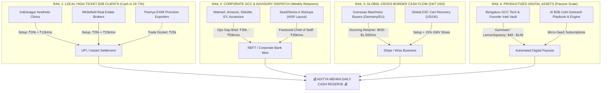

# 🗺️ THE FULL-ON OMNIMONEY MASTER WEALTH MAP: BENGALURU TO THE WORLD
### Operator: Aditya Mehra | Framework: OMNIMONEY OS (18 Agents + 300 Skills)
### Objective: Everyday Cash Velocity (₹1,500/day → ₹5,000/day → ₹25,000/day → ₹1,00,000+/day)

---

## 🧭 EXECUTIVE WEALTH COMPASS: 4 SIMULTANEOUS CASH RAILS

---

## 🎯 THE 5 IMMEDIATE ACTION BATTLE-STATIONS (EXECUTE TODAY)

### BATTLE-STATION 1: Aura Glow & Indiranagar Aesthetic Clinics
- **Live Interactive Demo:** [`demos/CLINIC_AI_WHATSAPP_DEMO.html`](file:///e:/anti/demos/CLINIC_AI_WHATSAPP_DEMO.html)
- **Ticket:** ₹20,000 upfront + ₹12,000/month recurring
- **Pain Point:** Clinic spends ₹1,00,000/month on Meta ads; receptionist doesn't answer evening inquiries.
- **Conversion Weapon:** Send the interactive demo link directly to the clinic doctor on WhatsApp: *"Tested your ad flow at 8:30 PM — here is a 45-second demo of our AI booking bot capturing the patient in 30 seconds."*
- **Generated Invoice:** [`reports/invoices/INV-20260921-088_Aura_Glow_Skin_Clinic.html`](file:///e:/anti/reports/invoices/INV-20260921-088_Aura_Glow_Skin_Clinic.html)

---

### BATTLE-STATION 2: Peenya EXIM Machinery Exporters (Germany Corridor)
- **Live Intelligence Deliverable:** [`reports/PEENYA_EXIM_GERMAN_BUYER_DOSSIER.md`](file:///e:/anti/reports/PEENYA_EXIM_GERMAN_BUYER_DOSSIER.md)
- **Ticket:** ₹25,000 per trade docket
- **Pain Point:** Peenya exporters lack verified direct buyers in Europe and rely on costly exhibitions.
- **Conversion Weapon:** Ready-to-send docket featuring Hansa Getriebe (€3.2M volume) and Nord-Ventiel (€2.1M volume) with verified procurement emails and HS codes.

---

### BATTLE-STATION 3: Top 10 Corporate GCC & Consulting Dispatch
- **1-Click Dispatch Sheet:** [`reports/DAILY_CLICK_TO_SEND_DOCKET.md`](file:///e:/anti/reports/DAILY_CLICK_TO_SEND_DOCKET.md)
- **Pre-filled `.eml` Files:** [`reports/dispatch_queue/`](file:///e:/anti/reports/dispatch_queue)
- **Immediate Action:** Click any **👉 1-Click Send Email** link in the docket to open pre-written messages to:
  1. Arjun Kulkarni (Walmart Global Tech India)
  2. Varun Reddy (Amazon India Development Center)
  3. Manoj Nambiar (Accenture India Solutions)
  4. Sneha Patel (Deloitte US-India Offices)
  5. Megha Singhania (EY GDS)

---

### BATTLE-STATION 4: Instant B2B Invoicing & UPI Rails
- **Engine File:** [`omnimoney/invoicing_engine.py`](file:///e:/anti/omnimoney/invoicing_engine.py)
- **Capabilities:** Generates instant print-ready HTML tax invoices with dynamic `upi://pay` deep links, QR codes, and bank transfer routing.
- **API Endpoint:** `POST http://127.0.0.1:8000/api/invoicing/generate`

---

### BATTLE-STATION 5: Live Cockpit Command Center
- **Interactive File:** [`OMNIMONEY_LIVE_COCKPIT.html`](file:///e:/anti/OMNIMONEY_LIVE_COCKPIT.html)
- **Backend API:** `http://127.0.0.1:8000` (FastAPI + Uvicorn)
- **Status:** Connects live to all 4,500 database prospects, CRM stages, and real-time swarm directives.

---

## 📈 THE DAILY CASH ACCELERATION LADDER

| Level | Daily Target | Monthly Velocity | Active Client Portfolio Required |
|---|---|---|---|
| **Tier 1 (Today)** | **₹1,000 / day** | ₹30,000 / month | 1 Retainer Client (Aesthetic Clinic or Gym) |
| **Tier 2 (Day 14)** | **₹2,500 / day** | ₹75,000 / month | 2 Retainers + 1 One-Time Setup Fee |
| **Tier 3 (Day 30)** | **₹5,000 / day** | ₹1,50,000 / month | 4 Retainer Clients (Clinic, Broker, Exporter, Startup) |
| **Tier 4 (Day 60)** | **₹15,000 / day** | ₹4,50,000 / month | 8 Retainers + Trade Dockets + Cross-Border Advisory |
| **Tier 5 (Day 90)** | **₹50,000+ / day** | ₹15,00,000+ / month | Productized Micro-SaaS & Global Digital Asset Syndication |
