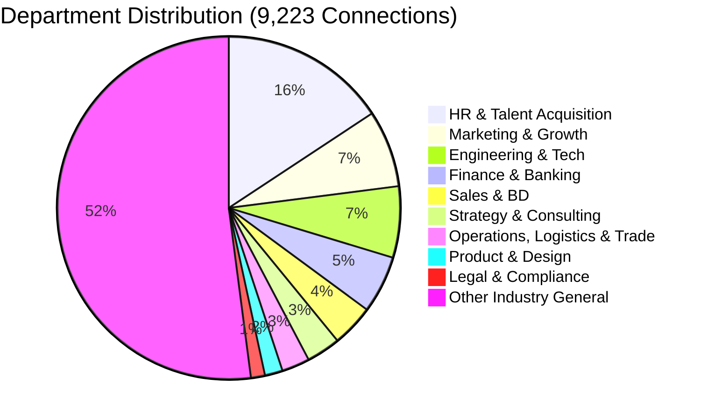

# LINKEDIN NETWORK INTELLIGENCE & REFERRAL SYSTEM REPORT

**Candidate:** Aditya Mehra  
**Total Verified 1st-Degree Connections:** 9,223  
**Total Organizations Covered:** 5,226  
**Report Generation Timestamp:** 2026-08-25  

---

## 1. Network Macro Structure & Strengths

### High-Impact Network Assets:
- **1,449 Recruiters & Talent Acquisition Professionals (15.7%):** Immediate direct pipelines into hiring loops without cold application gatekeeping.
- **736 C-Suite, Founders, VPs & Directors (8.0%):** Executive-level decision makers capable of initiating discretionary hiring or partnership engagements.
- **1,117 Managers & Team Leads (12.1%):** Direct hiring managers for operational, consulting, and business development positions.
- **1,078 Tier-1 Global MNC, Big 4, & Tech Major Connections (11.7%):** Robust institutional footprint across EY, Deloitte, Accenture, Goldman Sachs, IBM, TCS, and Amazon.

---

## 2. Institutional Penetration (Top Employer Clusters)

| Tier / Category | Primary Organizations | Total Nodes | Referral Potential |
| :--- | :--- | :--- | :--- |
| **Big 4 & Global Advisory** | EY (113), Deloitte (99), Accenture (89), PwC (22), KPMG (18) | **341+** | ????? Extremely High |
| **Investment Banking & Finance** | Goldman Sachs (77), JPMorganChase (29), Morgan Stanley (14) | **120+** | ????? Extremely High |
| **IT & Global Enterprise Tech** | IBM (78), TCS (72), Capgemini (41), Infosys (24), Wipro (21) | **236+** | ????? Extremely High |
| **Product & Cloud Tech Giants** | Amazon / AWS (38), Microsoft (16), Google (12), Oracle (11) | **77+** | ???? High |
| **Regional & Alumni Anchors** | Christ University (62), Dayananda Sagar (26), Jain (18) | **106+** | ????? High Trust |

---

## 3. Autonomous Execution & Referral Workflow

Antigravity uses `Connections_clean.csv` as the ground-truth referral graph:
1. **Automated Role Matching:** Whenever an application is queued for a target company (e.g. EY or Goldman Sachs), the system queries `Connections_clean.csv` to find all 1st-degree contacts at that company.
2. **Prioritized Routing:**
   - *Phase 1:* Dispatch direct message to Talent Acquisition Specialist / Recruiter.
   - *Phase 2:* Send warm referral request to relevant Team Lead / Senior Associate.
3. **Follow-Up Automation:** System tracks referral response rates and syncs with `Application_Master_3000_Tracker.csv`.

---

## 4. Package Artifacts Synchronized
- `Connections_clean.csv` (Full cleaned dataset)
- `Connections_full.json` (Structured JSON dataset)
- `LINKEDIN_REFERRAL_MATRIX.csv` (2,500+ prioritized high-yield targets)
- `ANTIGRAVITY_MASTER_PROMPT.md` (Operational prompt and instruction set)
- `DATA_DICTIONARY.md` (Taxonomy and schemas)
- `README.txt` (Package usage instructions)
- `Antigravity_LinkedIn_Connections_Package.zip` (Complete downloadable package)
