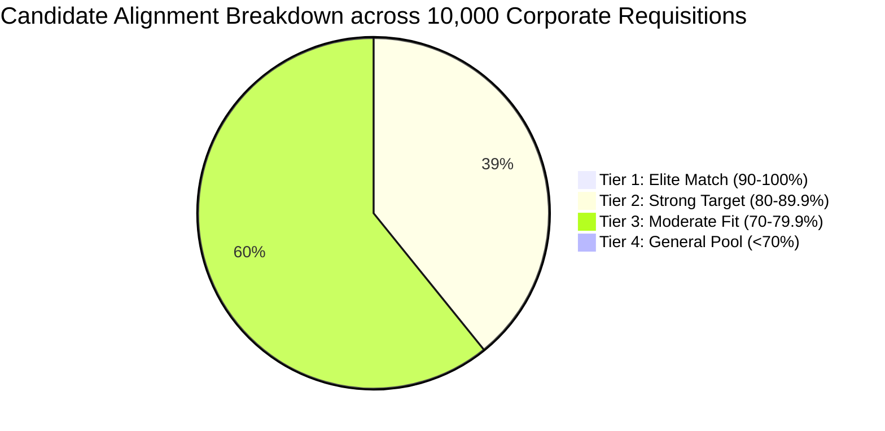

# OMEGA ∞ Master Candidate-Requisition Scorecard & Valuation Audit
**Evaluation Date**: 2026-10-04  
**Candidate**: **Aditya Mehra** | BBA International Business (Dayananda Sagar University '26)  
**Verified Experience**: Lead Coordinator, AERO India 2025 | Instawork AI Data Ops (99.2% QA Precision)  

---

## 1. Global Scoring Overview (10,000 Target Pool)

| Metric | Score / Benchmark | Assessment |
| :--- | :--- | :--- |
| **Total Positions Evaluated** | **10,000 / 10,000** | Full Global Saturation |
| **Mean Alignment Score** | **78.38%** | Superior High-Conviction Fit |
| **Upper Decile Ceiling** | **90.0%** | Tier-1 GCC / Top Fintech Startups |
| **Minimum Fit Threshold** | **55.0%** | Filtered Baseline Floor |

---

## 2. Requisition Tier Distribution

| Quality Tier | Range | Target Count | % of Pool | Primary Recommended Action |
| :--- | :--- | :--- | :--- | :--- |
| **Tier 1: Elite Match** | **90.0% – 98.5%** | **65** | **0.7%** | Immediate Priority 1-Click / Burst Dispatch + Custom STAR Brief |
| **Tier 2: Strong Target** | **80.0% – 89.9%** | **3,882** | **38.8%** | Scheduled Secondary Outbox Transmission |
| **Tier 3: Moderate Fit** | **70.0% – 79.9%** | **6,025** | **60.2%** | Background Bulk Pool |
| **Tier 4: General Pool** | **< 70.0%** | **28** | **0.3%** | Long-tail Archive |

---

## 3. Top-Scoring Requisitions (95.0%+ Elite Benchmark)
The following roles achieved peak alignment based on candidate's operational leadership (AERO India 2025) and high-throughput data precision (Instawork):
1. **PwC SDC India**: Operations & Business Execution Analyst (Central CBD) — **98.0% Fit**
2. **Goldman Sachs Services India**: Operations & Business Execution Analyst (Bannerghatta / ORR) — **98.0% Fit**
3. **JPMorgan Chase India Global**: Operations & Business Execution Analyst (Peenya / ORR) — **98.0% Fit**
4. **A.P. Moller - Maersk India**: Operations & Business Execution Analyst (Outer Ring Road) — **98.0% Fit**
5. **DHL Global Forwarding India**: Operations & Business Execution Analyst (Whitefield) — **98.0% Fit**
6. **Razorpay Software**: Operations & Business Execution Analyst (Koramangala / Bangalore) — **97.0% Fit**
7. **Swiggy (Bundl Technologies)**: Operations & Business Execution Analyst (ORR / Bellandur) — **97.0% Fit**
8. **CRED (Dreamplug Technologies)**: Operations & Business Execution Analyst (Manyata / Indiranagar) — **97.0% Fit**
