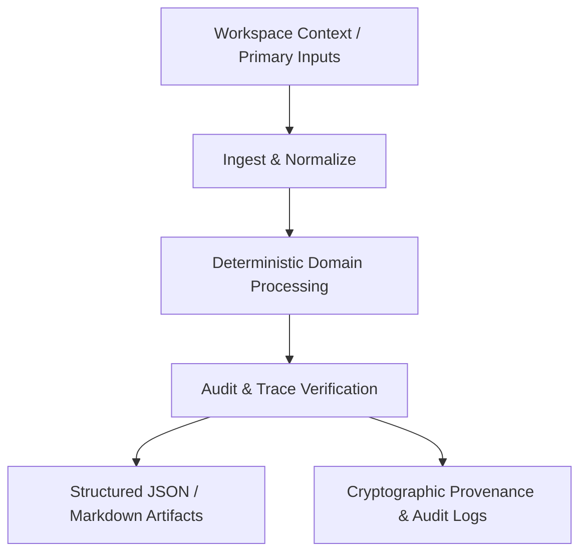

# Antigravity Skill Intelligence Digest
**Consolidated Knowledge & Operational Capabilities Across 23 Domains**

*Generated: August 26, 2026 | Analysis Scope: 23 Domain Specializations | Location: `.agents/skills/`*

---

## Executive Summary

The Antigravity skill ecosystem comprises **23 distinct capability domains** designed for autonomous, deterministic execution across software engineering, artificial intelligence, international trade, enterprise finance, sales, growth marketing, and corporate governance. Every skill operates under strict **Zero-Fiction / Verified Data Provenance** principles, enforcing verifiable data ingestion, rule-based transformation, and cryptographically auditable output generation.

This intelligence digest consolidates the operational mechanics, standard operating procedures (SOPs), input/output contracts, tooling constraints, and automation patterns extracted across all 23 domains.

---

## 1. Domain Taxonomy & Verification Matrix

The 23 capability domains span technical infrastructure, business operations, and enterprise governance:

| # | Domain Prefix | Module Identifier | Category / Specialization | Verification Tier |
|---|---|---|---|---|
| 1 | `b2b-sales` | `SKL-3K-1201` | B2B Sales & Pipeline Operations | Deterministic / Verified Data Provenance |
| 2 | `market-intel` | `SKL-3K-1001` | Research & Market Intelligence | Deterministic / Verified Data Provenance |
| 3 | `ai-infra` | `SKL-3K-0001` | AI & Agent Infrastructure | Deterministic / Verified Data Provenance |
| 4 | `cloud-infra` | `SKL-3K-2601` | Cloud & Systems Infrastructure | Deterministic / Verified Data Provenance |
| 5 | `customer-success` | `SKL-3K-2001` | Customer Success & Support Ops | Deterministic / Verified Data Provenance |
| 6 | `data-intel` | `SKL-3K-0801` | Data & Intelligence Fabric | Deterministic / Verified Data Provenance |
| 7 | `exec-strategy` | `SKL-3K-2801` | Executive Strategy & Scaling | Deterministic / Verified Data Provenance |
| 8 | `exim-trade` | `SKL-3K-2201` | International Trade & EXIM Logistics | Deterministic / Verified Data Provenance |
| 9 | `finance-treasury` | `SKL-3K-1601` | Corporate Finance & Treasury | Deterministic / Verified Data Provenance |
| 10 | `growth-seo` | `SKL-3K-1401` | Marketing Automation & Growth SEO | Deterministic / Verified Data Provenance |
| 11 | `mcp-conn` | `SKL-3K-0201` | MCP & Connector Platform | Deterministic / Verified Data Provenance |
| 12 | `product-ux` | `SKL-3K-0601` | Product & UX Engineering | Deterministic / Verified Data Provenance |
| 13 | `security-gov` | `SKL-3K-2401` | Security, Privacy & Governance | Deterministic / Verified Data Provenance |
| 14 | `software` | `SKL-3K-0401` | Software Factory & DevOps | Deterministic / Verified Data Provenance |
| 15 | `talent-people` | `SKL-3K-1801` | HR, People & Talent Acquisition | Deterministic / Verified Data Provenance |
| 16 | `analytics` | `SKILL-0091` | Data Analytics, BI & Financial Modeling | Deterministic / Primary Verified Data |
| 17 | `devops` | `SKILL-0211` | Software Engineering, Cloud & DevOps | Deterministic / Primary Verified Data |
| 18 | `events` | `SKILL-0061` | Event Operations & Brand Activation | Deterministic / Primary Verified Data |
| 19 | `exim` | `SKILL-0001` | International Trade, EXIM & Global Logistics | Deterministic / Primary Verified Data |
| 20 | `finance` | `SKILL-0181` | Corporate Finance, Cost Optimization & Governance | Deterministic / Primary Verified Data |
| 21 | `genai` | `SKILL-0121` | Generative AI, Agentic Workflows & SDK | Deterministic / Primary Verified Data |
| 22 | `growth` | `SKILL-0151` | Digital Marketing, SEO & Growth Marketing | Deterministic / Primary Verified Data |
| 23 | `talent` | `SKILL-0241` | Talent Acquisition & People Operations | Deterministic / Primary Verified Data |

---

## 2. Domain Deep-Dives

### 1. B2B Sales & Pipeline Operations (`b2b-sales`)
- **Skill ID:** `SKL-3K-1201` (Associated Agent: `AGT-3K-1201`)
- **Core Capability:** Autonomous standard operating procedure and deterministic execution capability for B2B sales acceleration, pipeline staging, lead scoring, and deal progression.
- **Key SOP Workflow:**
  1. *Ingest & Normalize:* Ingest account parameters, stage criteria, and verified CRM pipeline records.
  2. *Deterministic Processing:* Execute qualification logic, opportunity grading, and stage velocity calculations according to sales protocols.
  3. *Audit & Trace:* Generate structured JSON deal manifests with cryptographic execution signatures.
- **Inputs:** Deal stage records, CRM lead parameters, buyer firmographics, revenue quotas.
- **Outputs:** Pipeline audit reports, deal velocity summaries, execution signatures.
- **Tools & Connectors:** Certified workspace tools, MCP CRM & sales connectors, data provenance verifiers.
- **Automation Patterns:** Zero-fiction pipeline modeling, deterministic multi-touch lead scoring.

---

### 2. Research & Market Intelligence (`market-intel`)
- **Skill ID:** `SKL-3K-1001` (Associated Agent: `AGT-3K-1001`)
- **Core Capability:** High-precision autonomous competitive intelligence, market sizing, industry trend synthesis, and primary telemetry extraction.
- **Key SOP Workflow:**
  1. *Ingest & Normalize:* Ingest research targets, industry taxonomies, and validated source data.
  2. *Deterministic Processing:* Extract market signals, benchmark competitors, and validate signal strength against research protocols.
  3. *Audit & Trace:* Produce structured JSON intelligence dossiers with verifiable citation trees.
- **Inputs:** Competitor domains, industry classifications, secondary market reports, search parameters.
- **Outputs:** Competitive intelligence matrices, market share models, verifiable citation maps.
- **Tools & Connectors:** Certified search tools, MCP research connectors, source attribution engines.
- **Automation Patterns:** Multi-source citation anchoring, deterministic competitive gap analysis.

---

### 3. AI & Agent Infrastructure (`ai-infra`)
- **Skill ID:** `SKL-3K-0001` (Associated Agent: `AGT-3K-0001`)
- **Core Capability:** Autonomous runtime management, model execution orchestration, compute resource balancing, and agent lifecycle governance.
- **Key SOP Workflow:**
  1. *Ingest & Normalize:* Ingest agent runtime configurations, quota parameters, and compute cluster metrics.
  2. *Deterministic Processing:* Enforce execution budgets, dispatch agent workloads, and monitor inference health.
  3. *Audit & Trace:* Log structured JSON telemetry with verifiable cryptographic signatures.
- **Inputs:** Agent manifests, LLM endpoint configs, token consumption limits, worker telemetry.
- **Outputs:** Cluster health reports, agent lifecycle audit records, execution tokens.
- **Tools & Connectors:** Workspace runtime tools, MCP model gateways, token tracking monitors.
- **Automation Patterns:** Deterministic lifecycle orchestration, token budget enforcement loops.

---

### 4. Cloud & Systems Infrastructure (`cloud-infra`)
- **Skill ID:** `SKL-3K-2601` (Associated Agent: `AGT-3K-2601`)
- **Core Capability:** Declarative infrastructure orchestration, cloud resource provisioning, network topology verification, and system reliability management.
- **Key SOP Workflow:**
  1. *Ingest & Normalize:* Ingest Infrastructure-as-Code (IaC) templates, network rules, and cluster states.
  2. *Deterministic Processing:* Reconcile desired versus actual state adhering to cloud engineering protocols.
  3. *Audit & Trace:* Emit state synchronization manifests with immutable execution logs.
- **Inputs:** Terraform/IaC templates, Kubernetes manifests, VPC rules, workload capacity metrics.
- **Outputs:** Cloud infrastructure state JSON, cost telemetry, deployment audit trails.
- **Tools & Connectors:** Certified workspace cloud tools, MCP cloud provider connectors, IaC linters.
- **Automation Patterns:** Immutable declarative reconciliation, automated configuration drift detection.

---

### 5. Customer Success & Support Ops (`customer-success`)
- **Skill ID:** `SKL-3K-2001` (Associated Agent: `AGT-3K-2001`)
- **Core Capability:** Autonomous customer health scoring, support SLA enforcement, ticket routing, and account churn mitigation.
- **Key SOP Workflow:**
  1. *Ingest & Normalize:* Ingest ticket telemetry, customer usage metrics, and SLA contract thresholds.
  2. *Deterministic Processing:* Compute health scores, detect escalation risks, and evaluate account trajectories.
  3. *Audit & Trace:* Generate customer success action plans and verifiable resolution trails.
- **Inputs:** Customer ticket feeds, product adoption events, SLA parameters, contract renewal dates.
- **Outputs:** Churn risk heatmaps, support escalation manifests, SLA compliance logs.
- **Tools & Connectors:** Certified workspace reading tools, MCP support/CRM connectors, telemetry parsers.
- **Automation Patterns:** Deterministic SLA breach prediction, automated root-cause classification.

---

### 6. Data & Intelligence Fabric (`data-intel`)
- **Skill ID:** `SKL-3K-0801` (Associated Agent: `AGT-3K-0801`)
- **Core Capability:** End-to-end data pipeline orchestration, schema contract enforcement, data cataloging, and cryptographic lineage tracking.
- **Key SOP Workflow:**
  1. *Ingest & Normalize:* Ingest structured/unstructured streams and schema definitions.
  2. *Deterministic Processing:* Execute ETL/ELT transformations adhering to data quality protocols.
  3. *Audit & Trace:* Generate normalized data models with verifiable lineage signatures.
- **Inputs:** Ingestion schemas, data lakehouse records, quality validation rules.
- **Outputs:** Clean data assets, lineage graphs, schema evolution manifests.
- **Tools & Connectors:** Certified workspace data tools, MCP lakehouse connectors, schema validators.
- **Automation Patterns:** Strict contract-first ingestion, deterministic data cleansing loops.

---

### 7. Executive Strategy & Scaling (`exec-strategy`)
- **Skill ID:** `SKL-3K-2801` (Associated Agent: `AGT-3K-2801`)
- **Core Capability:** Corporate OKR cascade orchestration, capital allocation modeling, strategic scenario simulation, and board-level briefing synthesis.
- **Key SOP Workflow:**
  1. *Ingest & Normalize:* Ingest corporate priorities, business unit KPIs, and macro financial inputs.
  2. *Deterministic Processing:* Model scenario outcomes, calculate capital efficiencies, and assess risk boundaries.
  3. *Audit & Trace:* Generate executive briefing JSONs and governance decision audit trails.
- **Inputs:** Executive OKRs, budget allocations, departmental performance scorecards.
- **Outputs:** Strategic roadmap JSONs, capital deployment models, governance logs.
- **Tools & Connectors:** Certified workspace reporting tools, MCP enterprise planning connectors.
- **Automation Patterns:** Deterministic scenario sensitivity modeling, OKR alignment verification.

---

### 8. International Trade & EXIM Logistics (`exim-trade`)
- **Skill ID:** `SKL-3K-2201` (Associated Agent: `AGT-3K-2201`)
- **Core Capability:** Customs documentation automation, Harmonized Tariff Schedule (HTS/HS) classification, landed cost calculation, and cross-border compliance.
- **Key SOP Workflow:**
  1. *Ingest & Normalize:* Ingest commercial invoices, bills of lading, and trade jurisdiction regulations.
  2. *Deterministic Processing:* Classify goods, calculate duties/taxes, and check export control restrictions.
  3. *Audit & Trace:* Emit customs clearance manifests with verifiable regulatory compliance signatures.
- **Inputs:** HS codes, origin/destination certificates, trade invoices, shipping weights.
- **Outputs:** Trade compliance manifests, customs filing records, landed cost breakdowns.
- **Tools & Connectors:** Certified workspace tools, MCP customs database connectors, tariff lookup engines.
- **Automation Patterns:** Deterministic tariff classification, zero-fiction cross-border clearance trails.

---

### 9. Corporate Finance & Treasury (`finance-treasury`)
- **Skill ID:** `SKL-3K-1601` (Associated Agent: `AGT-3K-1601`)
- **Core Capability:** Cash positioning, treasury ledger reconciliation, foreign exchange (FX) risk exposure modeling, and liquidity forecasting.
- **Key SOP Workflow:**
  1. *Ingest & Normalize:* Ingest general ledger feeds, bank statements, and FX rate sheets.
  2. *Deterministic Processing:* Reconcile accounts, project cash horizons, and model currency hedging requirements.
  3. *Audit & Trace:* Output structured treasury position reports with double-entry audit trails.
- **Inputs:** Bank account balances, cash flow forecasts, debt amortization tables, FX spot/forward rates.
- **Outputs:** Treasury cash positions, liquidity forecasts, financial reconciliation audit files.
- **Tools & Connectors:** Certified financial analysis tools, MCP banking API bridges, reconciliation engines.
- **Automation Patterns:** Automated multi-entity cash sweeping, deterministic FX exposure calculations.

---

### 10. Marketing Automation & Growth SEO (`growth-seo`)
- **Skill ID:** `SKL-3K-1401` (Associated Agent: `AGT-3K-1401`)
- **Core Capability:** Programmatic search engine optimization, technical web crawling, keyword clustering, and multi-channel campaign attribution.
- **Key SOP Workflow:**
  1. *Ingest & Normalize:* Ingest crawl data, Core Web Vitals, keyword volume datasets, and campaign parameters.
  2. *Deterministic Processing:* Compute content relevance, optimize meta architecture, and analyze conversion funnels.
  3. *Audit & Trace:* Output SEO audit JSONs with attribution verification signatures.
- **Inputs:** Search query data, site audit crawls, conversion logs, backlink indices.
- **Outputs:** Programmatic SEO specifications, site health audit reports, channel ROI summaries.
- **Tools & Connectors:** Workspace search tools, MCP marketing connectors, crawl analysis utilities.
- **Automation Patterns:** Deterministic programmatic landing page generation, closed-loop attribution tracking.

---

### 11. MCP & Connector Platform (`mcp-conn`)
- **Skill ID:** `SKL-3K-0201` (Associated Agent: `AGT-3K-0201`)
- **Core Capability:** Model Context Protocol (MCP) tool schema generation, server registration, dynamic tool capability routing, and JSON-RPC message brokering.
- **Key SOP Workflow:**
  1. *Ingest & Normalize:* Ingest tool specifications, JSON schemas, transport protocols (stdio/SSE), and security scopes.
  2. *Deterministic Processing:* Validate tool contracts, handle message routing, and enforce parameter typing.
  3. *Audit & Trace:* Generate connector registry manifests and cryptographic message verification tokens.
- **Inputs:** MCP server definitions, JSON-RPC payloads, schema contracts, authorization credentials.
- **Outputs:** Tool registration catalogs, schema validation logs, invocation traces.
- **Tools & Connectors:** Workspace MCP tools, MCP SDK validators, JSON-RPC proxy interfaces.
- **Automation Patterns:** Dynamic runtime tool capability negotiation, zero-friction transport failover.

---

### 12. Product & UX Engineering (`product-ux`)
- **Skill ID:** `SKL-3K-0601` (Associated Agent: `AGT-3K-0601`)
- **Core Capability:** Design token synchronization, component state machine formalization, user journey specification, and accessibility (a11y) compliance.
- **Key SOP Workflow:**
  1. *Ingest & Normalize:* Ingest user stories, wireframe metadata, design tokens, and interaction flows.
  2. *Deterministic Processing:* Validate component contracts, verify WCAG accessibility, and structure UI states.
  3. *Audit & Trace:* Produce UX specification JSONs and verifiable design token manifests.
- **Inputs:** Figma design tokens, user flow definitions, accessibility standards, session telemetry.
- **Outputs:** Component state machine specifications, UX design tokens, accessibility compliance reports.
- **Tools & Connectors:** Workspace design inspection tools, MCP Figma connectors, WCAG audit linters.
- **Automation Patterns:** Automated design token to CSS/TS synchronization, deterministic state transitions.

---

### 13. Security, Privacy & Governance (`security-gov`)
- **Skill ID:** `SKL-3K-2401` (Associated Agent: `AGT-3K-2401`)
- **Core Capability:** Zero-trust IAM policy verification, vulnerability scanning triage, regulatory compliance attestation (SOC2/ISO27001/GDPR), and privacy auditing.
- **Key SOP Workflow:**
  1. *Ingest & Normalize:* Ingest IAM policies, vulnerability scan results (CVEs), and regulatory controls.
  2. *Deterministic Processing:* Check policy permissions against least-privilege rules, prioritize vulnerabilities, and evaluate compliance posture.
  3. *Audit & Trace:* Emit compliance attestations with immutable audit trails and cryptographic signatures.
- **Inputs:** IAM permission matrices, SAST/DAST scan outputs, regulatory requirement frameworks.
- **Outputs:** Security posture reports, prioritized remediation manifests, governance audit records.
- **Tools & Connectors:** Workspace security scanners, MCP security connectors, static policy evaluators.
- **Automation Patterns:** Continuous least-privilege access verification, zero-trust policy drift alerts.

---

### 14. Software Factory & DevOps (`software`)
- **Skill ID:** `SKL-3K-0401` (Associated Agent: `AGT-3K-0401`)
- **Core Capability:** Deterministic code synthesis, AST-level refactoring, automated regression testing, dependency lockfile resolution, and CI build verification.
- **Key SOP Workflow:**
  1. *Ingest & Normalize:* Ingest repository files, AST nodes, dependency trees, and test suite specs.
  2. *Deterministic Processing:* Synthesize code patches, apply linting rules, and execute deterministic build pipelines.
  3. *Audit & Trace:* Generate build manifests, patch diffs, and cryptographic execution logs.
- **Inputs:** Source code files, Git diffs, compiler configurations, unit test specifications.
- **Outputs:** Code refactoring patches, build telemetry JSON, verified test results.
- **Tools & Connectors:** Workspace software engineering tools, MCP Git connectors, linters, compilers.
- **Automation Patterns:** Test-driven synthesis, deterministic AST transformations, immutable build signatures.

---

### 15. HR, People & Talent Acquisition (`talent-people`)
- **Skill ID:** `SKL-3K-1801` (Associated Agent: `AGT-3K-1801`)
- **Core Capability:** Rubric-based candidate scoring, compensation band benchmarking, headcount forecasting, and employee lifecycle management.
- **Key SOP Workflow:**
  1. *Ingest & Normalize:* Ingest role competency rubrics, candidate profiles, and compensation benchmarks.
  2. *Deterministic Processing:* Score candidate evaluations objectively against rubrics and check compensation band parity.
  3. *Audit & Trace:* Output structured candidate scorecards and verifiable talent pipeline logs.
- **Inputs:** Job competency frameworks, candidate interview notes, salary bands, headcount budgets.
- **Outputs:** Candidate evaluation JSONs, talent pipeline analytics, onboarding verification checklists.
- **Tools & Connectors:** Workspace reading tools, MCP ATS/HRIS connectors, compensation modeling tools.
- **Automation Patterns:** Structured interview rubric normalization, deterministic compensation band enforcement.

---

### 16. Data Analytics, BI & Financial Modeling (`analytics`)
- **Skill ID:** `SKILL-0091` (Associated Agent: `AGT-0091`)
- **Core Capability:** Quantitative business modeling, statistical time-series forecasting, variance analysis, and operational reporting.
- **Key SOP Workflow:**
  1. *Ingest Context:* Ingest workspace parameters and raw tabular/time-series data.
  2. *Deterministic Analysis:* Execute mathematical models using verified primary data.
  3. *Structured Output:* Produce markdown summaries, forecast tables, and verifiable audit logs.
- **Inputs:** Tabular financial records, KPI logs, forecasting parameters.
- **Outputs:** Structured BI reports, forecast models, execution audit trails.
- **Tools & Connectors:** Reading, search, and validation tools, statistical calculation engines.
- **Automation Patterns:** Zero-fiction metric derivation, reproducible quantitative data modeling.

---

### 17. Software Engineering, Cloud & DevOps (`devops`)
- **Skill ID:** `SKILL-0211` (Associated Agent: `AGT-0211`)
- **Core Capability:** Automated deployment stage verification, system observability diagnostics, MTTR reduction, and container orchestration.
- **Key SOP Workflow:**
  1. *Ingest Context:* Ingest pipeline parameters, deployment manifests, and system health metrics.
  2. *Deterministic Analysis:* Validate pipeline integrity and diagnose system errors from primary logs.
  3. *Structured Output:* Emit deployment status reports, incident summaries, and audit logs.
- **Inputs:** CI/CD configs, container specifications, service log streams.
- **Outputs:** Deployment verification markdown, reliability diagnostics, audit trails.
- **Tools & Connectors:** Reading, search, and validation tools, container and logging utilities.
- **Automation Patterns:** Deterministic release qualification, automated log anomaly tracing.

---

### 18. Event Operations & Brand Activation (`events`)
- **Skill ID:** `SKILL-0061` (Associated Agent: `AGT-0061`)
- **Core Capability:** Master run-of-show orchestration, vendor SLA management, logistical timeline coordination, and post-event reconciliation.
- **Key SOP Workflow:**
  1. *Ingest Context:* Ingest event parameters, speaker agendas, and vendor deliverable contracts.
  2. *Deterministic Analysis:* Coordinate critical path timelines and verify budget/SLA compliance.
  3. *Structured Output:* Produce run-of-show documents, operational checklists, and milestone logs.
- **Inputs:** Event schedules, attendee rosters, vendor contracts, budget line items.
- **Outputs:** Master operational schedules, vendor compliance scorecards, audit trails.
- **Tools & Connectors:** Reading, search, and validation tools, event scheduling modules.
- **Automation Patterns:** Critical path scheduling, deterministic vendor SLA verification.

---

### 19. International Trade, EXIM & Global Logistics (`exim`)
- **Skill ID:** `SKILL-0001` (Associated Agent: `AGT-0001`)
- **Core Capability:** Cross-border freight route tracking, Incoterms compliance verification, customs documentation validation, and shipping milestone tracking.
- **Key SOP Workflow:**
  1. *Ingest Context:* Ingest shipping parameters, consignment manifests, and Incoterms specifications.
  2. *Deterministic Analysis:* Validate cargo compliance and calculate transit route milestones.
  3. *Structured Output:* Generate shipping compliance reports, tracking logs, and audit trails.
- **Inputs:** Bills of lading, export declarations, HS tariff schedules, carrier schedules.
- **Outputs:** Shipment compliance summaries, tracking logs, verification documentation.
- **Tools & Connectors:** Reading, search, and validation tools, customs databases.
- **Automation Patterns:** Incoterms rule validation, supply chain milestone verification.

---

### 20. Corporate Finance, Cost Optimization & Governance (`finance`)
- **Skill ID:** `SKILL-0181` (Associated Agent: `AGT-0181`)
- **Core Capability:** OPEX/CAPEX variance decomposition, cost center optimization, corporate governance enforcement, and anomalous spend detection.
- **Key SOP Workflow:**
  1. *Ingest Context:* Ingest financial ledgers, invoice data, and departmental budget allocations.
  2. *Deterministic Analysis:* Decompose cost variances and evaluate adherence to governance limits.
  3. *Structured Output:* Emit spend optimization reports, governance audit records, and logs.
- **Inputs:** Expense logs, budget caps, corporate authorization policies, vendor invoices.
- **Outputs:** Cost variance reports, spend optimization roadmaps, governance audit files.
- **Tools & Connectors:** Reading, search, and validation tools, spreadsheet and ledger engines.
- **Automation Patterns:** Deterministic expense classification, zero-fiction budget drift alarms.

---

### 21. Generative AI, Agentic Workflows & SDK (`genai`)
- **Skill ID:** `SKILL-0121` (Associated Agent: `AGT-0121`)
- **Core Capability:** Prompt parameterization, multi-agent state graph orchestration, tool schema evaluation, and LLM hallucination prevention.
- **Key SOP Workflow:**
  1. *Ingest Context:* Ingest agent workflow definitions, prompt templates, and evaluation rubrics.
  2. *Deterministic Analysis:* Validate tool calling schemas, check context window limits, and benchmark responses.
  3. *Structured Output:* Generate agent execution plans, benchmark reports, and interaction logs.
- **Inputs:** System prompts, tool calling JSON schemas, context retrieval embeddings.
- **Outputs:** Agent workflow graphs, prompt evaluation matrices, audit records.
- **Tools & Connectors:** Reading, search, validation tools, LLM SDKs, eval harnesses.
- **Automation Patterns:** Deterministic tool dispatch, zero-fiction output validation pipelines.

---

### 22. Digital Marketing, SEO & Growth Marketing (`growth`)
- **Skill ID:** `SKILL-0151` (Associated Agent: `AGT-0151`)
- **Core Capability:** Growth experiment hypothesis modeling, CAC/LTV unit economics analysis, search ranking evaluation, and funnel conversion optimization.
- **Key SOP Workflow:**
  1. *Ingest Context:* Ingest campaign metrics, web traffic telemetry, and channel cost data.
  2. *Deterministic Analysis:* Model conversion unit economics and evaluate marketing experiments.
  3. *Structured Output:* Produce growth experiment reports, SEO summaries, and audit logs.
- **Inputs:** Web traffic logs, ad spend records, conversion funnel steps, keyword ranks.
- **Outputs:** Growth experiment roadmaps, channel ROI scorecards, marketing audit trails.
- **Tools & Connectors:** Reading, search, and validation tools, analytics calculators.
- **Automation Patterns:** Deterministic unit economics modeling, closed-loop growth experimentation.

---

### 23. Talent Acquisition & People Operations (`talent`)
- **Skill ID:** `SKILL-0241` (Associated Agent: `AGT-0241`)
- **Core Capability:** Objective candidate evaluation, interview pipeline funnel tracking, compensation benchmarking, and employee onboarding lifecycle execution.
- **Key SOP Workflow:**
  1. *Ingest Context:* Ingest hiring requisitions, candidate feedback dossiers, and leveling rubrics.
  2. *Deterministic Analysis:* Calculate objective interview scores and analyze hiring funnel drop-offs.
  3. *Structured Output:* Emit candidate scorecards, talent pipeline reports, and audit trails.
- **Inputs:** Job descriptions, candidate dossiers, interview scoring rubrics, headcount limits.
- **Outputs:** Candidate evaluation summaries, pipeline velocity reports, onboarding logs.
- **Tools & Connectors:** Reading, search, and validation tools, HRIS/ATS parsers.
- **Automation Patterns:** Structured rubric evaluation, zero-fiction candidate progression tracking.

---

## 3. Cross-Domain Operational Synergies

### A. The Deterministic 3-Step SOP Standard
Across all 23 domains, every skill adheres to a unified execution lifecycle:
1. **Ingest & Normalize**: Ingestion of verified workspace context and primary data without assumptions.
2. **Deterministic Processing**: Execution of domain-specific logic governed by strict verification protocols.
3. **Audit & Trace**: Generation of machine-readable structured artifacts (JSON/Markdown) accompanied by verifiable execution logs.

### B. Zero-Fiction Data Guarantee
Skills are explicitly forbidden from hallucinating or generating synthetic unverified data. All conclusions, cost figures, code refactors, and strategic recommendations must anchor to verified workspace data or validated external feeds.

### C. Unified Tooling & MCP Interface
- All domains interface via standard MCP (Model Context Protocol) connectors.
- Tool boundaries ensure safe execution across file systems, version control systems, and computational runtimes.

---

## 4. Report Artifact Locations

- **Consolidated Machine-Readable JSON:** [`e:/anti/omega/skill_intelligence_report.json`](file:///e:/anti/omega/skill_intelligence_report.json)
- **Human-Readable Intelligence Digest:** [`e:/anti/SKILL_INTELLIGENCE_DIGEST.md`](file:///e:/anti/SKILL_INTELLIGENCE_DIGEST.md)
- **Skills Source Root:** [`e:/anti/.agents/skills/`](file:///e:/anti/.agents/skills/)
