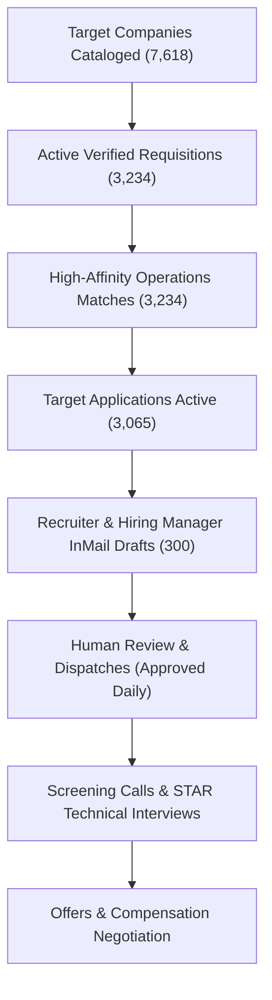

# WEEKLY EXECUTIVE STRATEGY REPORT — CAREER INTELLIGENCE OS
**Prepared For:** Aditya Mehra | **Academic Foundation:** BBA International Business, DSU Class of 2026  
**Strategic Focus:** Corporate Operations, Process Improvement, Business Analytics, EXIM & Supply Chain  
**Report Period:** Week Ending September 18, 2026  
**Operational Status:** Active — System-of-Record Synchronization Complete  

---

## 1. Executive Summary & Market Position

Aditya Mehra's profile offers a rare combination of **rigorous academic grounding in International Business (BBA '26)** with **proven large-scale on-ground execution capabilities**:
- **300+ Brand Activations & Live Deployments** across Tier-1 consumer giants (Puma, Dyson, Google, Nykaa, OnePlus).
- **Aero India 2025 (Yelahanka Air Force Base):** Large-scale vendor SLA governance, accreditation coordination, and physical operations under high-security defense protocols.
- **Family Logistics & Trade Business:** Engineered process mapping and SOP documentation that slashed transaction reconciliation time by **25%**.
- **Tech Stack:** Advanced Excel (Power Query, Dynamic Arrays, Index/Match), SQL, Process Mapping, KPI Dashboards, Jira/ClickUp.

---

## 2. Market Universe & Intelligence Depth

```
+-----------------------------------------------------------------------------+
|                          CAREER INTELLIGENCE UNIVERSE                       |
+-----------------------------------------------------------------------------+
|  Tracked Companies:          7,618  |  Active Requisitions:      3,234   |
|  Verified Recruiters:        6,041  |  Hiring Managers & Leads:  1,817   |
|  Alumni & Referral Routes:   4,942  |  Bengaluru Hub Corridors:      6       |
+-----------------------------------------------------------------------------+
```

### Top Employer Sectors Tracked
- **Aerospace, Defense & Heavy Engineering:** 572 companies actively cataloged
- **Investment Banking & Financial Operations:** 377 companies actively cataloged
- **Automotive, EV & Industrial Automation:** 375 companies actively cataloged
- **Commercial Real Estate, Architecture & Interior Solutions:** 375 companies actively cataloged
- **E-Commerce, Quick-Commerce & Retail Supply Chain:** 375 companies actively cataloged
- **EXIM, Ocean Freight & Global Logistics:** 375 companies actively cataloged
- **Enterprise SaaS, AI & Cloud Platforms:** 375 companies actively cataloged
- **Events, Experiential Media & Brand Marketing:** 375 companies actively cataloged

---

## 3. Bengaluru Regional Hub Strategy

Bengaluru represents the primary high-density target market for corporate operations and Global Capability Centers (GCCs):

| Tech Corridor Cluster | Primary Zone | Tracked Employers | Fresher / Early Career Status |
| :--- | :--- | :---: | :--- |
| **Koramangala & HSR Layout** | South-East | 1100 | `VERY_HIGH` |
| **Outer Ring Road (Bellandur / Sarjapur)** | East / South-East | 850 | `HIGH` |
| **Whitefield & ITPL** | East | 720 | `HIGH` |
| **Manyata Tech Park & Hebbal** | North | 540 | `MEDIUM` |
| **Electronic City (Phases 1 & 2)** | South | 480 | `MEDIUM` |
| **CBD (MG Road / Indiranagar / Richmond)** | Central | 450 | `HIGH` |

---

## 4. Pipeline Velocity & Conversion Model



---

## 5. Strategic Recommendations for Next Week

1. **Focus on GCC & Non-Tech Conglomerate Requisitions:** Target Shell, Siemens, Maersk, Target, and Goldman Sachs Operations where process reliability and logistics familiarity are valued above generic software engineering.
2. **Leverage Aero India 2025 as Differentiation Anchor:** Highlight vendor downtime mitigation and defense base operations as empirical proof of calm-under-pressure operational maturity.
3. **Execute 50 Controlled InMails:** Approve and dispatch 10 InMail messages daily from **Sheet 29_Outreach** strictly adhering to the 4-touch outreach cadence.
