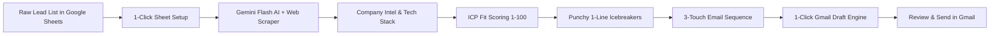

# ⚡ Sheet2Pipeline — Complete Setup, User Manual & Monetization Blueprint

> **The Google Sheets + Gemini Flash AI Micro-SaaS Engine for B2B Lead Enrichment, ICP Qualification, Hyper-Personalized Icebreakers & 1-Click Gmail Outreach.**

---

## 📑 Table of Contents
1. [Product Overview & Architecture](#-product-overview--architecture)
2. [5-Minute Installation & Setup Guide](#-5-minute-installation--setup-guide)
3. [How to Get Your Free Google Gemini API Key](#-how-to-get-your-free-google-gemini-api-key)
4. [Feature Walkthrough & Workflow](#-feature-walkthrough--workflow)
5. [Custom Formulas Reference (`=S2P_...`)](#-custom-formulas-reference)
6. [Standard Google Sheets Data Schema (CSV Template)](#-standard-google-sheets-data-schema)
7. [Agency Monetization & Micro-SaaS Business Blueprint ($29–$79/mo)](#-agency-monetization--micro-saas-business-blueprint)
8. [Sales Scripts, Landing Page Copy & Cold Outreach Pitch](#-sales-scripts--cold-outreach-pitch)
9. [Troubleshooting & FAQs](#-troubleshooting--faqs)

---

## 🚀 Product Overview & Architecture

**Sheet2Pipeline** turns any standard Google Sheet into an autonomous, enterprise-grade B2B outbound engine powered by Google Gemini Flash AI (1.5 Flash / 2.0 Flash / Pro).

Instead of paying **$150–$300/month** for fragmented subscriptions (Clay, Apollo, Instantly, Lemlist, ChatGPT Plus), **Sheet2Pipeline** runs entirely within Google Workspace using Google's free Gemini API tier (15 requests per minute, 1,500 requests per day at zero cost).



---

## 🛠️ 5-Minute Installation & Setup Guide

### Step 1: Create a New Google Sheet
1. Open your browser and navigate to [sheets.new](https://sheets.new).
2. Name your spreadsheet: `Sheet2Pipeline — Outbound Command Center`.

### Step 2: Open Google Apps Script
1. In the top Google Sheets menu bar, click on **Extensions** ➔ **Apps Script**.
2. A new tab will open with the Apps Script editor.
3. Delete any default code (`function myFunction() {}`) inside `Code.gs`.

### Step 3: Paste the Sheet2Pipeline Code
1. Open the file `sheet2pipeline_apps_script.js`.
2. Copy the entire contents of the file.
3. Paste it directly into the Apps Script editor window.
4. Click the **Save** icon (💾 or `Ctrl + S` / `Cmd + S`).
5. Name the project `Sheet2Pipeline Engine`.

### Step 4: Refresh Your Google Sheet & Grant Authorizations
1. Return to your Google Sheet tab and **refresh the browser page** (`F5` or `Cmd + R`).
2. Wait 3 to 5 seconds. You will see a new menu in the top bar: **`⚡ Sheet2Pipeline AI`**.
3. Click on **`⚡ Sheet2Pipeline AI`** ➔ **`🚀 1-Click Sheet Template Setup`**.
4. Google will display an **"Authorization Required"** prompt:
   - Click **Continue**.
   - Select your Google Account.
   - Click **Advanced** (bottom left).
   - Click **"Go to Sheet2Pipeline Engine (unsafe)"** (Google flags standard custom scripts as unverified).
   - Click **Allow** to grant permissions for Google Sheets, Gmail Drafts, and URL Fetch.
5. The script will automatically format Row 1 with branded headers, column styling, and insert a sample lead row!

---

## 🔑 How to Get Your Free Google Gemini API Key

Google provides generous free-tier API access for Gemini Flash models.

1. Go to **[Google AI Studio](https://aistudio.google.com/app/apikey)** (`https://aistudio.google.com/app/apikey`).
2. Sign in with your Google account.
3. Click the blue button: **"Create API key"** (or "Get API key").
4. Select or create a project (e.g., `Sheet2Pipeline`).
5. Copy the generated API key (it starts with `AIzaSy...`).
6. In your Google Sheet, click **`⚡ Sheet2Pipeline AI`** ➔ **`⚙️ Open Settings & AI Control Panel`**.
7. Paste your API key into the **Google Gemini API Key** field.
8. Click **"💾 Save & Test API Key"**.
9. You will see a green confirmation: `✅ API Key verified and saved successfully!`

---

## 🎯 Feature Walkthrough & Workflow

### 1. Configure Your Outreach Context (Sidebar)
Open **`⚡ Sheet2Pipeline AI`** ➔ **`⚙️ Open Settings & AI Control Panel`**:
- **Your Name & Company**: (e.g. `Adi Mehra | OutboundVelocity`)
- **Core Value Proposition**: (e.g. `We help B2B SaaS founders add 15-25 qualified demos/month on a 100% pay-on-performance basis.`)
- **Target ICP Criteria**: (e.g. `B2B SaaS, Agency Founders, CMOs, VPs of Sales with 10-100 employees in US/EU/India.`)
- **Call to Action**: (e.g. `Open to seeing a quick 3-min teardown of how we did this for [Competitor]?`)
- Click **"💾 Save Outreach Profile"**.

### 2. Add Your Prospects (Columns A–G)
Paste your leads into the sheet:
- **Col A**: First Name
- **Col B**: Last Name
- **Col C**: Prospect Email
- **Col D**: Job Title
- **Col E**: Company Name
- **Col F**: Website / Domain (e.g., `https://stripe.com` or `stripe.com`)
- **Col G**: Prospect Bio / Context (LinkedIn headline or recent post snippet)

### 3. Run Pipeline Actions (Select Rows ➔ Click Menu Action)
Highlight the rows you want to process (e.g., Row 2 to Row 20) and choose your action:

| Menu Option | What It Does |
| :--- | :--- |
| **`🌐 Enrich Company Intel`** | Scrapes the company website, detects tech stack (Shopify, HubSpot, Next.js, Stripe, etc.), and extracts core business model + pain triggers into Col H. |
| **`🎯 Score Prospect ICP Fit`** | Compares prospect role, company size, and intel against your ICP criteria and scores it `1-100` with executive reasoning into Col I. |
| **`💡 Generate Icebreakers`** | Writes a personalized, non-cringe 1-line hook (10–22 words) referencing their exact role or company intel into Col J. |
| **`✉️ Generate Cold Email Sequences`** | Writes a sub-80-word initial pitch + 2 follow-ups with compelling subject lines into Cols K, L, M, N. |
| **`⚡ Run Full Pipeline`** | Executes all 4 steps sequentially across all highlighted rows with real-time status toasts. |
| **`📬 Create Gmail Drafts`** | Connects to your Gmail and creates native drafts formatted with HTML line breaks, prospect email, and subject line. |

---

## 🧮 Custom Formulas Reference

You can also use Sheet2Pipeline directly as native spreadsheet formulas:

### 1. Company Enrichment & Tech Stack
```excel
=S2P_ENRICH("https://supabase.com")
```
*Returns bulleted company summary, detected tech stack, and pain points.*

### 2. Personalized 1-Line Icebreaker
```excel
=S2P_ICEBREAKER(A2, E2, D2, G2)
```
*Arguments: `(First_Name, Company_Name, Job_Title, Bio_or_Notes)`*
*Returns a sharp, peer-level 1-line opening hook.*

### 3. ICP Scoring (1-100)
```excel
=S2P_ICP_SCORE(D2, E2, G2)
```
*Arguments: `(Job_Title, Company_Name, Bio_or_Notes)`*
*Returns e.g., `92/100 - Direct economic buyer with active outbound scaling mandate.`*

### 4. Instant Cold Email Pitch
```excel
=S2P_EMAIL(A2, E2, "High SDR ramp time and low cold email deliverability")
```
*Arguments: `(First_Name, Company_Name, Specific_Pain_Point)`*
*Returns complete, ready-to-send cold email.*

---

## 📊 Standard Google Sheets Data Schema

Save this as a reference CSV template for bulk imports:

```csv
First Name,Last Name,Prospect Email,Job Title,Company Name,Website / Domain,Prospect Bio / Context,Company Intel & Tech Stack,ICP Fit Score (1-100),Personalized Icebreaker,Email Subject Line,Cold Email (Touch 1),Follow-Up 1,Follow-Up 2,Gmail Draft Status
Alex,Rivera,alex@cloudscale.io,Head of Sales,CloudScale,https://cloudscale.io,"Scaling mid-market outbound SDR team. Hiring 4 SDRs.",,,,,,,,Pending
Elena,Rostova,elena@finflow.co,Chief Marketing Officer,FinFlow,https://finflow.co,"Series A fintech platform. Focused on organic and outbound ABM.",,,,,,,,Pending
Marcus,Vance,marcus@hypergrowth.agency,Founder & CEO,HyperGrowth Agency,https://hypergrowth.agency,"B2B lead generation agency helping SaaS companies scale pipelines.",,,,,,,,Pending
```

---

## 💰 Agency Monetization & Micro-SaaS Business Blueprint

### 1. Product Packaging & Pricing Tiers

| Tier | Price | What's Included | Target Buyer |
| :--- | :--- | :--- | :--- |
| **Tier 1: Starter Kit** | **$39** one-time | • `sheet2pipeline_apps_script.js`<br>• Pre-formatted Google Sheet Template<br>• Setup Video / PDF Guide | Solo Freelancers, SDRs, Growth Hackers |
| **Tier 2: Pro Agency Bundle** | **$79** one-time *or* **$29/mo** | • Complete Script + Lifetime Updates<br>• 15 Tested Cold Email Prompt Frameworks<br>• Tech Stack Enrichment Expansion<br>• Unlimited seats / client sheets | B2B Agencies, Lead Gen Consultancies |
| **Tier 3: Done-For-You Outbound Engine** | **$397 – $750** one-time | • Custom setup in client's Google Workspace<br>• Custom AI prompt tuning for their exact niche<br>• 500 enriched & scored verified leads included<br>• 30-min strategy walkthrough call | Agency Owners & B2B Founders |

---

### 2. Platform Setup (Gumroad / Lemon Squeezy / Stripe)

1. **Create a Gumroad / Lemon Squeezy Product**:
   - Product Name: `Sheet2Pipeline — AI Lead Enrichment & Cold Outreach Engine for Google Sheets`
   - Tagline: *Turn Google Sheets into a $0/month Clay + Apollo Alternative powered by Gemini AI.*
   - Files to Upload in Gumroad:
     - `sheet2pipeline_apps_script.js`
     - `sheet2pipeline_setup_guide.md`
     - Link to View-Only "Copy This Template" Google Sheet
2. **Set Pricing**:
   - Offer a launch discount: `$49 regular, $29 for first 50 buyers` (Code: `EARLYBIRD`).

---

## 📢 Sales Scripts & Cold Outreach Pitch

Use these exact copy templates to sell Sheet2Pipeline to B2B agency owners, freelance consultants, and SDR managers.

### 1. LinkedIn / Twitter DM Pitch (Direct & Value-First)

> **Subject / Opening**: quick teardown of your outbound stack
> 
> Hey [First Name],
> 
> Noticed you're scaling [Company Name]'s client acquisition.
> 
> Most agencies I talk to are burning $200–$400/month on Clay, Apollo, and ChatGPT seats just to enrich leads and write icebreakers that still sound like generic AI.
> 
> I built a lightweight Google Sheets tool (**Sheet2Pipeline**) that runs directly in your Sheets using Google's free Gemini Flash AI:
> 
> 1. Scrapes company sites & extracts tech stacks (HubSpot, Shopify, Stripe, etc.)
> 2. Scores prospect ICP fit (1-100) automatically
> 3. Generates 1-line personalized hooks that don't sound cringe
> 4. Pushes customized emails straight to Gmail Drafts in 1 click
> 
> Zero monthly software fees. 
> 
> Mind if I send over a 2-minute video breakdown of how it works inside Google Sheets?
> 
> Best,  
> **Adi Mehra**

---

### 2. Short Cold Email Pitch (High Conversion)

> **Subject**: quick question re: [Company Name] outbound
> 
> Hi [First Name],
> 
> Saw that [Company Name] is actively expanding its client pipeline in [Industry].
> 
> Quick question — are you guys currently paying monthly tool subscriptions (Clay / Apollo / copywriters) for lead enrichment and email personalization?
> 
> We built **Sheet2Pipeline** — an open Google Sheets engine that enriches leads, scores ICP fit (1-100), and creates 1-click Gmail drafts using Gemini Flash AI at $0 API cost.
> 
> Open to checking out a quick 3-minute Loom demo to see if it saves your team 10+ hours a week?
> 
> Best,  
> **Adi Mehra**  
> Founder, Sheet2Pipeline

---

### 3. Gumroad / Landing Page Hero Copy

```markdown
# Turn Google Sheets into an Autonomous AI Sales Machine ⚡

### Stop paying $250/mo for Clay & Apollo. Enrich leads, detect tech stacks, score ICP fit, and create 1-click Gmail drafts directly inside Google Sheets.

🔥 **100% Native Google Workspace** — No 3rd-party servers, no data leakage.
⚡ **Powered by Google Gemini Flash** — 15 requests/min completely free.
📬 **1-Click Gmail Integration** — Push 50 personalized drafts into your inbox instantly.
🧮 **Custom Formulas Included** — Use `=S2P_ICEBREAKER()` & `=S2P_ENRICH()` in any cell.

👉 [Get Instant Access for $29] (One-Time Payment • Lifetime Access)
```

---

## ❓ Troubleshooting & FAQs

#### Q: Is the Gemini API really free?
**A:** Yes! Google AI Studio provides a free tier for `gemini-1.5-flash` and `gemini-2.0-flash` with a rate limit of 15 Requests Per Minute (RPM) and 1,500 Requests Per Day, which is more than enough for daily outbound prospecting.

#### Q: How do I avoid rate limit errors when running 100+ leads?
**A:** Sheet2Pipeline has built-in exponential backoff retries. When processing large batches, select 25–50 rows at a time, or let the script run with its automatic pacing.

#### Q: Can I customize the prompts?
**A:** Absolutely. You can tune your Offer, Target ICP, and Call to Action directly from the **Settings Sidebar**, or customize the underlying prompt strings inside `sheet2pipeline_apps_script.js`.

#### Q: Where do Gmail drafts go?
**A:** When you click **"📬 Create Gmail Drafts"**, drafts appear immediately in your standard Gmail **Drafts** folder (`mail.google.com/#drafts`). You can open them, review the personalized copy, and click send!

---

**Built with ⚡ by Adi Mehra | Sheet2Pipeline Micro-SaaS**
