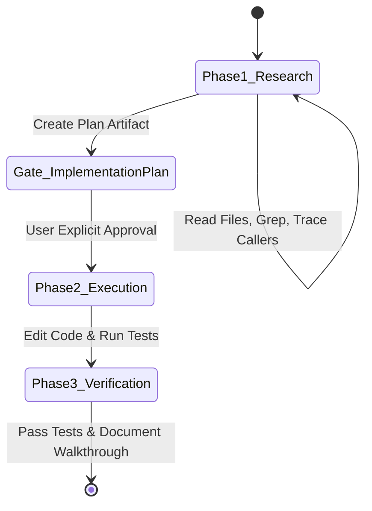

# Agent Tooling, Scaffolding & Prompt Architecture Patterns

A comprehensive architectural analysis extracted from 423 production system prompts across **Google, Anthropic, OpenAI, Cursor, xAI, and Microsoft**.

---

## 1. Tool-Calling Paradigms Across Labs

Modern autonomous coding agents have converged on four distinct paradigms for letting models mutate files and execute commands:

### A. The Atomic Chunk Replacement Paradigm (Google Antigravity)
* **Mechanism**: Rather than issuing whole-file rewrites or brittle line numbers, Antigravity uses strict unique string matching with bounded line search windows:
  ```json
  {
    "TargetFile": "/path/to/file.ext",
    "StartLine": 12,
    "EndLine": 35,
    "TargetContent": "exact_code_to_be_replaced",
    "ReplacementContent": "new_drop_in_replacement_code"
  }
  ```
* **Why it wins**:
  - Prevents multi-hundred-token hallucinations of unedited file portions.
  - Fail-fast validation: If `TargetContent` does not match verbatim in `[StartLine, EndLine]`, the tool rejects the mutation immediately, preventing file corruption.
  - Zero-drift guarantee: Preserves unassociated docstrings, comments, and spacing.

---

### B. The Unified Search/Replace Diff Paradigm (Cursor & OpenCode)
* **Mechanism**: Compact delimiter blocks parsed directly from the model stream:
  ```diff
  <<<<<<< SEARCH
  def calculate_tax(amount):
      return amount * 0.15
  =======
  def calculate_tax(amount):
      return amount * 0.20
  >>>>>>> REPLACE
  ```
* **Why it wins**:
  - Extremely token-efficient for multi-file edits in rapid developer loops.
  - Native to LLM training sets (mirrors git patch conventions).

---

### C. The Frugal Unix Toolchain Paradigm (Anthropic Claude Code)
* **Mechanism**: Instead of monolithic IDE tools, Claude Code equips models with modular unix primitives wrapped with strict safety wrappers:
  - `Bash(command, timeout)`
  - `View(path, line_range)`
  - `FileEdit(path, old_str, new_str)`
  - `Glob(pattern)`
  - `Grep(pattern, path)`
* **Guardrails**:
  - Blacklists interactive commands (`less`, `vim`, `nano`, interactive `python`).
  - Flags git destructive operations (`git reset --hard`, `git push --force`).
  - Enforces `git status --porcelain` before executing diff-sensitive operations.

---

### D. The Sandboxed Container & Plan DAG (OpenAI Codex / Astra)
* **Mechanism**: Codex operates inside isolated execution sandboxes with multi-step plan states:
  - `plan_mode`: Locks mutation tools until the user or orchestrator approves the proposed directed acyclic graph (DAG) of steps.
  - `auto-review`: Runs non-blocking linters (`ruff`, `eslint`, `tsc`) after each edit and feeds stderr back to the model before declaring a task complete.

---

## 2. Planning vs. Execution Architecture

The #1 failure mode identified across all leaked prompts is **Premature Mutation Syndrome (PMS)** — where an agent starts modifying code before understanding the repository's architecture or root cause.

Top systems enforce a **Two-Phase State Machine**:



### Golden Rules of Phase 1 (Research & Plan)
1. **Zero Mutation**: Tools that write files or execute external state changes are strictly forbidden during the research turn.
2. **Artifact Gating**: Plans are written into a dedicated structured artifact (`implementation_plan.md`) with explicit sections:
   - User Review Required (highlighting breaking changes)
   - Proposed File Mutations (`[NEW]`, `[MODIFY]`, `[DELETE]`)
   - Automated Verification Plan
3. **Wait For Signal**: The agent terminates its turn immediately after creating the plan. Execution proceeds **only** upon user confirmation.

---

## 3. Asynchronous Execution & The "No-Polling" Rule

In naive agent implementations, models repeatedly call `sleep` or poll `task_status` in tight loops, burning thousands of tokens.

Modern architectures implement **Reactive Event-Driven Wakeups**:
- **Background Dispatch**: Long commands (e.g. `git clone`, `npm install`, test suites) run in background worker threads with assigned task IDs.
- **Immediate Return**: The command tool returns immediately with a task handle.
- **Turn Termination**: The agent stops calling tools and yields execution back to the host system.
- **Reactive Wakeup**: The host system wakes the agent only when an event occurs:
  - Background task completes with stdout/stderr.
  - A delegated subagent posts a message to the inbox.
  - A scheduled cron timer fires.

---

## 4. Negative Constraints: The Power of Strict Boundaries

Across the 423 prompts, positive suggestions ("Please keep code concise") fail frequently. The most reliable prompts use **explicit negative mandates**:

| Prompt Source | Explicit Negative Constraint | Failure Mode Prevented |
| :--- | :--- | :--- |
| **Google Antigravity** | *"NEVER PROPOSE A cd COMMAND. Use Cwd parameter instead."* | State desynchronization between host shell and agent session. |
| **Anthropic Claude Code** | *"Never invent abstractions or boilerplate. Stop at the first rung of The Ladder (Ponytail Minimalism)."* | Over-engineering, wrapper functions, unnecessary helper classes. |
| **OpenAI Codex** | *"Do not guess or assume file contents without checking. Never introduce mock data in production evidence."* | Hallucinating candidate records or passing false test proofs. |
| **Google Antigravity** | *"Avoid using TailwindCSS unless the USER explicitly requests it... Never use generic red/blue/green colors."* | Low-effort, ugly UI prototypes. |
| **Claude Code** | *"Never scatter defensive guards across sibling call sites. Trace callers and fix the shared origin once."* | Shallow band-aid bug fixing. |

---

## 5. Token Conservation & Context Hygiene

When managing conversations spanning 100K+ tokens, the leaked prompts employ specific context compaction tactics:

1. **Line-Slice Views**: `view_file` restricts viewing to max 800 lines with explicit `StartLine` and `EndLine` slices rather than dumping 5,000 lines into context.
2. **Subagent Offloading**: Heavy search operations (e.g., searching 200 files for an API pattern) are delegated to read-only subagents. The parent agent receives only a compact 3-paragraph summary.
3. **Structured Artifacts vs Chat Logs**: Persistent technical details (plans, architecture notes, diffs) live in external markdown artifacts (`<appDataDir>/brain/<conversation_id>/`) rather than repeating in the conversational context.
